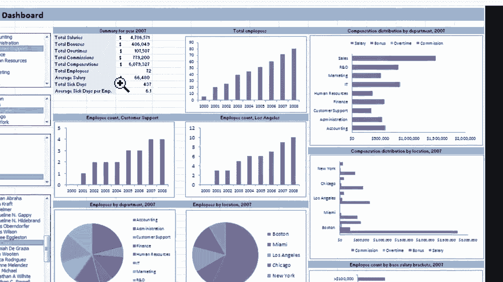
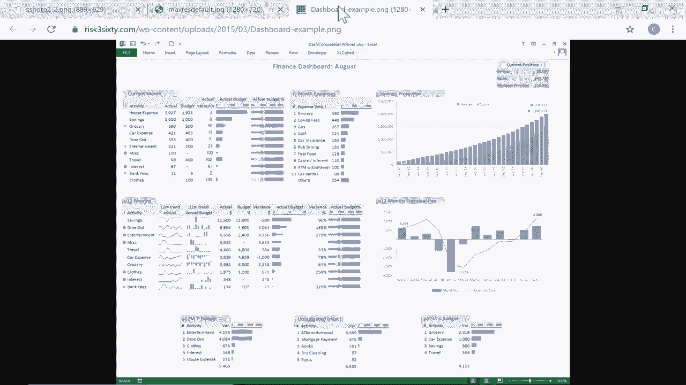
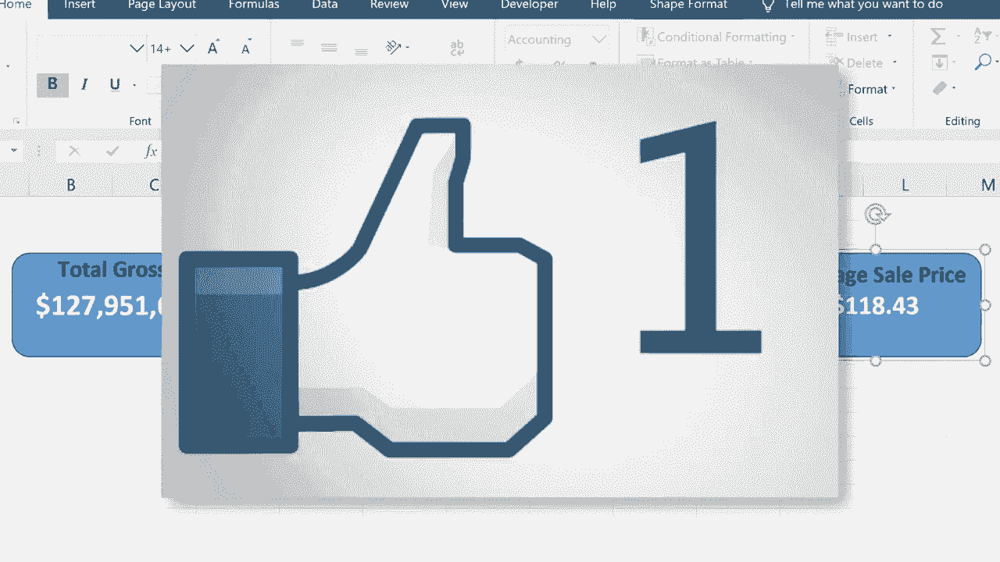

# Excel中级教程 - P18：仪表板入门指南 📊

在本节课中，我们将学习如何为Excel工作簿创建一个基础的仪表板。仪表板能够将复杂数据源中的关键信息以清晰、美观的方式集中展示，帮助用户快速聚焦于核心指标。

## 什么是仪表板？ 🤔

仪表板是一种数据可视化工具，它从其他电子表格或工作簿中提取数据，并将重要的图表、图形和数字集中展示在一个独立的界面上。其目的是简化复杂的数据集，让用户能够专注于特定的数据和指标。

以下是几个仪表板的例子：

*   **年度总结仪表板**：展示一年的关键数据概览。
*   **销售分析仪表板**：展示按地区划分的销售总额与趋势。
*   **高级财务仪表板**：整合大量财务数据的复杂视图。

这些示例虽然高级，但我们将从最基础的方法开始学习。

## 创建基础仪表板的步骤 🛠️

上一节我们介绍了仪表板的概念，本节中我们来看看如何动手创建一个简单的仪表板。我们将从一个包含多年财务数据的复杂工作表开始。

### 第一步：规划与设置新工作表

首先，需要规划仪表板上要显示的内容。例如，可以计划在左上角显示年度总销售额，在右侧显示平均价格等。规划完成后，即可开始创建。

1.  在Excel工作簿底部，点击“+”号添加一个新工作表。
2.  双击新工作表标签，将其重命名为“Dashboard”（或任何你喜欢的名称）。
3.  将此工作表拖到最前面，作为你的仪表板界面。

### 第二步：使用形状创建数据容器

设置仪表板的一个简单方法是使用形状作为数据的容器和背景。

以下是操作步骤：

1.  点击【插入】选项卡，在【插图】组中找到【形状】。
2.  选择一个形状（例如圆角矩形），在仪表板工作表上点击并拖动绘制出来。
3.  这个形状将用于显示“2020年总销售额”这个数据。

### 第三步：将形状链接到动态数据

如果直接在形状中输入数字，数据无法自动更新。我们需要将形状链接到源数据单元格。

1.  点击选中刚才绘制的形状。
2.  将光标移至顶部的**公式栏**，输入等号 `=`。
3.  切换到包含源数据的工作表（例如“2020”），点击“总销售额”对应的总计单元格。
4.  按下**回车键**。此时，形状中显示的数字已动态链接到源数据单元格。

**核心操作公式**：
`=‘源工作表名称’!单元格地址`
例如：`=‘2020’!$B$100`

### 第四步：美化仪表板元素

仪表板的意义在于清晰美观。我们可以对形状和文字进行格式化。

1.  **调整数字格式**：点击形状内的数字，可以调整字体、大小、颜色和对齐方式。
2.  **添加数据标签**：点击【插入】>【文本框】，在形状旁添加一个文本框，输入“总销售额”作为标签。
3.  **组合对象**：按住 **Ctrl** 键同时选中形状和文本框，在【页面布局】>【排列】组中点击【组合】。这样它们就可以作为一个整体被移动和管理。
4.  **复制元素**：右键点击已组合的仪表板元素，选择“复制”和“粘贴”，可以快速创建新的数据块（如“销售总数”、“平均价格”）。
5.  **更新链接**：对于新复制的元素，需要点击其中的形状，然后在公式栏中重新链接到正确的源数据单元格（如“售出单位总计”）。

### 第五步：确保数据格式正确

有时在仪表板上调整数字格式（如货币格式）会失效，需要在源数据单元格中进行调整。

1.  切换到源数据工作表（如“2020”）。
2.  选中需要格式化的总计单元格（如总销售额）。
3.  在【开始】选项卡的【数字】组中，将其格式设置为“货币”。
4.  返回仪表板，数字将自动更新为正确的货币格式。

## 总结与回顾 📝

本节课中我们一起学习了创建Excel基础仪表板的核心流程：

1.  **规划布局**：明确要在仪表板上展示的关键指标。
2.  **建立容器**：使用【形状】功能创建数据的显示框。
3.  **动态链接**：通过**公式栏**输入 `=` 将形状链接到源数据单元格，实现数据同步更新。
4.  **美化与组合**：格式化文字、调整颜色，并使用【组合】功能将标签和数据框整合。
5.  **校对格式**：确保数字格式（如货币、小数位数）在源数据中设置正确。

通过以上步骤，你可以将杂乱的数据工作表转化为一个焦点明确、直观易懂的仪表板。这只是仪表板制作的起点，后续还可以融入图表、控件等更高级的元素。