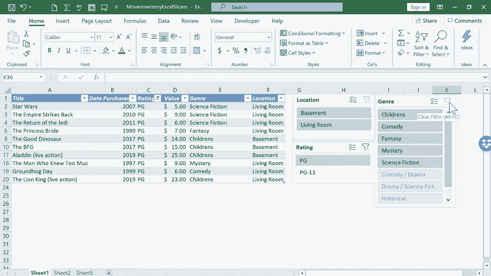

# Excel中级教程 - P20：使用切片器筛选数据 📊

在本教程中，我们将学习如何在Excel中使用切片器来筛选和查看特定数据。切片器是传统筛选器的可视化替代工具，它能让数据筛选过程更加直观和高效。

## 概述

上一节我们介绍了Excel中的排序和筛选功能。本节中，我们来看看如何使用切片器这一更直观的工具来筛选数据。切片器通过提供清晰的按钮式界面，让用户能够轻松地筛选表格数据，同时保持数据的可见性。

## 准备工作：清理数据

在使用切片器之前，需要确保数据区域整洁规范。以下是清理数据的步骤：

1.  删除无关标题行：选中标题行（如“电影库存”），右键点击行号，选择“删除”。
2.  清除数据区域下方的额外信息：选中这些单元格，右键点击，选择“清除内容”。
3.  确保数据区域是一个连续的矩形范围，没有合并单元格或空行分隔。

## 创建表格

切片器需要基于Excel表格（Table）才能使用。以下是创建表格的方法：

1.  点击数据区域内的任意单元格。
2.  转到“插入”选项卡。
3.  点击“表格”按钮。
4.  在弹出的对话框中确认数据范围，点击“确定”。

此时，你的数据区域会被格式化为一个正式的表格。如果需要更改样式，可以在“表格设计”选项卡中进行调整。

## 插入切片器

表格创建完成后，即可添加切片器。以下是具体步骤：

1.  确保光标位于表格内部。
2.  转到“表格设计”选项卡。
3.  在“工具”组中，点击“插入切片器”。
4.  在弹出的对话框中，勾选你希望用于筛选的字段（例如“类型”、“位置”、“评分”）。
5.  点击“确定”。

Excel会为每个选中的字段生成一个独立的切片器面板。

## 使用切片器筛选数据

切片器面板上会显示该字段的所有唯一值作为按钮。以下是使用切片器进行筛选的操作：

*   **单项筛选**：直接点击切片器上的一个按钮（例如“喜剧”），表格将立即筛选出包含该值的所有行。
*   **多项筛选**：若想同时筛选多个值（例如“喜剧”和“喜剧剧情”），需要先启用“多选”模式。点击切片器右上角的“多选”按钮（图标通常为复选标记），然后即可依次点击多个按钮进行筛选。
*   **清除筛选**：要清除某个切片器的筛选，点击该切片器右上角的“清除筛选器”按钮（漏斗带红叉图标）。
*   **关联筛选**：当使用多个切片器时，它们是联动的。例如，选择“喜剧”后，在“位置”切片器中，只有存在喜剧电影的位置按钮是可选的，其他按钮会变灰，这有助于快速定位数据。

## 切片器的优势

与传统筛选器相比，切片器具有以下优点：

*   **直观可视**：当前应用的筛选条件一目了然。
*   **易于操作**：点击按钮即可筛选，无需下拉菜单。
*   **保持数据可见性**：不会隐藏行号，提醒用户数据已被筛选。
*   **便于共享**：其他用户能更清楚地理解当前数据的视图状态。

## 总结

本节课中，我们一起学习了Excel中切片器的使用方法。我们从清理数据、创建表格开始，然后逐步完成了插入切片器并使用其进行单项、多项筛选的操作。切片器是一个强大的可视化筛选工具，能显著提升数据分析和查看的效率。希望你能在实战中灵活运用它。