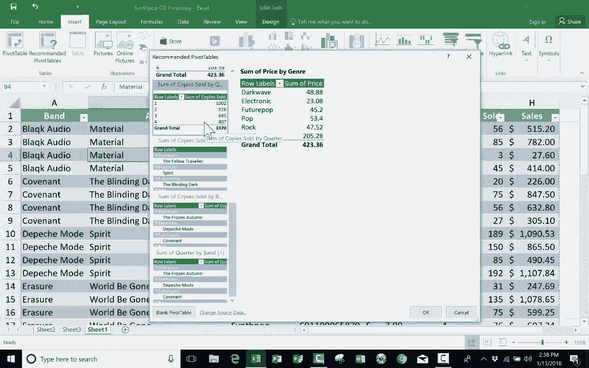

# Excel中级教程 P22：使用“推荐的数据透视表” 📊

在本节课中，我们将学习如何使用Excel的“推荐的数据透视表”功能，这是创建数据透视表最快捷的方法之一。我们将了解其工作原理、适用场景以及如何根据推荐结果进行调整。

## 概述

“推荐的数据透视表”是Excel较新版本提供的一项智能功能。它能自动分析你的数据，并推荐几种可能对你有用的数据透视表布局。这为不熟悉数据透视表复杂设置的用户，或想快速探索数据不同维度的用户提供了极大便利。

## 检查功能可用性

首先，你需要确认你的Excel版本支持此功能。

*   打开Excel，定位到顶部菜单栏的 **“插入”** 选项卡。
*   在 **“数据透视表”** 按钮旁边，查看是否存在 **“推荐的数据透视表”** 按钮。
*   如果存在，则说明你的版本支持此功能。

## 准备数据

上一节我们介绍了常规数据透视表的创建与设置。本节中我们来看看如何利用智能推荐来简化这一过程。为了理解本教程，建议你预先了解常规数据透视表的基础知识。你可以观看相关教程视频进行学习。

本教程使用一个假设的合成流行音乐商店库存表作为示例数据。数据表包含以下列：
*   `项目编号`
*   `价格`
*   `季度`
*   `售出总数`
*   `总销售额`（即总收入）

数据排列方式与典型库存清单一致。

## 使用“推荐的数据透视表”功能

当你想从数据中提取特定信息并以新视角查看时，数据透视表是理想工具。“推荐的数据透视表”功能则能帮你快速起步。

1.  选中数据区域内的任意单元格。
2.  点击 **“插入”** 选项卡下的 **“推荐的数据透视表”** 按钮。
3.  随后会弹出一个窗口，展示Excel基于你的数据生成的几种推荐方案。

以下是Excel可能推荐的一些数据透视表类型示例：

*   **按类型汇总的价格总和**：此表汇总了商店中每种音乐类型所有商品的价格总和。这有助于了解库存商品的总定价情况，但并未反映实际销售数据。
*   **按类型汇总的销售额总和**：此表汇总了每种音乐类型的实际总销售额。这对于分析哪种音乐类型最受顾客欢迎、贡献收入最多更为有用。
*   **按乐队汇总的售出副本总和**：此表显示了每位艺人的唱片销售总量。这对于评估不同乐队的市场表现非常直观。

## 评估与选择推荐方案

弹出的推荐列表提供了多种预先生成的数据透视表预览。你的任务是浏览这些选项，并判断哪一个能提供你所需的信息。

例如，“按类型汇总的价格总和”显示的是库存价值，而非销售业绩，可能不是你想要的。而“按乐队汇总的售出副本总和”则直接展示了销售情况，可能更具实用性。

点击你认为有用的推荐方案，然后点击 **“确定”**。Excel会自动在工作表中插入一个基于该推荐的数据透视表。

## 调整推荐的数据透视表

即使使用了推荐功能，你仍然可以完全控制最终的数据透视表。

插入数据透视表后，右侧会出现 **“数据透视表字段”** 窗格。你可以在此进行以下调整：
*   向 **“行”**、**“列”**、**“值”** 或 **“筛选器”** 区域添加或移除字段。
*   更改值字段的汇总方式（如求和、计数、平均值）。
*   对数据进行排序或筛选。

例如，你可以在已生成的“按乐队售出副本”透视表中，将“季度”字段拖入“列”区域，以分析不同季度的销售变化。

## 总结

本节课我们一起学习了“推荐的数据透视表”功能。这是一个强大的工具，能基于你的数据智能推荐分析视角，帮助你快速创建数据透视表。尤其适用于当你不太确定如何组织数据透视表时，进行初步探索和获取灵感。记住，推荐的结果是起点，你可以随时通过“数据透视表字段”窗格对其进行自定义调整，以满足更具体的分析需求。