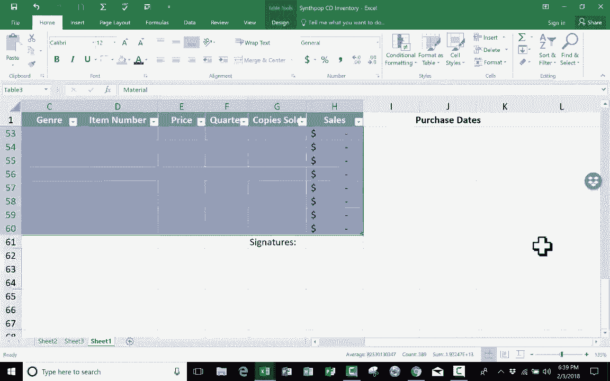

# Excel中级教程 - P23：最有用的键盘快捷键 ⌨️

在本节课中，我们将学习 Microsoft Excel 中最有用的一些键盘快捷键。掌握这些快捷键可以显著提升你的工作效率，让你无需频繁使用鼠标即可完成常见操作。

## 概述
我们将从几乎所有程序都通用的基础快捷键开始，然后深入介绍在Excel中导航、选择数据以及操作工作表的专用快捷键。每个快捷键都将通过简单的步骤进行说明。

## 通用基础快捷键
首先，我们介绍两个非常常见且实用的基础快捷键。

*   **Ctrl + S**：按住 `Ctrl` 键，然后轻按字母 `S`。此操作会保存你当前的电子表格，其功能等同于点击工具栏的“保存”按钮或通过“文件”菜单进行保存。
*   **Ctrl + P**：按住 `Ctrl` 键，然后轻按字母 `P`。此操作会在 Microsoft Excel 中打开打印选项对话框，你可以直接点击打印按钮来打印文档。

## 创建表格的快捷键
上一节我们介绍了通用的保存和打印快捷键，本节中我们来看看一个专属于Excel的实用功能。

*   **Ctrl + T**：此快捷键的作用是将选定的单元格区域转换为格式化的表格。例如，如果你有一组数据，只需选中它们，然后按下 `Ctrl + T`，Excel会弹出对话框确认数据范围并询问是否包含标题行，确认后即可快速生成一个带有交替颜色等样式的表格。

## 在电子表格内导航
在大型电子表格中准确、快速地移动光标是提高效率的关键。以下是相关的导航快捷键。

以下是用于在数据区域内部快速跳转的快捷键：
*   **Ctrl + Home**：将光标移动到当前工作表的左上角（通常是单元格A1）。
*   **Ctrl + End**：将光标移动到当前工作表中包含数据的区域的右下角。
*   **Ctrl + 方向键（如↓）**：将光标沿箭头方向快速移动到当前数据区域的边缘。例如，在某一列中按 `Ctrl + ↓` 会跳转到该列最后一个连续非空单元格。

## 在工作表之间导航
为了保持双手在键盘上操作，避免使用鼠标切换工作表，可以使用以下快捷键。

以下是用于在不同工作表之间切换的快捷键：
*   **Ctrl + Page Up**：切换到当前工作表左侧（前一个）的工作表。
*   **Ctrl + Page Down**：切换到当前工作表右侧（后一个）的工作表。

## 快速填充与选择数据
接下来，我们看看用于快速复制和选择数据的快捷键，这些操作在日常编辑中非常频繁。

*   **Ctrl + D**：“向下填充”的快捷键。首先选中一个单元格或一个区域，然后向下拖动选择要填充的目标区域，最后按下 `Ctrl + D`，即可将源单元格的内容复制到下方选中的区域。
*   **Ctrl + A**：此快捷键用于选择数据。如果光标位于一个表格内部，第一次按 `Ctrl + A` 会选择整个表格；如果不在表格内或再次按下 `Ctrl + A`，则会选择整个工作表。
*   **Ctrl + 空格键**：选中光标所在位置的整个列。
*   **Shift + 空格键**：选中光标所在位置的整个行。

## 总结
本节课中我们一起学习了Excel中最有用的一系列键盘快捷键。我们从通用的保存(`Ctrl+S`)和打印(`Ctrl+P`)开始，学习了如何快速创建表格(`Ctrl+T`)、在数据间高效导航(`Ctrl+Home/End/方向键`)、在工作表间切换(`Ctrl+Page Up/Page Down`)，以及快速填充(`Ctrl+D`)和选择数据(`Ctrl+A`, `Ctrl+空格`, `Shift+空格`)。熟练运用这些快捷键将帮助你更流畅、更高效地使用Excel。