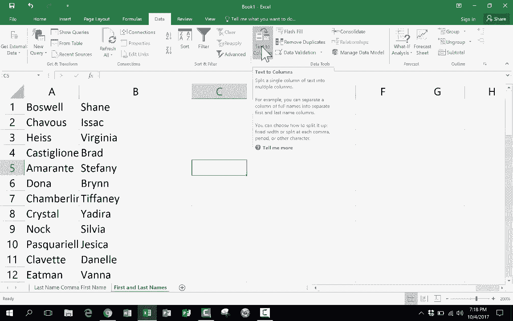

# Excel中级教程 - P24：拆分姓名 📝

在本节课中，我们将学习如何在Excel中拆分姓名。这是一个处理数据时非常常见的需求，无论是姓名以“姓氏, 名字”的格式存储，还是以“名字 姓氏”的格式存储，我们都可以通过Excel的内置功能快速将其分离到不同的列中。

## 概述：为何需要拆分姓名？

在数据整理过程中，我们经常遇到姓名信息存储在同一单元格内的情况。例如，数据可能以“张, 三”或“李四”的形式存在。这会给数据排序、筛选和分析带来不便。本节课将介绍如何使用“文本分列”功能，高效地解决这个问题。

## 案例一：拆分“姓氏, 名字”格式

上一节我们概述了拆分姓名的必要性，本节中我们来看看如何处理“姓氏, 名字”这种带逗号分隔的格式。

假设你的数据位于A列，格式为“姓氏, 名字”。我们的目标是将姓氏和名字拆分到两列。

以下是操作步骤：

1.  选中包含姓名的整列（例如A列）。
2.  点击顶部菜单栏的 **“数据”** 选项卡。
3.  在 **“数据工具”** 组中，找到并点击 **“分列”** 按钮。
4.  此时会弹出“文本分列向导”窗口。第一步是选择最符合你数据特征的描述。由于我们的数据由逗号分隔，因此选择 **“分隔符号”**，然后点击 **“下一步”**。
5.  在第二步中，设置分隔符号。取消默认的“Tab键”勾选，然后勾选 **“逗号”**。此时，下方的数据预览会显示分列效果。
6.  由于姓名之间通常还有一个空格，我们还需要勾选 **“连续分隔符号视为单个处理”** 选项，以确保多余的空格被移除。
7.  点击 **“下一步”**。第三步可以设置每列的数据格式，通常保持默认的 **“常规”** 即可。
8.  点击 **“完成”**。

操作完成后，A列的数据就会被拆分为两列：姓氏和名字。如果发现个别数据因多余空格而未完全分开，手动删除多余空格即可。

## 案例二：拆分“名字 姓氏”格式

学会了处理带逗号的格式后，我们再来看看另一种常见情况：姓名之间仅由空格分隔，格式为“名字 姓氏”。

处理逻辑与案例一完全相同，唯一的区别在于分隔符号的设置。

以下是关键步骤：

1.  同样，先选中目标列，然后打开 **“数据” > “分列”** 功能。
2.  在向导的第二步，分隔符号选择 **“空格”**。
3.  由于姓名之间通常只有一个空格，本次可以**不勾选**“连续分隔符号视为单个处理”。
4.  点击 **“完成”**，即可实现拆分。

## 调整列顺序

通过“文本分列”功能拆分后，你可能会得到“名字”在前、“姓氏”在后的结果。若希望将“姓氏”调整到第一列，可以按以下步骤操作：

1.  右键点击“名字”所在的列标（例如A列），选择 **“剪切”**。
2.  右键点击“姓氏”列右侧的空白列标（例如C列），选择 **“插入剪切的单元格”**。
3.  最后，可以右键点击原来的“名字”列（现在已为空），选择 **“删除”**。

这样，你就得到了A列为姓氏、B列为名字的整洁表格。

## 总结

本节课中，我们一起学习了Excel中拆分姓名的实用技巧。我们掌握了：

*   使用 **“数据”** 选项卡下的 **“分列”** 功能。
*   针对 **“姓氏, 名字”** 格式，选择 **逗号** 作为分隔符，并勾选处理连续分隔符的选项。
*   针对 **“名字 姓氏”** 格式，选择 **空格** 作为分隔符。
*   最后，通过剪切和插入操作来调整列的最终顺序。

“文本分列”是一个强大且易于使用的工具，能极大地提升数据清洗和整理的效率。