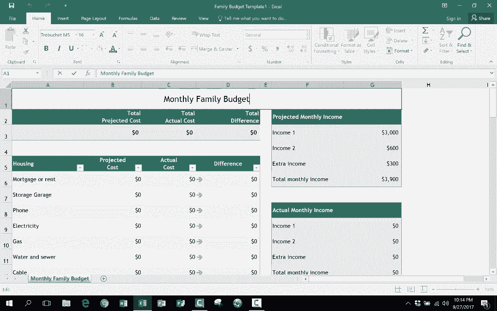

# Excel中级教程 - P25：创建自己的Excel模板 📄

在本节课中，我们将学习如何创建和使用个人Excel模板。模板能帮助你快速启动重复性的工作，避免覆盖历史数据，从而节省大量时间和精力。

## 概述

上一节我们介绍了Excel的一些基础功能。本节中，我们来看看如何将常用的电子表格保存为个人模板，以便日后快速调用和复用。

## 如何创建个人Excel模板

以下是创建个人Excel模板的详细步骤。

1.  **打开目标工作簿**
    首先，打开你希望保存为模板的Excel工作簿。例如，一个已调整好的月度家庭预算表。

2.  **执行“另存为”操作**
    点击左上角的“文件”菜单，然后选择“另存为”选项。

3.  **选择保存位置**
    在“另存为”窗口中，选择“这台电脑”以保存到本地。

4.  **关键步骤：更改文件类型**
    在“保存类型”下拉菜单中，选择“Excel模板 (*.xltx)”。选择此类型后，系统通常会**自动定位**到名为“自定义Office模板”的专用文件夹。

5.  **命名并保存**
    为你的模板输入一个清晰的名称，例如“家庭预算模板”，然后点击“保存”按钮。

## 如何使用已保存的模板

创建模板后，你可以随时方便地使用它。

1.  **启动Excel并新建**
    打开Excel，在启动界面点击“新建”。

2.  **访问个人模板**
    在新建页面，点击“个人”选项卡。这里将列出你保存的所有个人模板。

3.  **打开模板**
    双击你想要使用的模板（如“家庭预算模板”）。此时将打开一个**全新的、内容为空**的工作簿，但其格式和公式均已预设好。

4.  **填充新数据并另存**
    在新打开的工作簿中，输入当月的数据（如将月份改为“11月”并填入数字）。完成后，点击“文件”->“另存为”，这次选择保存为普通的“Excel工作簿 (*.xlsx)”，并命名为“家庭预算_11月”等。这样便不会影响原始的模板文件。

## 使用模板的核心优势

使用个人模板主要有以下两大好处：

*   **提高效率**：无需每月重新设计表格格式或设置复杂公式，直接基于模板开始工作。
*   **防止误操作**：模板本身是“只读”的起点，从模板创建的新文件需要单独保存，这从根本上避免了因“保存”而意外覆盖上月数据的风险。

## 总结

本节课我们一起学习了如何将常用的Excel表格另存为个人模板，以及如何调用模板来创建新文件。掌握这个技巧，能让你在处理周期性重复任务时更加得心应手。