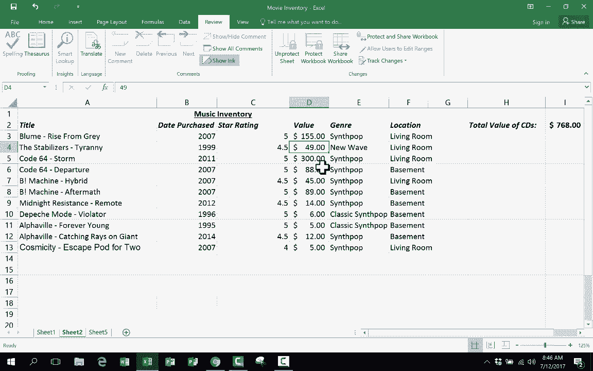

# Excel中级教程 - P26：26）🔒 保护工作表

在本节课中，我们将学习一个高级Excel技巧：如何保护工作表。通过这个功能，你可以允许他人在工作表的特定区域进行编辑，同时锁定其他所有内容，防止数据被意外修改或删除。

上一节我们介绍了其他数据管理技巧，本节中我们来看看如何精确控制工作表的编辑权限。

假设你有一个记录音乐收藏的工作表，你希望他人只能更新“当前价值”这一列的数据，而不能改动“艺术家”、“专辑名称”或“购买日期”等其他信息。以下是实现这一目标的具体步骤。

**第一步：选择允许编辑的单元格**

首先，你需要用鼠标点击并拖动，选中你希望允许他人编辑的单元格区域。在本例中，就是“当前价值”所在的列。

**第二步：取消选中单元格的“锁定”属性**

默认情况下，Excel中的所有单元格都是被“锁定”的。但这种锁定在激活工作表保护前并不生效。为了让选中的区域在保护后仍可编辑，你需要先将其属性改为“未锁定”。

1.  保持单元格区域的选中状态。
2.  在“开始”选项卡的“字体”组右下角，点击“设置单元格格式”启动按钮（一个小箭头图标）。
3.  在弹出的对话框中，切换到“保护”选项卡。
4.  你会看到“锁定”复选框默认是被勾选的。取消勾选它，然后点击“确定”。

现在，你选中的单元格已被设置为“未锁定”状态，而工作表中所有其他单元格仍保持“锁定”状态。

**第三步：启用工作表保护**

设置好单元格的锁定状态后，需要最后一步来激活整个保护机制。

1.  切换到“审阅”选项卡。
2.  在“更改”组中，找到并点击“保护工作表”按钮。
3.  系统会弹出一个对话框。你可以在这里设置一个密码（可选），以防止他人随意取消工作表保护。即使不设密码，保护功能同样生效。
4.  点击“确定”。如果设置了密码，系统会要求你再次输入以确认。

至此，工作表保护已启用。现在，当你尝试在未解锁的单元格（如“艺术家”或“专辑名称”）中输入内容时，Excel会弹出警告并阻止操作。而你设置为“未锁定”的“当前价值”单元格，则可以自由地进行编辑和更新。

本节课中我们一起学习了如何保护Excel工作表。其核心逻辑是**“先设置，后保护”**：首先将允许编辑的单元格**手动设置为“未锁定”**，然后通过“审阅”选项卡**启用“保护工作表”**功能。启用保护后，所有“锁定”的单元格将无法被编辑，而“未锁定”的单元格则保持可编辑状态。这个技巧非常适合在共享工作表时，保护核心数据不被误改。