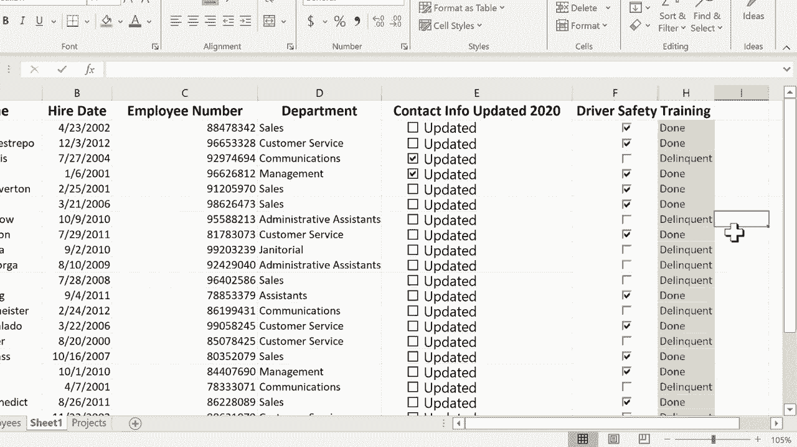

# Excel中级教程 - P29：使用复选框2 🎯


在本节课中，我们将学习如何基于复选框的“真/假”状态，使用IF函数和条件格式来创建更直观、更美观的数据展示效果。这是上一节“使用复选框”教程的延续。

上一节我们介绍了如何在Excel中创建和链接复选框，使其在单元格中显示“TRUE”或“FALSE”。本节中，我们来看看如何将这些逻辑值转化为更易读的文本，并利用条件格式实现视觉化提示。

## 使用IF函数转换复选框状态

首先，我们希望用自定义的文本（如“完成”或“拖欠”）来替代简单的“TRUE”或“FALSE”显示。

以下是具体操作步骤：

1.  在目标单元格（例如H2）中输入等号（`=`）以开始公式。
2.  输入IF函数并跟随左括号：`=IF(`。
3.  点击与复选框链接的单元格（例如G2）作为逻辑测试的条件。
4.  完成逻辑测试。例如，测试G2是否等于FALSE：`=IF(G2=FALSE,`。
5.  输入第一个逗号，它代表“那么”。
6.  在引号内输入当条件为真时要显示的文本，例如“拖欠”：`=IF(G2=FALSE, “拖欠”,`。
7.  输入第二个逗号，它代表“否则”。
8.  在引号内输入当条件为假时要显示的文本，例如“完成”：`=IF(G2=FALSE, “拖欠”, “完成”)`。
9.  输入右括号并按回车键完成公式。

**核心公式示例：**
```excel
=IF(G2=FALSE, “拖欠”, “完成”)
```

此公式的含义是：如果G2单元格的值为FALSE，则在当前单元格显示“拖欠”；否则，显示“完成”。

公式输入后，您可以使用自动填充手柄向下拖动，快速为其他行应用相同的逻辑。

## 优化表格布局

为了使表格更整洁，我们可以进行一些美化操作。

以下是具体操作步骤：

1.  选中包含复选框标签和结果文本的标题单元格（例如F1到H1）。
2.  点击“开始”选项卡中的“合并后居中”按钮，使标题在多个列上居中显示。
3.  右键点击包含“TRUE/FALSE”值的原始数据列（例如G列），选择“隐藏”。这样可以使界面更简洁，同时不影响公式的运行。

## 应用条件格式进行视觉提示

接下来，我们使用条件格式，根据“完成”或“拖欠”的文本，为单元格添加颜色高亮，使状态一目了然。

以下是具体操作步骤：

1.  选中包含状态文本的列（例如H列）。
2.  在“开始”选项卡的“样式”组中，点击“条件格式”。
3.  选择“突出显示单元格规则”，然后点击“文本包含”。
4.  在弹出的对话框中，输入文本“拖欠”，并在右侧下拉菜单中选择一个高亮样式（例如“浅红色填充深红色文本”），点击“确定”。
5.  重复步骤2-4，为包含文本“完成”的单元格设置另一个高亮规则（例如选择“绿填充色深绿色文本”）。

设置完成后，所有标记为“拖欠”的单元格将显示为红色，而“完成”的单元格将显示为绿色，实现了数据的视觉化区分。

## 总结



本节课中我们一起学习了如何深化复选框的应用。我们使用**IF函数**将复选框的逻辑值转换为更友好的自定义文本，并通过**条件格式**为这些文本添加颜色高亮，从而创建出一个信息清晰、视觉直观的数据表格。这些技巧能显著提升您表格的可读性和专业性。