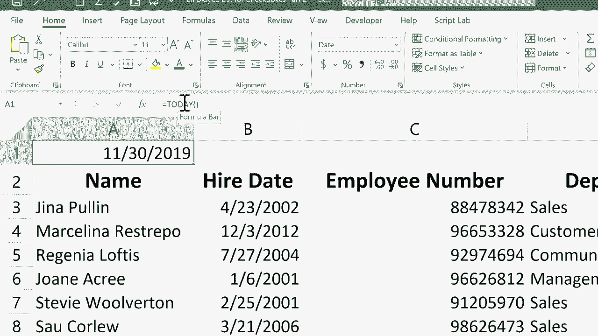

# Excel中级教程 (P30) 📅：快速输入当前日期和时间

在本节课中，我们将学习如何在Excel中快速输入静态的当前日期和时间。这与使用`TODAY()`函数不同，后者是动态更新的。我们将重点介绍两种键盘快捷键，它们能让你在单元格中快速插入不会自动改变的日期和时间戳。

在之前的教程中，我们介绍了如何使用`=TODAY()`公式来动态显示当前日期。这个公式会在每次打开工作簿时自动更新为当天日期。然而，在某些场景下，比如记录员工的入职日期，我们需要一个固定不变的日期，而不是一个动态变化的日期。

## 输入静态当前日期

如果你需要记录一个固定不变的当前日期，手动输入完整的日期（例如“11/30/2019”）虽然可行，但效率不高。以下是一种更快捷的方法。

以下是使用键盘快捷键输入静态当前日期的步骤：
1.  选中目标单元格。
2.  在键盘上同时按下 **Ctrl** 键和 **;**（分号）键。
3.  按下 **Enter** 键确认输入。

执行上述操作后，所选单元格中便会填入当天的日期，并且这个日期不会随时间的推移而改变。

## 输入静态当前时间

有时，除了日期，记录精确的时间也同样重要。例如，记录某个事件发生的具体时刻。Excel也为此提供了快捷方式。

以下是使用键盘快捷键输入静态当前时间的步骤：
1.  选中目标单元格。
2.  在键盘上同时按下 **Ctrl** 键、**Shift** 键和 **;**（分号）键。
3.  按下 **Enter** 键确认输入。

这样，当前时间就会被固定在该单元格中。

## 动态与静态的区别

理解动态日期/时间与静态日期/时间的区别至关重要。我们通过一个简单的对比来明确这一点。

*   **动态日期（使用`TODAY()`函数）**：公式为 `=TODAY()`。每次打开或重新计算工作簿时，单元格内容会自动更新为系统当前日期。
*   **静态日期/时间（使用快捷键）**：通过 **Ctrl+;** 或 **Ctrl+Shift+;** 输入的值是固定的文本或数值。它们一旦输入就不会自动改变，除非你手动进行修改。

例如，如果你在11月30日使用快捷键输入了日期和时间，那么即使在一周后打开文件，单元格仍然显示“11月30日”和“9:37”。

本节课中，我们一起学习了在Excel中快速输入静态日期和时间的两种核心快捷键：**Ctrl+;** 用于输入当前日期，**Ctrl+Shift+;** 用于输入当前时间。这些技巧对于需要记录固定时间戳的场景（如日志、入职日期、交易时间等）非常实用，能显著提升你的数据录入效率。

