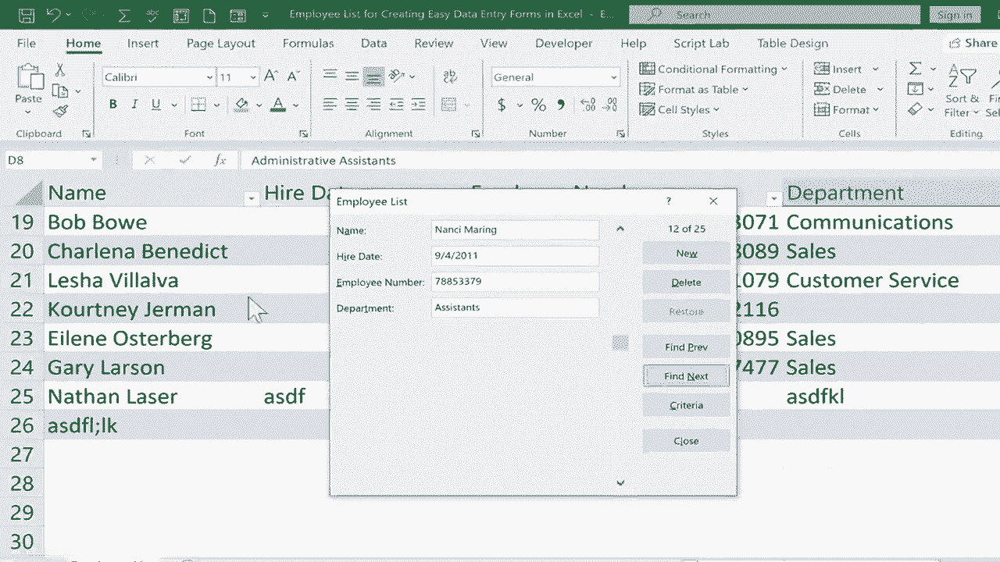

# Excel中级教程 - P31：创建简单的数据输入表单 📝

在本节课中，我们将学习如何在Excel中创建一个简单的数据输入表单。这种表单能极大地方便在表格中输入和浏览数据记录，尤其适用于处理多列或多行数据的情况。

假设你有一个员工名单，需要录入姓名、入职日期、员工编号和部门等信息。手动在单元格间切换输入不仅效率低下，还容易出错。通过本教程介绍的数据输入表单，你可以更直观、更准确地进行数据录入。

## 第一步：将“表单”功能添加到快速访问工具栏

首先，我们需要将“表单”工具添加到Excel的快速访问工具栏，以便快速调用。

快速访问工具栏位于Excel窗口左上角，你可以将常用功能添加至此。

以下是添加“表单”功能的步骤：

1.  点击快速访问工具栏右侧的“自定义快速访问工具栏”下拉按钮。
2.  在弹出的菜单底部，选择“其他命令”。
3.  在打开的“Excel选项”对话框中，从“从下列位置选择命令”的下拉菜单中选择“不在功能区中的命令”。
4.  在左侧的命令列表中，找到并选中“表单”。
5.  点击“添加”按钮，将其移到右侧的列表中。
6.  点击“确定”按钮关闭对话框。

现在，“表单”按钮已经出现在你的快速访问工具栏中。

## 第二步：将数据区域转换为表格

使用数据输入表单有一个前提：你的数据必须位于一个Excel表格中。因此，我们需要先将普通的数据区域转换为表格格式。

转换方法非常简单：

1.  单击数据区域内的任意一个单元格。
2.  按下快捷键 **`Ctrl + T`**。
3.  在弹出的“创建表”对话框中，确认Excel自动选取的数据范围是否正确（通常都是正确的），并确保勾选了“表包含标题”选项。
4.  点击“确定”。

此时，你的数据区域就变成了一个带有筛选按钮和特定样式的表格。

## 第三步：使用数据输入表单

数据转换为表格后，就可以使用表单功能了。

1.  确保光标位于表格内的任意单元格。
2.  点击快速访问工具栏上刚刚添加的“表单”按钮。

一个独立的表单窗口将会弹出。窗口左侧会垂直显示当前记录（即一行数据）的所有字段，这比在横向的单元格中查看要清晰得多。窗口右侧则提供了一系列操作按钮。

以下是表单窗口中各按钮的功能说明：

*   **新建**：清空表单，准备输入一条全新的记录。输入完成后按回车键，数据会自动添加到表格末尾。
*   **删除**：永久删除当前表单中显示的记录。操作前会弹出确认对话框。
*   **还原**：撤销在当前记录表单中所做的、尚未保存（即未按回车或点击“新建”）的任何修改。
*   **上一条**：查看表格中的前一条记录。
*   **下一条**：查看表格中的后一条记录。
*   **条件**：用于查找特定记录。点击后，可以在表单字段中输入查找条件（如部门为“销售”），然后按回车键，表单会定位到第一条匹配的记录。使用“上一条”或“下一条”可以浏览所有匹配的记录。
*   **关闭**：关闭表单窗口。

**使用技巧**：在表单中输入日期时，可以按快捷键 **`Ctrl + ;`** 快速输入当前日期。

## 总结

本节课我们一起学习了在Excel中创建和使用数据输入表单的方法。

我们首先将“表单”功能添加到快速访问工具栏，然后将数据区域转换为表格，最后利用表单进行高效的数据录入、浏览、查找和修改。

这个功能特别适合需要频繁录入多列数据的场景，它能将横向的数据输入转变为更符合阅读习惯的纵向表单，有效减少错误并提升工作效率。

