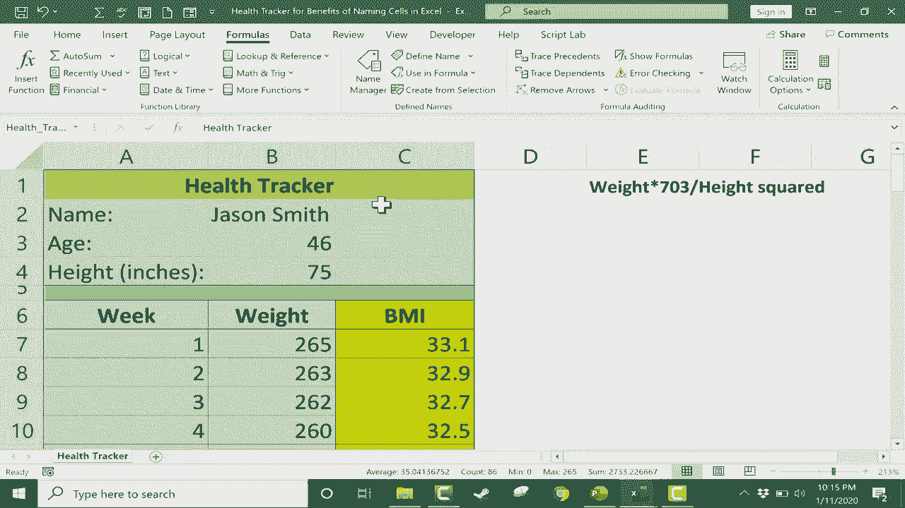

# Excel中级教程 - P33：命名单元格的好处 📊

在本节课中，我们将学习在Excel中为单元格或单元格区域命名的好处。命名单元格可以使公式更易读、更易维护，并有助于避免在复制公式时出现引用错误。

## 概述

我们将通过一个简单的健康追踪器示例，演示如何为单元格命名、命名时的规则，以及命名如何简化公式编写和数据管理。

---

## 创建示例与初始问题

假设我们是一名私人教练，需要为学员杰森·史密斯创建一个健康追踪器。我们已记录了他的姓名、年龄和身高（英寸）。

现在需要计算他的身体质量指数。BMI的计算公式（使用英寸和磅为单位）是：
`BMI = (体重 × 703) / (身高²)`

我们需要在Excel中重建这个公式。

首先，点击目标单元格，输入等号`=`开始公式。
1.  点击体重所在的单元格（例如C7）。
2.  输入乘号`*`和数字`703`。
3.  输入除号`/`。
4.  点击身高所在的单元格（例如B4）。
5.  输入幂运算符`^`（通过按**Shift+6**输入）。
6.  输入数字`2`表示平方。
7.  按回车完成公式。

输入体重值（例如265）后，公式会计算出BMI结果。

但是，当我们尝试使用**自动填充手柄**将公式拖动到下一周时，出现了问题。公式中身高的引用（B4）自动变成了B5，导致计算错误。这是因为默认的单元格引用是相对的。

## 为单元格命名

解决上述问题的一个有效方法是为关键单元格命名。

以下是命名单元格的两种主要方法：

**方法一：使用名称框**
1.  选中需要命名的单元格（例如包含身高的B4单元格）。
2.  查看工作表左上角的**名称框**，它当前显示为“B4”。
3.  高亮显示“B4”，直接输入新名称（例如“身高”）。
4.  **关键步骤**：输入后必须按**回车键**确认。

**方法二：使用“公式”选项卡**
1.  选中需要命名的单元格。
2.  转到“公式”选项卡。
3.  在“定义的名称”组中，点击“定义名称”。
4.  在弹出的对话框中，“名称”字段会自动建议一个名称（如“年龄”），你可以修改它。
5.  可以设置名称的适用范围（整个工作簿或特定工作表）并添加注释。
6.  点击“确定”。

为身高和年龄等单元格命名后，可以通过点击名称框旁边的箭头，或通过“公式”选项卡下的“名称管理器”来查看和管理所有已定义的名称。

## 命名规则与注意事项

在Excel中命名单元格时，需要遵循以下规则：
*   **必须以字母开头**：名称不能以数字或符号（如@、#、$）开头。
*   **不能包含空格**：如果需要分隔单词，请使用下划线`_`（按**Shift+减号键**）。
*   **避免与单元格地址重复**：不要使用像“B3”、“F10”这样的名称，以免与单元格引用混淆。
*   **避免使用特殊字符**：除下划线外，通常不建议使用其他特殊字符。

## 在公式中使用命名单元格

现在，我们重写BMI公式，使用命名单元格代替直接的单元格地址。

1.  在公式中，当需要引用身高时，不再点击B4单元格，而是直接输入我们定义的名称“**身高**”。
2.  在输入过程中，Excel的自动完成功能会提示“身高”这个名称，可以双击选择。
3.  完整的公式看起来像这样：`=C7*703/身高^2`
4.  按回车确认。

此时，再使用自动填充手柄向下复制公式，你会发现公式可以正确计算每一周的BMI了。这是因为命名单元格创建了**绝对引用**，无论公式被复制到哪里，它都始终指向名为“身高”的那个特定单元格。

## 命名单元格区域及其他用途

除了单个单元格，还可以为整个单元格区域命名。

1.  用鼠标拖动选中需要命名的区域（例如A1到C59）。
2.  在“公式”选项卡中点击“定义名称”。
3.  输入名称（例如“HealthTracker”），并点击确定。

命名区域有诸多便利：
*   **快速导航与选择**：在名称框下拉列表中选择区域名称，即可快速选中该区域所有单元格。
*   **简化公式**：在公式中可以直接使用区域名称。
*   **便捷打印**：选中命名区域后，进入“文件”->“打印”，在设置中选择“打印选定区域”，即可只打印该部分内容，无需手动调整打印范围。

## 总结

本节课我们一起学习了Excel中命名单元格的核心技巧。
*   我们了解了通过**名称框**和**“公式”选项卡**为单元格命名的方法。
*   我们掌握了命名时必须遵守的**规则**，如以字母开头、不含空格等。
*   我们实践了在公式中**使用命名单元格**，这使公式更易读，并解决了复制公式时引用错误的问题。
*   最后，我们还探索了为**单元格区域命名**的进阶功能，它能提升数据管理和打印的效率。

合理使用单元格命名，能让你的电子表格更加清晰、专业且易于维护。