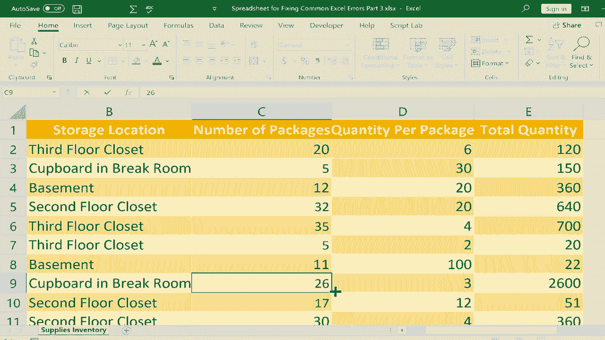

# Excel中级教程 - P35：修复常见错误3 - REF 和 VALUE 🔧

在本节课中，我们将学习如何识别和修复Excel中两种常见的错误类型：**#REF!**（引用错误）和**#VALUE!**（值错误）。理解这些错误的成因是有效排查和解决问题的关键。

上一节我们介绍了其他类型的公式错误，本节中我们来看看当公式引用失效或数据类型不匹配时会发生什么。

## 理解 #REF! 引用错误

**#REF!** 错误通常发生在公式引用的单元格被删除或移动，导致Excel找不到原始数据源时。

### 错误成因与修复演示

以下是引用错误的典型场景：

*   **删除整列或整行**：假设我们有一个计算总电池数量的公式 `=C2*D2`。如果认为C列或D列数据不必要而将其整列删除，公式将失去引用目标，从而显示 `#REF!`。
    *   **修复方法**：使用 `Ctrl + Z` 撤销删除操作是最快的方法。若需保留删除操作，则必须手动编辑公式，将其更新为有效的单元格引用。

*   **删除单个单元格**：右键删除某个被引用的单元格（如C2），并选择“下方单元格上移”时，公式 `=C2*D2` 可能被破坏，因为原始的C2已不存在。
    *   **修复方法**：同样可以撤销操作，或双击错误单元格，在公式栏中将引用修正为当前正确的单元格地址。

> **核心概念**：`#REF!` 错误意味着公式中的某个引用（如 `A1`、`Sheet2!B5`）指向了一个不再存在的区域。

## 理解 #VALUE! 值错误

**#VALUE!** 错误通常发生在公式试图对不兼容的数据类型执行运算时，例如将文本与数字相加或相乘。

### 常见触发场景

以下是导致值错误的几种常见情况：

*   **文本与数字进行数学运算**：例如，公式 `=B2*D2` 中，如果B2是文本“储藏室”，而D2是数字6，Excel无法将文本转换为数值进行计算，因此返回 `#VALUE!`。
    *   **修复方法**：检查并确保参与数学运算的单元格都是数值格式。将文本内容改为数字，或引用正确的数值单元格。

*   **数字中含有不可见字符**：输入数字“11”时，若不小心加入空格（如“11 ”），Excel会将其视作文本，导致在公式计算中出现 `#VALUE!` 错误。
    *   **修复方法**：清除单元格中的空格或其他不可见字符。可以使用 `TRIM()` 函数或查找替换功能（将空格替换为空）。

*   **数字被误输入为字母**：在输入数字“30”时，误将数字“0”输入为字母“O”，导致“3O”被识别为文本，从而引发错误。
    *   **修复方法**：仔细检查并更正输入错误，将字母替换为正确的数字。

*   **数字与特殊符号混合输入**：直接在单元格中输入“#28”或“$28”（而非通过单元格格式设置货币），Excel可能无法将其识别为纯数字，进而在计算中报错。
    *   **修复方法**：避免在数值中手动输入符号。如需显示货币符号，应选中单元格后，在“开始”选项卡的“数字”格式组中选择相应的格式（如货币）。

> **核心概念**：`#VALUE!` 错误常源于数据类型冲突。确保公式 `=A1+B1` 中的 `A1` 和 `B1` 都是可计算的数值或能被隐式转换为数值的数据。

## 总结与排查思路

本节课中我们一起学习了 `#REF!` 和 `#VALUE!` 两种错误。

*   当遇到 **`#REF!`** 错误时，应检查公式中的单元格引用是否因删除、剪切或移动操作而失效，并修正引用地址。
*   当遇到 **`#VALUE!`** 错误时，应重点检查公式所引用的单元格内容，确保参与运算的数据类型是兼容且正确的（如数字、日期），并清除文本数字中的多余空格或错误字符。

养成在修改工作表结构（如删除行列）后检查相关公式的习惯，并在输入数据时确保其格式的纯净性，可以极大地减少这两类错误的发生。