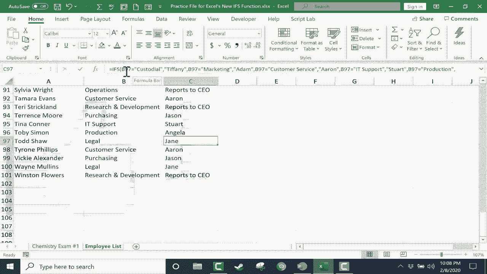

# Excel中级教程 - P36：使用新的IFS函数 📊


在本教程中，我们将学习Excel中一个令人兴奋的新函数：`IFS`。这个函数首次出现在Excel 2019和Office 365中，它提供了一种更简洁、更直观的方式来处理多个条件判断。在深入了解`IFS`函数之前，我们先回顾一下Excel中使用了多年的传统`IF`函数。

## 回顾传统IF函数

假设我们有一个学生成绩表，包含学生编号、姓名和考试分数。我们希望根据分数自动判断学生是否通过考试。

以下是使用传统`IF`函数的方法：

第一步是选择一个单元格，输入公式。例如，在E2单元格输入：
```excel
=IF(D2>59, "Pass", "Fail")
```
这个公式的逻辑是：测试D2单元格的分数是否大于59。如果为真，则显示“Pass”；如果为假，则显示“Fail”。输入完成后按回车键，然后可以使用自动填充功能将公式应用到整列。

然而，传统`IF`函数在处理多个条件时存在局限性。例如，如果我们想根据分数划分更详细的等级（如A、B、C等），就需要使用嵌套的`IF`函数，这会使公式变得复杂且难以理解。

## 引入IFS函数

为了解决嵌套`IF`函数的复杂性，Excel引入了`IFS`函数。`IFS`函数允许你在一个公式中按顺序测试多个条件，并返回第一个为真的条件对应的值。

让我们使用`IFS`函数来为学生的分数划分字母等级。

首先，点击E2单元格，输入以下公式：
```excel
=IFS(D2>92, "A", D2>89, "A-", D2>84, "B+", D2>79, "B", D2>74, "B-", D2>69, "C+", D2>64, "C", D2>59, "C-", D2<58, "F")
```
这个公式按顺序检查分数是否满足各个条件。如果第一个条件（D2>92）为真，则返回“A”，并停止检查后续条件。如果第一个条件为假，则检查第二个条件（D2>89），依此类推。

输入公式后按回车键，然后双击自动填充手柄，将公式应用到所有学生。这样，每个学生都会根据其分数获得相应的字母等级。

## 处理未覆盖的情况

在使用`IFS`函数时，有时可能遇到所有条件都不满足的情况。例如，如果一个学生没有参加考试，分数单元格可能是空的或标记为“N/A”。这时，公式可能返回错误或不正确的结果。

为了解决这个问题，可以在`IFS`公式的末尾添加一个强制为真的条件。例如：
```excel
=IFS(D2>92, "A", D2>89, "A-", D2>84, "B+", D2>79, "B", D2>74, "B-", D2>69, "C+", D2>64, "C", D2>59, "C-", D2<58, "F", TRUE, "未参加测试")
```
在这个公式中，`TRUE`作为一个始终为真的条件，如果前面的所有条件都不满足，则返回“未参加测试”。

## IFS函数的另一个应用示例

`IFS`函数不仅适用于数字，也适用于文本条件。例如，假设我们有一个员工列表，需要根据部门自动显示主管姓名。

在C2单元格输入以下公式：
```excel
=IFS(B2="清洁", "Tiffany", B2="市场部", "David", B2="客户服务", "Sarah", TRUE, "不可用")
```
这个公式检查B2单元格的部门名称，并返回对应的主管姓名。如果部门不在列表中，则返回“不可用”。

输入公式后按回车键，并使用自动填充功能应用到所有员工。这样，每个员工的主管信息都会自动显示。

## 总结

本节课我们一起学习了Excel中的`IFS`函数。通过与传统`IF`函数的对比，我们了解到`IFS`函数在处理多个条件判断时更加简洁和直观。我们还学习了如何使用`IFS`函数为学生的分数划分等级，以及如何根据员工的部门自动显示主管信息。最后，我们探讨了如何处理未覆盖的情况，通过在公式末尾添加强制为真的条件来确保公式的完整性。

`IFS`函数是Excel中一个强大的工具，可以显著提高数据处理的效率和可读性。希望本教程对你有所帮助！



