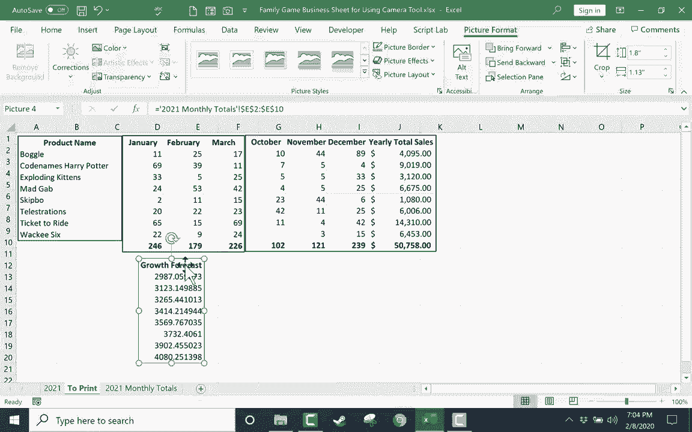

# Excel中级教程 - P38：使用相机工具 📸

在本节课中，我们将学习如何使用Excel中一个非常便捷但常被忽略的功能——**相机工具**。这个工具能帮助你“拍摄”电子表格中任意区域的动态快照，并将它们组合到同一张工作表上，方便打印、展示或制作报告。

---

## 概述

相机工具并非生成静态图片，而是创建一个与源数据**动态链接**的图片对象。这意味着当源数据更新时，所有“快照”中的内容也会自动更新。这对于制作包含多个表格或图表摘要的报告页非常有用。

---

## 第一步：将相机工具添加到快速访问工具栏

默认情况下，相机工具不在功能区中。我们需要手动将其添加到快速访问工具栏。

上一节我们介绍了相机工具的基本概念，本节中我们来看看如何找到并启用它。

1.  在Excel窗口的左上角，找到**快速访问工具栏**。
2.  点击工具栏右侧的**向下箭头**（自定义快速访问工具栏按钮）。
3.  在下拉菜单中，选择 **“更多命令…”**。
4.  在弹出的“Excel选项”对话框中，将“从下列位置选择命令”的下拉菜单改为 **“所有命令”**。
5.  在长长的命令列表中，向下滚动找到 **“相机”**。
6.  选中“相机”命令，点击 **“添加 >>”** 按钮，将其移到右侧的列表中。
7.  点击 **“确定”** 按钮。

现在，相机工具的图标就会出现在你的快速访问工具栏上了。

---

## 第二步：使用相机工具拍摄动态快照

现在我们已经将相机工具准备就绪，本节中我们来看看如何使用它来“拍摄”数据。

以下是使用相机工具的基本步骤：

1.  在源工作表中，**选中**你想要拍摄的单元格区域（例如，一个表格或一个图表）。
2.  点击快速访问工具栏上的 **相机图标**。此时，鼠标指针会变成一个十字准线。
3.  切换到目标工作表（可以新建一个，例如命名为“报告”或“打印”）。
4.  在目标工作表的任意位置**单击一下**。你选中的区域就会以一张“图片”的形式粘贴出来。
5.  你可以**拖动**这张图片来调整位置，或拖动其**边角**来调整大小。

---

## 第三步：理解动态链接与打印应用

这个工具最强大的地方在于其动态链接特性。它不仅仅是截图。

假设你的源数据发生了变化：
*   在源表格中修改任意数字。
*   然后切换到存放“相机快照”的工作表。
*   你会看到，快照中的**数据也随之自动更新了**。

这使它成为制作动态报告的神器。你可以将分散在不同工作表、甚至不同工作簿中的关键信息，汇总到一页上。

以下是利用此功能制作可打印报告页的流程：

1.  新建一个工作表，专门用于整合内容（例如命名为`Print_View`）。
2.  使用相机工具，将各个工作表中需要展示的部分依次“拍摄”并粘贴到此工作表。
3.  排列好这些图片对象，使其布局清晰。
4.  进入 **“文件” > “打印”**，或按快捷键 `Ctrl + P` 预览打印效果。
5.  根据需要调整纸张方向（纵向/横向）或边距，使所有内容适配在一页纸上。
6.  你可以直接打印，也可以选择 **“打印到PDF”**，生成一个便于分享的电子文件。

---

## 总结

本节课中我们一起学习了Excel相机工具的核心用法：
1.  **添加工具**：通过自定义快速访问工具栏，从“所有命令”中添加“相机”功能。
2.  **拍摄快照**：选中区域 → 点击相机图标 → 在目标位置单击粘贴。
3.  **利用特性**：理解其**动态链接**的特性，源数据变，快照内容也变。
4.  **实际应用**：将多个数据区域整合到单一工作表，方便制作报告、打印或导出PDF。

通过这个简单而强大的工具，你可以轻松地创建出专业、整洁且能自动更新的数据摘要页面。