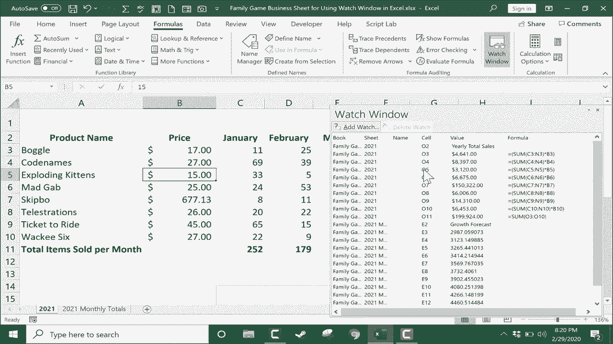

# Excel中级教程 (P39) 👁️：使用监视窗口

在本节课中，我们将学习如何在Excel中设置和使用“监视窗口”。这个工具能帮助你实时监控特定单元格或区域的数据变化，尤其适用于分析大型或复杂电子表格中数据变动的影响。

## 概述：什么是监视窗口？

监视窗口是一个浮动面板，可以持续显示你选定单元格的当前值、公式及其位置。无论你滚动到工作表的哪个位置，这个窗口都会保持可见，让你能轻松追踪关键数据的变化。

上一节我们介绍了其他数据追踪工具，本节中我们来看看如何利用监视窗口来聚焦于重要的计算结果。

## 第一步：选择要监视的单元格

首先，你需要选定希望持续关注的单元格或单元格区域。

以下是如何操作：
1.  点击目标单元格。
2.  如果需要监视一个区域，按住鼠标左键并拖动以选择该区域。
3.  松开鼠标按钮完成选择。

## 第二步：打开并添加监视窗口

选择好区域后，接下来需要调出监视窗口并添加监视。

以下是具体步骤：
1.  转到顶部菜单栏的 **“公式”** 选项卡。
2.  在 **“公式审核”** 功能区组中，找到并点击 **“监视窗口”** 按钮。
3.  此时会弹出一个空白的“监视窗口”面板。
4.  在面板中，点击 **“添加监视...”** 按钮。
5.  Excel会自动填入你之前选定的单元格地址，确认无误后点击 **“添加”**。

> **注意**：监视窗口功能在大多数现代Windows版Excel中可用，但在Excel for Mac版本中可能不包含此功能。

## 监视窗口面板详解

成功添加后，监视窗口会显示所选单元格的详细信息。

面板中通常包含以下几列信息：
*   **工作簿**：显示数据所在的工作簿名称。
*   **工作表**：显示数据所在的具体工作表名称。
*   **名称**：如果单元格已被命名，则显示名称；否则显示单元格地址（如 `A1`）。
*   **值**：显示该单元格当前的计算结果或数值。
*   **公式**：显示该单元格中包含的公式（如果有）。

## 实战应用：实时观察数据变动

设置好监视窗口后，你就可以开始进行数据分析。例如，你可以更改原始数据表中的某个价格或数量，同时观察监视窗口中“年度总销售额”等关键指标的变化。

这种实时反馈让你能直观地看到输入变量的改变如何影响最终结果，而无需在表格的不同部分之间来回滚动和查找。

## 高级技巧：跨工作表/工作簿监视

监视窗口的强大之处在于它能同时监视来自不同位置的数据。

如果你想监视另一个工作表甚至另一个工作簿中的数据，请按以下步骤操作：
1.  切换到目标工作表或工作簿。
2.  选择新的要监视的单元格区域。
3.  在已打开的“监视窗口”面板中，再次点击 **“添加监视...”**。
4.  确认新的单元格引用，然后点击 **“添加”**。

现在，你的监视窗口列表中就会同时显示来自不同来源的数据，方便你进行综合比对和分析。

## 管理监视窗口

当你不再需要监视某些数据时，可以对其进行管理。

以下是管理监视项的方法：
*   **删除监视**：在“监视窗口”列表中选中某一项，然后点击 **“删除监视”** 按钮即可将其移除。
*   **关闭窗口**：直接点击窗口右上角的关闭按钮（`X`），即可关闭监视窗口面板。这不会删除已添加的监视项。
*   **重新打开**：当你下次从“公式”选项卡再次点击“监视窗口”按钮时，面板会重新打开，并保留之前添加的所有监视项。

## 总结

本节课中我们一起学习了Excel“监视窗口”功能的使用方法。我们掌握了如何添加监视以实时追踪关键数据的变化，如何解读监视面板中的信息，以及如何跨区域管理多个监视项。这个工具对于分析大型表格、进行假设分析或调试复杂公式尤为有用，能显著提升你的工作效率和数据洞察力。