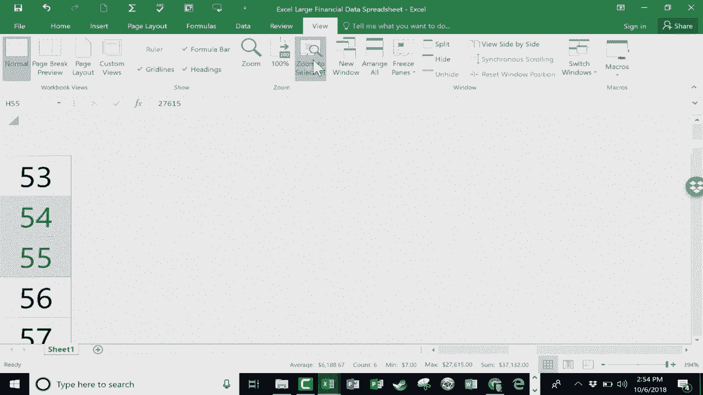

# Excel中级教程 (P4) 🧭：电子表格中的导航技巧

在本节课中，我们将学习如何在包含大量数据的Excel电子表格中进行高效导航。当处理成百上千条记录时，快速定位和查看数据的不同部分至关重要。我们将介绍几种实用的视图调整和快速跳转方法。

## 调整视图缩放

上一节我们介绍了导航的重要性，本节中我们来看看如何调整视图以快速了解数据全貌。

在Excel窗口的右下角，有一个视图缩放滑块。通过拖动此滑块，可以快速调整工作表的显示比例。缩小视图有助于观察数据的整体布局和范围。

**注意**：当视图缩小时，如果列宽不足以显示所有内容，单元格内可能会出现 `#####` 符号。这仅表示显示问题，数据本身并未丢失。只需再次放大视图，这些符号便会消失。

另一种调整缩放的方法是：按住键盘上的 `Ctrl` 键，同时滚动鼠标滚轮。向上滚动为放大，向下滚动为缩小。

## 使用快捷键快速跳转

了解整体布局后，我们常常需要在表格的特定位置间快速移动。以下是实现快速跳转的几种方法。

以下是两种常用的键盘快捷键：
*   **Ctrl + End**：跳转到当前数据区域的右下角（即最后一个包含数据的单元格）。
*   **Ctrl + Home**：跳转到工作表的左上角（A1单元格）。

## 巧用双击边缘导航

除了快捷键，还有一个高效且精准的导航技巧：双击单元格边缘。

此方法可以让你在当前列内快速跳转，而不会像 `Ctrl+End` 那样移动到其他列。
*   将鼠标指针放在当前单元格的**下边框**上，待指针变为十字箭头时**快速双击**，即可跳转到该列连续数据区域的**底部**。
*   将鼠标指针放在当前单元格的**上边框**上，待指针变为十字箭头时**快速双击**，即可跳转到该列连续数据区域的**顶部**。

## 缩放至选定区域

最后，当你需要专注于表格的某个特定部分时，可以使用“缩放到选定区域”功能。

操作步骤如下：
1.  用鼠标选中你希望重点查看的单元格区域。
2.  在Excel菜单栏中找到“视图”选项卡。
3.  点击“缩放到选定区域”按钮。

执行后，视图将自动放大，使你选定的区域尽可能填满整个窗口，方便你进行细致的查看或编辑。

---

本节课中我们一起学习了在Excel中高效导航的四个核心技巧：**调整视图缩放**、**使用快捷键跳转**、**双击单元格边缘**以及在特定区域**缩放至选定区域**。掌握这些方法能帮助你在处理大型电子表格时更加得心应手，提升工作效率。