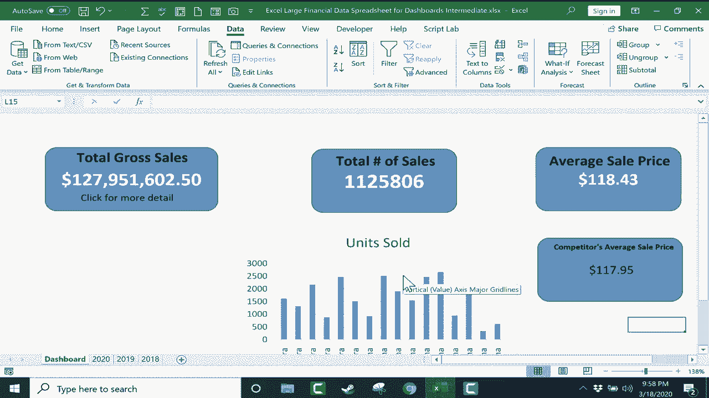

# Excel中级教程 - P40：Excel仪表板中级指南 📊

在本节课中，我们将学习如何为Excel仪表板添加交互功能和美化外观，并掌握如何从外部工作簿中提取数据，以创建一个更专业、更实用的数据看板。

---

## 仪表板功能增强与美化

上一节我们介绍了仪表板的基础搭建。本节中，我们来看看如何为其添加超链接和图表，并优化其视觉呈现。

### 添加超链接以实现数据钻取

仪表板上的汇总数据有时需要查看其背后的明细。添加超链接可以快速跳转到对应的源数据工作表。

以下是添加超链接的步骤：

1.  在 **“插入”** 选项卡的 **“文本”** 组中，点击 **“文本框”**，在仪表板上绘制一个文本框并输入提示文字（例如：“点击获取更多细节”）。
2.  选中文本框中的文字，在 **“插入”** 选项卡的 **“链接”** 组中，点击 **“链接”** 按钮。
3.  在弹出的对话框中，选择 **“本文档中的位置”**。
4.  在右侧列表中选择目标工作表（例如：“2020”），并在 **“请键入单元格引用”** 框中输入要跳转到的具体单元格（例如：`H1`）。
5.  点击 **“确定”** 完成设置。点击该文本即可跳转到指定位置。

### 插入图表以可视化数据

图表能让数据趋势一目了然。你可以将图表从数据源工作表添加到仪表板。

以下是添加图表的步骤：

1.  在源数据工作表中，按住 `Ctrl` 键选择需要图表化的数据区域（例如：产品名称和销售数量）。
2.  按快捷键 `Alt + F1`，快速创建一个嵌入式图表。
3.  右键点击该图表，选择 **“剪切”**。
4.  切换到仪表板工作表，在目标位置右键点击并选择 **“粘贴”**。调整图表的位置和大小。

### 优化界面以提升视觉效果

一个简洁的界面能让仪表板更专业，减少干扰。

以下是优化界面的方法：

1.  隐藏网格线和标题：在 **“视图”** 选项卡的 **“显示”** 组中，取消勾选 **“网格线”** 和 **“标题”**。
2.  隐藏编辑栏：在 **“视图”** 选项卡的 **“显示”** 组中，取消勾选 **“编辑栏”**。
3.  折叠功能区：点击Excel窗口右上角的 **“功能区显示选项”** 按钮（🔽），选择 **“自动隐藏功能区”**。需要时可点击顶部绿色区域临时显示。
4.  调整缩放比例：使用窗口右下角的缩放滑块，调整仪表板的显示比例，使其布局更协调。

---

## 链接外部工作簿数据

上一节我们美化了仪表板界面。本节中，我们来学习如何从另一个独立的Excel工作簿中提取并显示数据。

### 建立跨工作簿的数据链接

这种方法可以整合来自不同文件的数据。

以下是链接外部数据的步骤：

1.  在仪表板上，准备一个用于显示外部数据的文本框或形状。
2.  选中该对象，在编辑栏中输入等号 `=` 以开始公式。
3.  使用 `Alt + Tab` 快捷键切换到已打开的目标工作簿窗口。
4.  点击目标工作簿中想要引用的单元格，然后按 `Enter` 键。
5.  公式将显示为类似 `=[CompetitorData.xlsx]Sheet1!$A$1` 的格式，仪表板上会立即显示该单元格的值。

### 管理与更新外部链接

当源文件位置变化或需要更新时，需要管理这些外部链接。

以下是管理外部链接的方法：

1.  在包含链接的工作簿中，进入 **“数据”** 选项卡。
2.  在 **“查询和连接”** 组中，点击 **“编辑链接”**。
3.  在弹出的对话框中，会列出所有外部链接。你可以进行以下操作：
    *   **检查状态**：查看链接是否有效。
    *   **更新值**：手动刷新数据。
    *   **更改源**：如果源文件移动了位置，可以在此重新定位。
    *   **打开源**：直接打开被链接的源工作簿。

---

## 课程总结

本节课中我们一起学习了Excel仪表板的中级技巧。我们掌握了如何通过**超链接**实现数据钻取，如何插入**图表**增强可视化，以及如何通过隐藏网格线、调整缩放等操作**优化界面**。最后，我们重点学习了如何从**外部工作簿链接数据**（`=[FileName.xlsx]SheetName!CellReference`）并管理这些链接，从而构建一个功能更强大、数据源更丰富的动态仪表板。