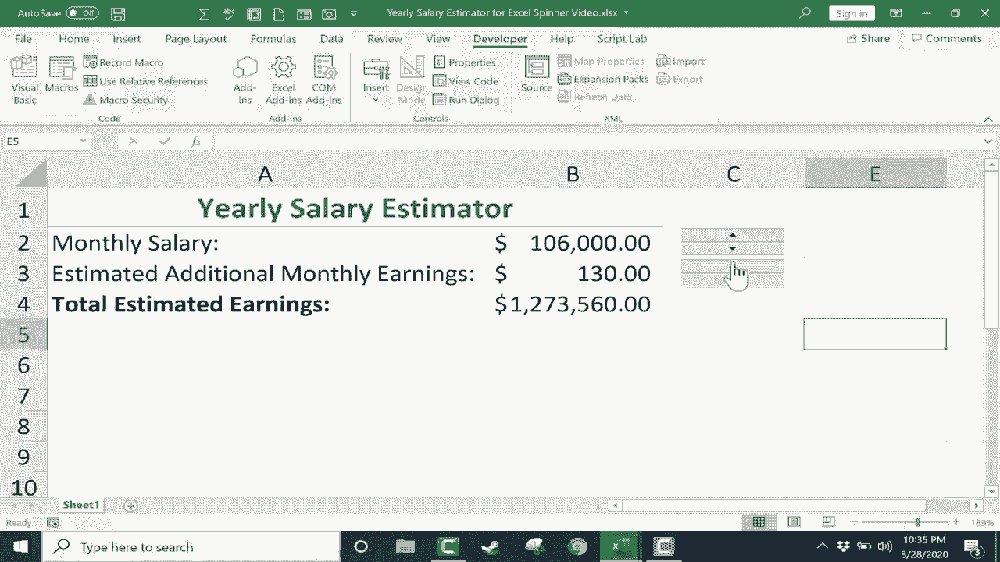

# Excel中级教程 - P41：使用旋转按钮 📊

在本节课中，我们将学习如何在Excel中使用一个名为“旋转按钮”的表单控件。这个控件也被称为“微调器”，它允许用户通过点击按钮来调整单元格中的数值，而无需手动输入。我们将从启用开发者选项卡开始，逐步学习如何插入、设置和使用旋转按钮，并解决其数值范围的限制问题。

## 启用开发者选项卡 🔧

在开始使用旋转按钮之前，需要确保Excel的功能区中显示了“开发者”选项卡。

以下是启用步骤：
1.  点击“文件”菜单。
2.  选择“选项”。
3.  在弹出的“Excel选项”对话框中，点击“自定义功能区”。
4.  在右侧的“主选项卡”列表中，找到并勾选“开发者”复选框。
5.  点击“确定”。

完成上述步骤后，“开发者”选项卡将出现在Excel的功能区中。

## 插入与调整旋转按钮 ➕

上一节我们介绍了如何启用开发者选项卡，本节中我们来看看如何插入和调整旋转按钮控件。

以下是具体操作：
1.  点击“开发者”选项卡。
2.  在“控件”组中，点击“插入”。
3.  在“表单控件”区域，选择“旋转按钮”（图标通常为上下箭头）。
4.  此时鼠标指针会变成加号，在表格中点击并拖动，即可绘制一个旋转按钮。
5.  绘制完成后，可以拖动按钮来移动位置。
6.  要调整大小，可以点击按钮边缘的控制柄进行拖动。若想等比例缩放，可在拖动时按住 `Ctrl` 键。

## 设置旋转按钮 ⚙️

现在我们已经插入了旋转按钮，但点击它还没有任何效果。为了使按钮能够控制单元格的数值，我们需要对其进行设置。

以下是设置步骤：
1.  右键单击旋转按钮。
2.  在弹出的菜单中选择“设置控件格式”。
3.  在打开的对话框中，切换到“控制”选项卡。
4.  设置以下参数：
    *   **当前值**：旋转按钮链接的单元格的初始值，例如 `0`。
    *   **最小值**：旋转按钮可调节到的最小值，例如 `0`。
    *   **最大值**：旋转按钮可调节到的最大值，例如 `25000`。
    *   **步长**：每次点击按钮时数值的变化量，例如 `100`。
    *   **单元格链接**：点击右侧的折叠按钮，选择希望用旋转按钮控制的单元格（例如 `$B$2`），然后点击按钮返回对话框。
5.  点击“确定”完成设置。

设置完成后，点击工作表其他区域，再点击旋转按钮的上下箭头，即可看到链接单元格的数值随之变化。

## 应用实例：薪资估算器 💰

让我们通过一个简单的“年度薪资估算器”实例来应用旋转按钮。

假设我们有一个表格：
*   B2单元格：月薪
*   B3单元格：额外月收入
*   B4单元格：总估算年薪，其公式为 `=(B2+B3)*12`

我们希望用户通过旋转按钮来调整B2（月薪）和B3（额外月收入）的值，而不是手动输入。

操作步骤如下：
1.  为“月薪”（B2单元格）插入并设置一个旋转按钮（方法同上），将“单元格链接”指向 `$B$2`。
2.  为“额外月收入”（B3单元格）再设置一个旋转按钮。可以复制第一个按钮，然后右键单击新按钮，修改“设置控件格式”，将“单元格链接”改为 `$B$3`，并根据需要调整“步长”（例如设为 `10`）。
3.  点击旋转按钮，B2和B3的数值会变化，B4的总年薪公式会自动计算结果。

## 突破数值限制的技巧 🚀

在设置旋转按钮时，你可能会发现“最大值”被限制在30000。如果我们需要控制更大的数值，可以使用一个简单的数学技巧。

以下是解决方法：
1.  假设我们想用旋转按钮控制B2单元格（月薪），目标范围是0到100,000。
2.  我们先将旋转按钮链接到一个辅助单元格，例如D2。
3.  在旋转按钮的“设置控件格式”中，将“最大值”设为 `100`（因为30000的限制，我们无法直接设为100000），“步长”设为 `1`。
4.  在B2单元格中输入公式：`=D2*1000`。
    *   这个公式意味着：辅助单元格D2中的每个“1”，代表B2单元格中的1000。
    *   因此，当D2通过旋转按钮从0变到100时，B2的实际值就从0变到了100,000。
5.  最后，可以右键点击D列列标，选择“隐藏”，将辅助列隐藏起来，使表格界面保持整洁。

## 操作技巧与注意事项 📝

在使用旋转按钮时，有几个实用的技巧和需要注意的地方。

以下是关键点：
*   **激活与移动**：点击旋转按钮进行调节后，按钮周围会出现控制柄，此时无法拖动按钮。若要移动按钮，需先右键单击它，然后才能进行拖动操作。
*   **快速调整**：点击并按住旋转按钮的箭头，数值会持续快速变化。
*   **复制控件**：可以右键单击已设置好的旋转按钮，选择“复制”，然后“粘贴”来快速创建功能相同的控件，只需修改其链接的单元格即可。
*   **界面优化**：将用于计算的辅助列隐藏，可以让最终的表格看起来更专业、更简洁。

## 总结 🎯

本节课中我们一起学习了Excel中旋转按钮（微调器）的使用方法。我们从启用开发者选项卡开始，逐步掌握了插入、调整大小、设置参数（当前值、最小值、最大值、步长、单元格链接）等核心操作。通过一个薪资估算器的实例，我们看到了旋转按钮如何让数据输入变得便捷。最后，我们还学习了一个突破其30000最大值限制的实用技巧，即通过公式 `=辅助单元格*倍数` 来间接控制目标单元格。掌握这个表单控件，可以显著提升你制作交互式表格的效率与用户体验。

