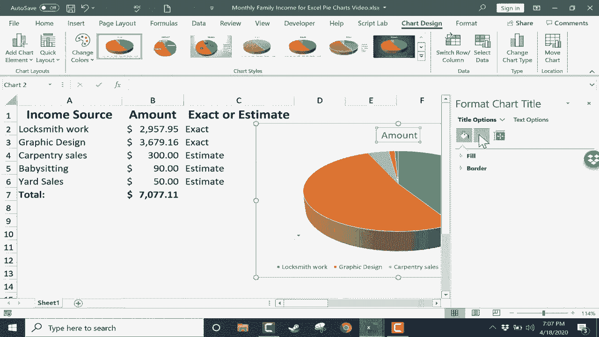
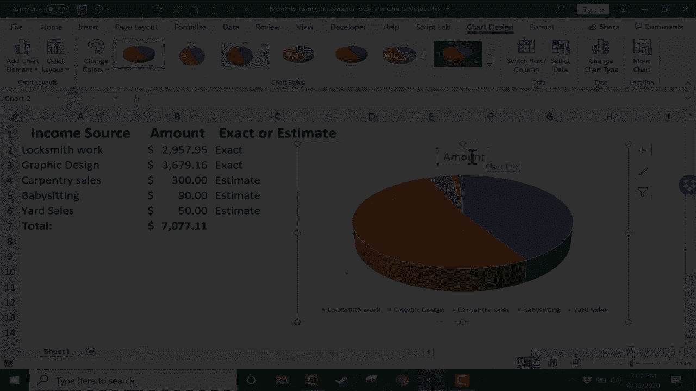
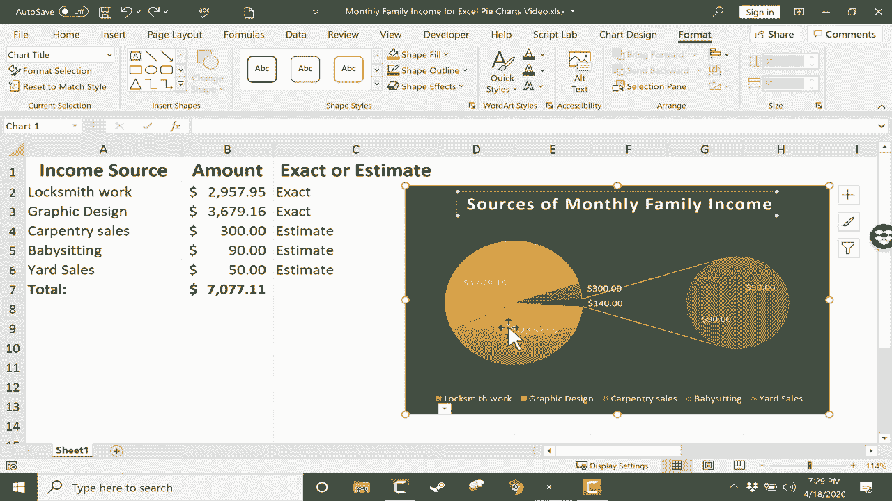
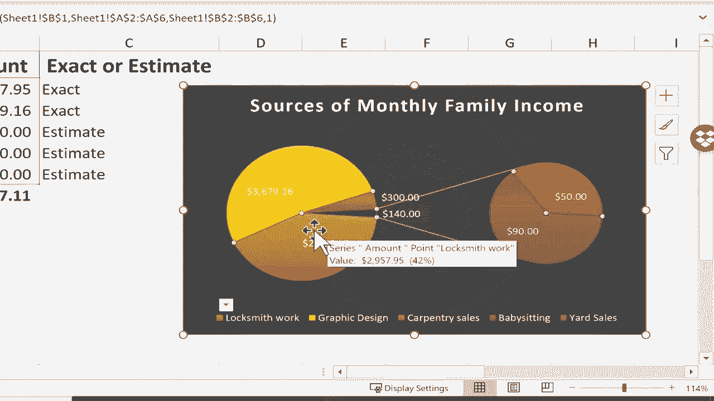
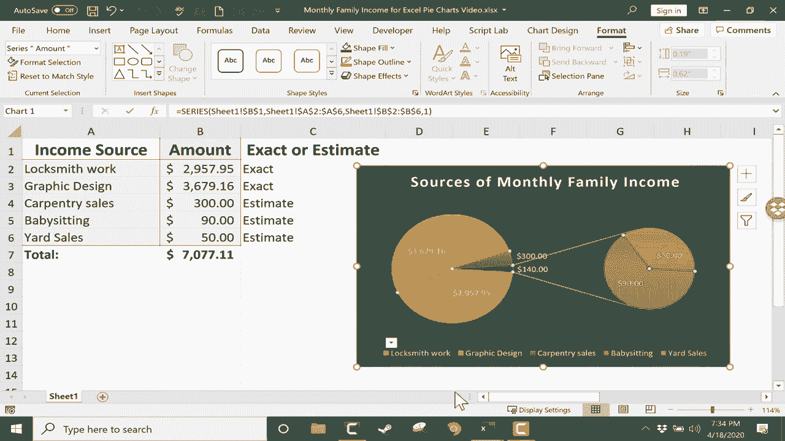

# Excel中级教程 - P42：创建饼图 📊

在本节课中，我们将学习如何在Excel中创建饼图，并了解其适用场景与核心功能。饼图是一种用于展示各部分与整体之间比例关系的图表。

## 何时使用饼图

上一节我们介绍了课程目标，本节中我们来看看饼图的适用场景。饼图的目的是显示个别部分与整体之间的关系。例如，一个家庭的月度收入由多个来源构成，每一项收入都是总收入的一个组成部分。这种“部分-整体”关系是使用饼图的理想情况。

反之，对于包含大量类别或复杂多维度的数据，饼图可能不是最佳选择，因为它会导致切片过多、难以阅读。

## 创建基础饼图

了解了适用场景后，我们开始动手创建第一个饼图。

以下是创建饼图的具体步骤：
1.  **选择数据**：用鼠标拖动选择包含类别和数值的数据区域（A列和B列）。注意，**不要选择总计行**，因为总计会扭曲饼图的比例。
2.  **插入图表**：点击顶部菜单栏的 **`插入`** 选项卡，在图表区域找到并点击 **`饼图`** 图标。
3.  **选择样式**：在弹出的选项中，将鼠标悬停在不同样式上可预览效果。例如，可以选择“三维饼图”。
4.  **放置图表**：点击所选样式后，饼图将出现在工作表上。可以点击并拖动图表，将其移动到合适的位置。

## 自定义与美化饼图

创建基础图表后，我们可以通过“图表设计”和“格式”选项卡对其进行深度定制，使其更清晰、美观。

选中饼图后，顶部会出现 **`图表设计`** 和 **`格式`** 两个专用选项卡。

### 图表设计选项

在“图表设计”选项卡中，我们可以调整图表的核心元素。

以下是主要的自定义功能：
*   **添加图表元素**：点击此按钮可以添加或修改**图表标题**、**数据标签**和**图例**。
    *   建议将默认标题修改为更具描述性的文字，例如“家庭月收入来源”。
    *   为数据标签选择“最佳匹配”或“数据标注”，可以更清晰地显示每个切片代表的数值和类别。
    *   可以调整图例的位置，例如放置在右侧。
*   **更改颜色**：点击此按钮可以一键切换整个图表的配色方案。
*   **图表样式**：这里提供了多种预设的视觉样式，可以快速改变图表的外观。
*   **切换行/列**与**选择数据**：用于重新定义图表的数据源。
*   **更改图表类型**：可以将饼图更改为其他类型，如条形图，或转换为“饼图的饼图”以更好地展示细分数据。

### 格式选项

“格式”选项卡允许我们对图表及其元素的视觉效果进行更精细的控制。

以下是格式设置的关键点：
*   **形状样式**：可以为图表区（背景）设置填充颜色、轮廓颜色及粗细。
*   **艺术字样式**：可以修改图表中所有文字的字体、颜色和特效。
*   **选择和可见性**：方便地选择图表中的特定元素（如某个数据点）进行单独格式化。

## 高级技巧与注意事项

掌握了基本创建和美化方法后，我们再来了解两个能让饼图更出彩的高级技巧。

1.  **突出显示切片（爆炸效果）**：双击饼图的任意一个切片，然后点击并向外拖动，即可将该切片从整体中分离出来，以突出强调。这个操作被称为“爆炸”切片。
    `操作：双击切片 -> 拖动`
2.  **动态更新**：饼图与数据源是动态链接的。当工作表中的原始数据发生变化时，饼图会自动更新以反映最新情况。

最后，务必记住：**饼图并非万能**。它最适合展示**不超过5-7个**部分构成的整体。对于类别过多或没有“整体”概念的数据（如随时间变化的序列），应选择其他图表类型（如折线图或柱状图）。

## 总结

本节课中我们一起学习了Excel中饼图的创建与美化。关键点包括：理解饼图适用于展示“部分-整体”关系；掌握通过 **`插入`** 选项卡创建图表；熟练使用 **`图表设计`** 和 **`格式`** 选项卡添加标题、数据标签和调整样式；以及运用“爆炸”切片和利用图表动态性等实用技巧。请始终根据数据特性和展示目标来选择合适的图表。