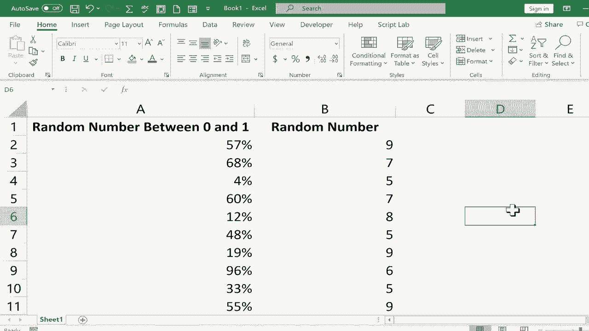

# Excel中级教程 - P43：44）生成随机数 🎲


在本节课中，我们将学习如何在Excel中生成随机数。随机数在模拟数据、抽样测试或创建示例时非常有用。我们将介绍两种生成随机数的方法，并学习如何将动态的随机数转换为静态值。

---

## 生成0到1之间的随机小数

首先，我们来看如何生成一个介于0和1之间的随机小数。这需要使用`RAND`函数。

以下是具体步骤：
1.  点击一个目标单元格。
2.  输入等号`=`，然后输入`R`。Excel会弹出提示，显示`RAND`函数。
3.  输入完整的公式`=RAND()`。这个公式不需要任何参数。
4.  按下键盘上的回车键。单元格中就会显示一个随机小数。

**核心公式**：
```excel
=RAND()
```
这个函数会返回一个大于等于0且小于1的均匀分布随机实数。

现在，我们已经生成了一个随机数。接下来，我们看看如何快速生成一列这样的随机数。

---

## 批量生成随机数序列

上一节我们介绍了单个随机数的生成，本节中我们来看看如何快速填充一列随机数。这需要用到Excel的“自动填充”功能。

以下是具体操作：
1.  点击已输入`=RAND()`公式的单元格。
2.  将鼠标移动到该单元格右下角，直到光标变成一个黑色的“+”字（即填充柄）。
3.  按住鼠标左键并向下拖动到你需要的行数（例如第12行）。
4.  松开鼠标，就会生成一列随机小数。

**重要提示**：每次工作表重新计算（例如修改其他单元格、按F9键）时，由`RAND`函数生成的这些数字都会刷新，变为新的随机数。

为了让这些小数更易读，我们可以将其格式化为百分比。选中整列数据，点击“开始”选项卡中的“百分比样式”按钮（%）即可。

---

## 生成指定范围内的随机整数

有时我们需要特定范围内的随机整数，而不是0到1之间的小数。这时就需要使用`RANDBETWEEN`函数。

以下是具体步骤：
1.  点击一个目标单元格。
2.  输入等号`=`，然后输入`RANDBETWEEN`。
3.  输入左括号`(`，接着输入下限数字（例如1），输入逗号`,`，再输入上限数字（例如5000），最后输入右括号`)`。
4.  按下回车键，即可得到一个在1到5000之间的随机整数。

**核心公式**：
```excel
=RANDBETWEEN(1, 5000)
```
你可以将1和5000替换为任何你需要的整数边界。

同样，你可以使用填充柄向下拖动，生成一列指定范围内的随机整数。这些数字也会在每次重新计算时刷新。

---

## 将随机数固定为静态值

由于`RAND`和`RANDBETWEEN`函数生成的数字会不断变化，如果我们希望保留当前生成的一组随机数，就需要将它们转换为静态值。

以下是具体操作：
1.  选中由随机函数生成的所有数字区域。
2.  按下 `Ctrl + C` 进行复制。
3.  右键点击你想要粘贴到的目标单元格。
4.  在粘贴选项中，选择“粘贴特殊”。
5.  在弹出的对话框中，选择“数值”，然后点击“确定”。

完成以上步骤后，粘贴出来的数字就不再是公式，而是固定的数值，不会随工作表计算而改变。之后，你可以删除或隐藏原来那列包含动态公式的数据。

---

## 课程总结 🎯

本节课中我们一起学习了在Excel中生成随机数的核心技巧：
1.  使用 **`=RAND()`** 函数生成0到1之间的随机小数。
2.  使用 **`=RANDBETWEEN(下限, 上限)`** 函数生成指定范围内的随机整数。
3.  利用**填充柄**快速生成随机数序列。
4.  通过**“粘贴特殊”为“数值”**的方法，将动态的随机数转换为静态值，防止其后续变化。



掌握这些方法，你就能轻松地在Excel中创建用于各种目的的随机数据了。