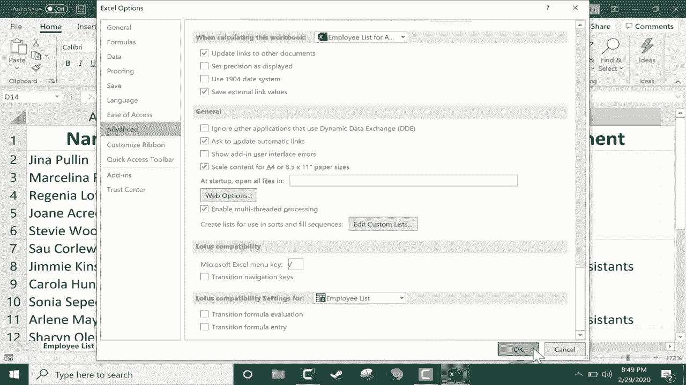
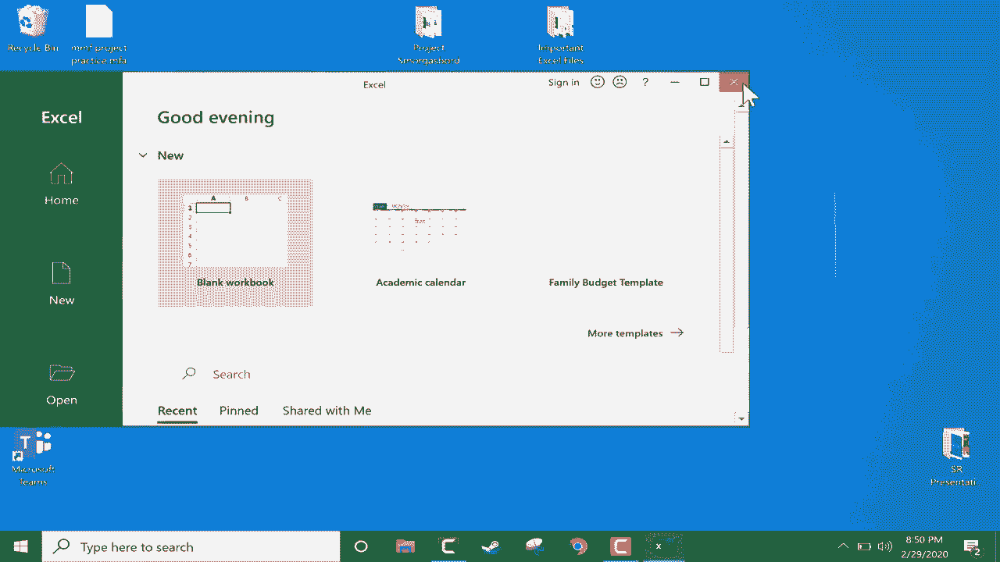

# Excel中级教程 - P44：45）自动打开多个文件 📂

在本节课中，我们将学习如何设置Excel，使其在每次启动时自动打开一组特定的文件。这个技巧能帮助你节省时间，尤其当你需要频繁处理同一批电子表格时。

## 概述

我们将通过创建一个专用文件夹，并将目标文件（或其快捷方式）放入其中，然后在Excel的高级选项中设置该文件夹路径，来实现自动打开多个文件的功能。

## 准备工作：创建并填充文件夹

首先，你需要创建一个文件夹，用于存放那些希望Excel自动打开的文件。

以下是具体步骤：

1.  在电脑的任意位置（例如桌面或文档文件夹）新建一个文件夹。
2.  将需要自动打开的Excel文件移动到这个文件夹中。

**重要提示**：如果你不想移动原始文件（例如，它们是共享文件），可以创建文件的快捷方式。

以下是创建快捷方式的步骤：

1.  右键点击目标Excel文件。
2.  在弹出的菜单中选择“创建快捷方式”。
3.  将生成的快捷方式文件拖入之前创建的文件夹中。

通过以上步骤，我们创建了一个包含目标Excel文件或其快捷方式的专用文件夹。接下来，我们需要在Excel中设置这个文件夹。

## 核心设置：配置Excel启动选项

上一节我们准备好了包含目标文件的文件夹，本节中我们来看看如何在Excel中完成关键设置。

操作步骤如下：

1.  打开任意一个Excel工作簿（甚至可以是空白工作簿）。
2.  点击左上角的“文件”选项卡。
3.  在下拉菜单底部选择“选项”。
4.  在弹出的“Excel选项”窗口中，选择左侧的“高级”类别。
5.  在右侧设置区域中，向下滚动，找到“常规”部分下的“启动时打开此目录中的所有文件”选项。
6.  在该选项右侧的输入框中，粘贴或输入你之前创建的文件夹的完整路径。
    *   例如：`C:\Users\你的用户名\Desktop\我的Excel文件`
7.  点击“确定”保存设置。

现在，关闭所有Excel窗口以应用更改。

## 验证效果与日常管理

设置完成后，让我们验证效果并了解如何进行日常管理。

重新启动Excel应用程序，你会发现之前放入文件夹中的所有文件都会自动打开。

如果你需要更改自动打开的文件列表，只需直接管理文件夹的内容即可：

*   **添加文件**：将新的Excel文件或快捷方式拖入文件夹。
*   **移除文件**：将文件或快捷方式移出文件夹。删除快捷方式不会影响原始文件。
*   **停止自动打开**：如果想取消此功能，只需回到“Excel选项” -> “高级”设置中，清空“启动时打开此目录中的所有文件”的输入框即可。

## 总结

本节课中我们一起学习了如何让Excel在启动时自动打开多个指定文件。核心步骤是：**创建一个专用文件夹存放目标文件，然后在Excel高级选项中设置该文件夹路径**。这个技巧虽然简单，但能有效提升日常工作效率，减少重复打开文件的操作。你可以通过灵活管理文件夹内的内容，来随时调整自动打开的文件组合。