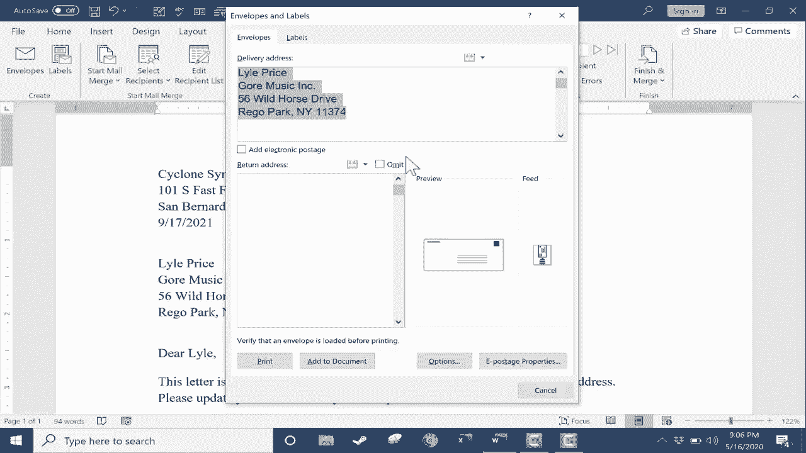

# Excel中级教程 - P45：从 Excel 到 Microsoft Word 的邮件合并 📧

在本节课中，我们将学习如何使用邮件合并功能，将 Microsoft Excel 中的数据自动填充到 Microsoft Word 文档中。这项技能对于批量生成个性化信件、标签或信封非常有用，可以节省大量重复劳动的时间。

## 概述：邮件合并的核心概念

邮件合并的核心是将一个包含固定内容的 Word 文档（主文档）与一个包含可变数据的 Excel 表格（数据源）连接起来。Word 会读取 Excel 中的数据，并为数据源中的每一行记录生成一份独立的文档。

其基本流程可以概括为：**准备数据源 -> 连接 Word 与 Excel -> 插入合并域 -> 预览并完成合并**。

---

## 第一步：准备 Excel 数据源 📊

上一节我们了解了邮件合并的概念，本节中我们来看看如何准备数据源。这是邮件合并成功的基础。

在开始邮件合并之前，必须确保你的 Excel 数据格式正确、整洁。一个结构良好的数据源能让后续操作事半功倍。

以下是准备数据源时需要注意的几个关键点：

*   **标题行**：确保数据表的第一行是列标题（如“姓名”、“公司”、“地址”）。这些标题将成为 Word 中的“占位符”（合并域）。
*   **数据分列**：考虑是否将复合信息分开存储。例如，将“地址”拆分为“街道”、“城市”、“州”、“邮编”等独立列，或在“姓名”列之外单独设置“称谓”列（如先生/女士）。这能提供更大的灵活性。
*   **数据清洁**：检查并修正数据中的错误、多余空格或不一致格式。最好在合并前完成这些清理工作。

对数据满意后，保存并关闭 Excel 文件。

---

## 第二步：在 Word 中连接数据源 🔗

我们已经准备好了 Excel 数据，现在进入 Microsoft Word，开始建立连接。

1.  打开你的 Word 主文档（例如，一封需要个性化的信函）。
2.  转到 **“邮件”** 选项卡。
3.  在 **“开始邮件合并”** 组中，点击 **“选择收件人”**。
4.  在下拉菜单中选择 **“使用现有列表”**。
5.  在弹出的文件浏览器中，找到并选择你准备好的 Excel 文件，点击“打开”。
6.  此时，Word 会提示你选择该 Excel 文件中的哪个工作表包含数据。通常选择默认的第一个工作表即可。
7.  **重要**：勾选 **“首行包含列标题”** 复选框，然后点击“确定”。

连接成功后，虽然界面看似没有明显变化，但“邮件”选项卡下的许多按钮（如“插入合并域”）将被激活。

---

## 第三步：编辑收件人列表与插入合并域 ✏️

成功连接数据后，我们可以对收件人进行筛选，并开始将Excel数据插入到Word文档的指定位置。

### 编辑收件人列表

点击 **“邮件”** 选项卡下的 **“编辑收件人列表”**，你可以：
*   取消勾选特定收件人，将其排除在合并之外。
*   使用 **“筛选”** 功能，根据特定条件（如所在州）选择收件人。
*   对列表进行排序或查找重复项。

### 插入合并域

合并域是 Word 文档中来自 Excel 数据的占位符。以下是插入它们的步骤：

1.  在 Word 文档中，将光标置于或选中需要替换的文本位置（例如，选中“收件人姓名”）。
2.  在 **“邮件”** 选项卡的 **“编写和插入域”** 组中，你有两个主要选择：
    *   **插入合并域**：点击此按钮，会下拉显示你 Excel 中的所有列标题。你可以逐个选择并插入，例如先插入“名字”，再插入“姓氏”。这种方式更灵活。
    *   **地址块** 或 **问候语**：这两个是快捷按钮。点击“问候语”，可以快速设置信函开头的称呼格式（如“亲爱的 `«名字»`”）。点击“地址块”，可以快速插入格式化的完整地址。

**提示**：使用“地址块”或“问候语”后，如果预览效果不正确，可以点击其对话框中的 **“匹配域”** 按钮。在这里，你可以手动将 Word 预设的字段（如“名字”）映射到你 Excel 中对应的列标题（如“FirstName”）。

插入合并域后，原来的静态文本（如“收件人姓名”）就可以删除了。文档中会出现类似 `«名字»` `«姓氏»` 的域代码。

---

## 第四步：预览与完成合并 ✅

所有合并域都插入完毕后，在最终生成文档前，务必进行预览和检查。

1.  在 **“邮件”** 选项卡，点击 **“预览结果”**。此时，文档中的合并域（如 `«名字»`）会被替换为实际数据源中的第一条记录。
2.  使用 **“下一记录”** 、 **“上一记录”** 按钮浏览不同收件人的文档效果，检查格式和数据是否正确。
3.  在预览模式下，你仍然可以直接在文档中修改格式（如添加空格），这些修改会应用到所有合并后的文档。
4.  确认无误后，再次点击“预览结果”关闭预览。
5.  点击 **“完成并合并”**。你有三个选项：
    *   **编辑单个文档**：将所有合并记录生成一个新的 Word 文档，每一条记录占据一页或一个部分。适合进一步编辑或存档。
    *   **打印文档**：直接发送到打印机，为每条记录打印一份。
    *   **发送电子邮件**：如果你的数据源包含“电子邮件地址”列，Word 可以自动生成并准备发送邮件（需要配置 Outlook）。

**最后**：别忘了保存你的 Word 主文档。这样，未来你可以再次使用它与其他数据源进行合并。

---

## 总结与拓展

本节课中，我们一起学习了邮件合并的完整流程：从准备规范的 Excel 数据源，到在 Word 中建立连接、插入合并域，最后预览并完成合并。

邮件合并的功能不仅限于信函，你还可以用同样的方法：
*   批量制作带地址的信封或标签。
*   生成个性化的证书或邀请函。
*   创建包含可变数据的产品目录。

掌握邮件合并，能让你在处理任何需要批量个性化文档的任务时效率倍增。

