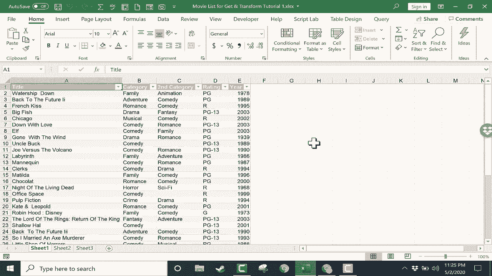

# Excel中级教程 - P46：47）获取和转换／Power Query 1 🧹

在本节课中，我们将要学习如何使用Excel的“获取和转换”功能，也就是**Power Query**。我们将通过一个具体的例子，学习如何导入、清理和转换杂乱的数据，使其变得整洁、标准且易于分析。

---

## 概述

“获取和转换”（Power Query）是Excel中一个强大的数据清理和转换工具。它允许你在一个独立的“沙盒”环境中对数据进行各种操作，而不会破坏原始数据源。本节课，我们将从一个电影数据列表开始，学习如何利用Power Query解决数据格式不一致、多余空格等问题。

---

## 第一步：启动Power Query

首先，我们需要将数据加载到Power Query编辑器中。

仔细看看这个工作表。这是一个电影列表，其中包含关于这些电影的其他信息。假设这个电子表格是从其他地方获取的，数据格式并不标准。

我的数据中有一些我不喜欢的多余空格、不同的颜色等等。创建此数据的人一定是从互联网上或电子邮件中复制粘贴了一些信息，因此它没有标准化。我想获取和转换这些数据。

第一步就是简单地在数据的某处点击。我这里有几行几列的数据范围。我只需在数据范围内的某个位置点击，然后可以转到“数据”选项卡，在“获取和转换”组中查看。

我注意到有多个来源可以获取数据。我可以从文本、网页、表格或范围获取数据。这里有一个按钮，一个下拉按钮，你可以点击查看更多可能的数据来源。

因此，再次确保我已点击某个范围，我将点击“从表格/范围”。Excel已确定我的数据位置。是的，我的表格有标题。我点击“是”。

注意它所做的，它把我的范围、数据变成了一个表格，并打开了这个新窗口。这就是**Power Query编辑器**。

---

## 第二步：认识Power Query编辑器

如果你不习惯这个窗口，它可能会让人感到困惑。看起来像是Excel发生了剧烈变化。其中一个原因是这个窗口占满了我的屏幕。所以我会点击右上角的按钮，把Power Query编辑器稍微缩小一点。

这样你就可以看到我原来的电子表格仍在后台。我的数据仍然完好无损。改变的唯一地方是它被转换成了一个表格，而在我的原始工作表上，我有这个Power Query编辑器。我会再次最大化它。

我希望你把这个Power Query编辑器视为一个沙盒，我可以在其中玩耍。我可以更改数据，可以尝试一些东西，而这些都不会影响或破坏我在电子表格中的原始数据。然后我可以选择将这些数据添加到我的电子表格或不添加。

让我们仔细看看这个Power Query编辑器。除了能够在屏幕右侧查看我的电子表格数据，我有“查询设置”，并在其中包含了一系列“已应用的步骤”。

它说“源”。换句话说，我为我的数据建立了一个源。那就是被转换为表格的范围。它说“更改类型”，这可能是指将我的范围转换为表格，因为我对这些数据进行更多更改，你会看到这些更改在这里列出。

---

## 第三步：清理和转换数据

好的，让我们看看如何改进这些数据。你会注意到我的标题列被选中。我可以切换到“类别”或“第二类别”或“评分”，随便我想做什么。但我将从“标题”开始。

选中后，我会去我的标签。注意，默认情况下我在“主页”选项卡上，这里有一些可以用来转换数据的选项。但在“转换”选项卡上还有更多选择，只需点击即可。

### 1. 统一文本格式

我可以进入“格式”，点击，我希望将我的标题列中的所有数据更改为小写。因此，通过点击那个按钮，并切换为小写。看看发生了什么。现在每个电影标题都仅为小写。这就是一个改进。

因为看看原始电子表格中的情况。有些标题是全大写的，有些不是。这真是一团糟。因此，在这个Power Query编辑器的沙盒中，我试图标准化内容，使其看起来应该的样子。现在所有内容都是小写的。

我可以回到“格式”按钮，选择“每个单词首字母大写”。我认为这是一个改进。

### 2. 处理多余空格

接下来，我想修复标题列中所有多余的空格。单词“gone”和“with”之间的空格太多。词“Matilda”前面也有太多空格。

要解决这些空格问题，我可以再次去“格式”按钮。我将尝试“修剪”多余的空格。当我点击“修剪”时，你会注意到，这些单元格中条目的开头和结尾的多余空格已经被清理掉了。多余的空格已被移除。

那么，单词之间的空格呢？这有点难处理。可能有更好的方法来做到这一点。但我将去“替换值”。我会点击，想让Excel找到连续三个空格的示例。

所以我连续按了三次空格键。我想将这三个连续的空格替换为一个空格。所以我在第二个框中点击，并再次按空格键。我将点击“确定”。现在，随着我点击“确定”，你可以看到这解决了很多空格问题。

我再试一次，这次我将去“替换值”。也许我将两个空格替换为一个。再次点击“确定”。这似乎改善了我的数据。

### 3. 标准化“评分”列

现在，让我们看看我的“评分”列。如果我点击“评分”这个词，它会高亮显示整列。我注意到这一列也有几个问题。有些电影列为“R级”。而其他电影则标记为“R”和“P G13”，我认为这也不正确。因此我们将再次使用“替换值”。

所以要查找的值是“R级”，咱们将其替换为“R”。我再做一次。替换值定义“P G13”，将其替换为“Pg-13”。点击“确定”，它为我清理了数据。

---

## 第四步：管理应用步骤

正如我所说，注意右侧，我的“已应用的步骤”。我有我所做的每一步的列表。如果我对其中任何一步后悔，比如我后悔修复“R级”，我只需点击这个红色的“X”。

你确定要删除这个步骤吗？这可能会导致一些问题。让我们试一下。我点击“删除”，它移除了那个步骤，并没有给我带来问题。

现在，我有很多其他方法可以转换这些数据。我主要向你展示了这个“格式”按钮和“替换值”按钮。这些是一些最强大的选项。但还有更多。如果你感兴趣，我会制作更多视频展示其他选项。

但现在，我还想告诉你，有时候，不仅仅是使用这些变换按钮，右键点击列标题并选择下拉菜单中的选项会更简单。我将再次“替换值”，将“R级”改回“R”。点击。

---

## 第五步：加载清理后的数据

假设我对这张电子表格所做的转换完全满意，并准备将其应用到我的工作簿中。我只需点击这个“主页”按钮，然后点击“关闭并加载”。

当我点击“关闭并加载”时，有时会花一点时间，但它会创建一个新的电子表格。你会注意到我的原始数据仍然在这里，表格1。是的，它现在是一个表格，但还有一个“表格4”，里面有我清理过的所有数据。我可以浏览下去查看所有数据都已导入。

我现在可以关闭这个面板。如果我真的更喜欢这个数据而不是原始数据，当然，我可以右键点击原始文件并删除那个电子表格，点击，删除。甚至我可以右键点击，将“表格4”重命名为我的新“表格1”。

---

## 总结

本节课中，我们一起学习了**Power Query**的基本使用方法。我们从一个杂乱的电影数据表开始，通过将其加载到Power Query编辑器，逐步执行了统一文本大小写、修剪和替换多余空格、标准化评分代码等操作。整个过程在独立的“沙盒”环境中进行，确保了原始数据的安全。最后，我们将清理干净的数据加载回Excel，得到了一个整洁、标准的数据集，为后续的分析工作打下了坚实的基础。