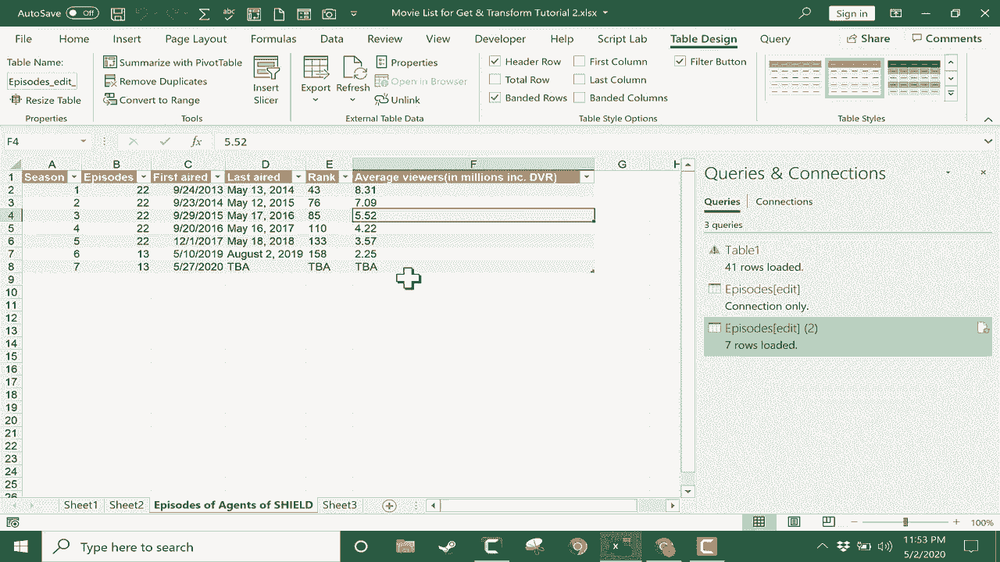

# Excel中级教程 - P47：48）获取和转换／Power Query 2 🌐


在本节课中，我们将学习如何使用Excel的“获取和转换”（Power Query）功能，从网页（如维基百科）导入数据，并在Excel中进行清理和转换，使其成为可用的格式。

---

## 概述

我们将通过一个具体示例，演示如何将一个维基百科页面上的表格数据导入Excel，并使用Power Query编辑器删除不必要的行和列、提升标题行，最终将整洁的数据加载回工作簿。

---

## 从网页获取数据

首先，我们需要从网页获取原始数据。假设我们已有一个包含目标网页URL的Excel工作表。

以下是操作步骤：

1.  复制目标网页的URL。
2.  在Excel中，切换到 **“数据”** 选项卡。
3.  在 **“获取和转换数据”** 组中，点击 **“从网页”**。
4.  在弹出的对话框中，粘贴复制的URL并点击 **“确定”**。


执行上述步骤后，会打开 **“导航器”** 窗口。这个窗口会显示从该URL检测到的所有可导入数据列表，通常是页面中的表格。

## 在导航器中选择数据

在导航器窗口中，你可以预览找到的数据。例如，从维基百科页面可能会找到名为“剧集”的表格。

以下是选择数据的步骤：

1.  在左侧列表中选择你想要导入的表格项（如“剧集”）。
2.  右侧会显示该表格的预览。
3.  如果数据预览符合预期，不要直接点击 **“加载”**。为了在导入前进行清理，我们点击 **“转换数据”** 按钮。

点击 **“转换数据”** 会打开 **Power Query编辑器**，我们将在其中对数据进行清洗和转换。

---

## 在Power Query编辑器中清理数据

上一节我们介绍了如何将数据导入Power Query编辑器，本节中我们来看看如何清理这些数据，例如删除多余的行和列。

在Power Query编辑器中，你可以看到原始数据。通常，从网页导入的数据会包含一些我们不需要的内容，比如重复的表头行或多余的列。

### 删除不必要的行

观察数据，第一行可能是重复的标题或无用信息，我们需要删除它。

以下是删除行的步骤：

1.  在数据区域中，点击你想要删除的行（例如第1行）。
2.  在 **“主页”** 选项卡的 **“减少行”** 组中，点击 **“删除行”**。
3.  从下拉菜单中选择 **“删除最前面几行”**。
4.  在弹出的对话框中，输入要删除的行数（例如 `1`），然后点击 **“确定”**。

```excel
// 操作对应步骤：删除顶部行
步骤：删除最前面几行 -> 数量：1
```

### 删除不必要的列

接下来，我们可能需要删除一些多余的列。例如，某些列可能是其他列的重复，或者完全不包含有用信息。

以下是删除列的步骤：

1.  点击你想要删除的列的标题以选中它。可以按住 `Ctrl` 键同时点击来选中多列。
2.  在 **“主页”** 选项卡中，点击 **“删除列”** 按钮。
3.  或者，在选中的列标题上右键单击，选择 **“删除”**。

重复此过程，直到删除所有不需要的列。

---

## 格式化与提升标题

清理完行和列后，我们通常需要确保第一行数据被正确识别为表格的标题。

当前，第一行数据可能显示为 `Column1`、`Column2` 等默认列名，而不是实际的标题内容。

以下是提升标题的步骤：

1.  在 **“主页”** 选项卡的 **“转换”** 组中，点击 **“将第一行用作标题”**。
2.  点击后，数据的第一行内容就会成为各列的标题。

经过以上步骤，你的数据应该已经变得整洁、结构清晰。

---

## 应用步骤与错误修正

在Power Query编辑器右侧的 **“查询设置”** 窗格中，有一个 **“应用的步骤”** 列表。它按顺序记录了你所做的每一次更改。

这个功能非常有用：

*   **查看历史**：你可以清楚地看到数据被清理的整个过程。
*   **撤销操作**：如果你对某个步骤不满意，可以点击该步骤左侧的 **红色“X”** 来删除它，此操作会撤销该步骤及其之后的所有步骤。
*   **重新编辑**：你也可以点击任意步骤进行重新编辑。

在之前的课程中，我们还介绍过使用 **“转换”** 选项卡中的工具（如 **“格式”** 或 **“替换值”**）来进一步清理和格式化数据。

---

## 将数据加载回Excel

数据清理和转换完成后，最后一步就是将其加载回Excel工作簿。

以下是加载数据的步骤：

1.  在 **“主页”** 选项卡的最左侧，找到 **“关闭并加载”** 按钮。
2.  **直接加载**：点击按钮的上半部分（或直接点击按钮），数据会立即作为一个新工作表加载到当前工作簿中。
3.  **加载选项**：点击按钮的下半部分箭头，可以选择不同的加载方式，例如“仅创建连接”或“加载到数据模型”。在本例中，我们直接点击 **“关闭并加载”**。

加载完成后，Excel会新增一个工作表（例如“Sheet6”），其中包含已清理好的数据。你可以右键单击工作表标签，选择 **“重命名”**，为其起一个更有意义的名称，例如“神盾局特工剧集”。



---


## 总结

本节课中我们一起学习了使用Excel Power Query从网页获取数据的完整流程。我们掌握了如何通过 **“从网页”** 功能导入数据，在 **Power Query编辑器** 中通过**删除行**、**删除列**和**将第一行用作标题**等操作来清理数据，并最终将整理好的数据**加载**回Excel工作表。利用 **“应用的步骤”** 列表，我们可以轻松管理和修正转换过程。这套方法能高效地将外部网络数据转换为Excel中可直接使用的结构化表格。