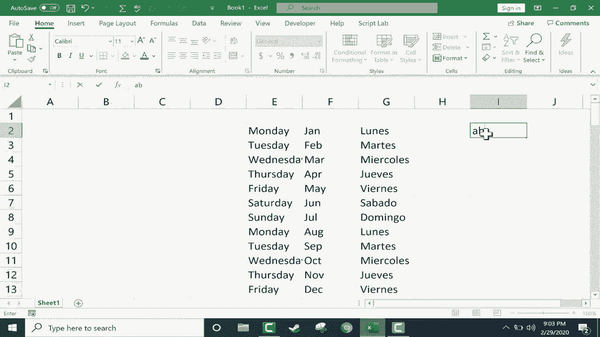

# Excel中级教程 - P48：自定义自动填充句柄 📝

在本节课中，我们将学习如何修改或添加Excel中预定义的文本序列，这些序列可以与“自动填充句柄”功能配合使用。掌握这项技能后，你可以创建符合个人或特定语言习惯的填充列表，从而极大地提升数据录入效率。

---

在之前的课程中，我们介绍了Excel自动填充句柄的基础用法。例如，输入“星期一”后，使用填充柄向下拖动，Excel会自动生成从星期一到星期日的序列。这个功能同样适用于月份（如“一月”）等预设序列。

本节中，我们来看看如何创建属于自己的自定义填充序列。

## 访问自定义列表设置

要创建自定义列表，首先需要进入Excel的高级设置选项。

以下是具体步骤：
1.  点击左上角的 **“文件”** 选项卡。
2.  在侧边栏底部选择 **“选项”**。
3.  在弹出的“Excel选项”窗口中，点击左侧的 **“高级”** 类别。
4.  向下滚动到窗口底部，找到 **“常规”** 部分。
5.  点击 **“编辑自定义列表…”** 按钮。

在弹出的“自定义序列”对话框中，你可以看到Excel内置的预设列表（如星期、月份）。这些就是自动填充功能所依赖的序列库。

## 创建新的自定义列表

现在，我们来创建一个新的列表。例如，我们不想使用中文的星期，而想使用西班牙语的星期名称。

在“自定义序列”对话框的 **“输入序列”** 框中，按顺序输入西班牙语的星期名称（请注意重音符号）：
*   lunes
*   martes
*   miércoles
*   jueves
*   viernes
*   sábado
*   domingo

输入完成后，点击 **“添加”** 按钮，这个新序列就会出现在左侧的列表中。最后，点击 **“确定”** 保存设置。

## 使用自定义列表

让我们来测试一下新创建的列表。

1.  在一个空白单元格（例如A1）中输入 **`lunes`**。
2.  选中该单元格，将鼠标指针移动到单元格右下角的填充柄（小方块）上。
3.  按住鼠标左键并向下拖动，Excel将自动按照你设定的西班牙语星期序列进行填充。

**提示**：如果你的目标填充区域旁边（左侧或右侧）的列已有数据，你可以直接**双击**填充柄，Excel会自动将序列填充到与相邻数据相同的行数。

## 管理自定义列表

上一节我们介绍了如何创建列表，本节中我们来看看如何管理和删除它们。

如果你不再需要某个自定义列表，可以回到 **“文件” > “选项” > “高级” > “编辑自定义列表…”** 的路径。

在“自定义序列”对话框中，从左侧列表选中要删除的序列，然后点击 **“删除”** 按钮即可。

**此外**，你还可以将工作表中已存在的序列快速导入为自定义列表。
以下是操作方法：
1.  在电子表格的连续单元格中输入你的序列。
2.  打开“自定义序列”对话框。
3.  点击 **“从单元格中导入序列”** 旁边的选择按钮，用鼠标选中你刚输入的序列单元格。
4.  点击 **“导入”** 按钮，该序列就会被添加到自定义列表中。

---

本节课中，我们一起学习了如何创建、使用和管理Excel的自定义自动填充列表。通过这项功能，你可以将任何常用的、有顺序的文本系列（如部门名称、产品代码、特定术语等）设置为填充序列，从而实现快速、准确的数据输入。这无疑是提升日常办公效率的一个实用技巧。