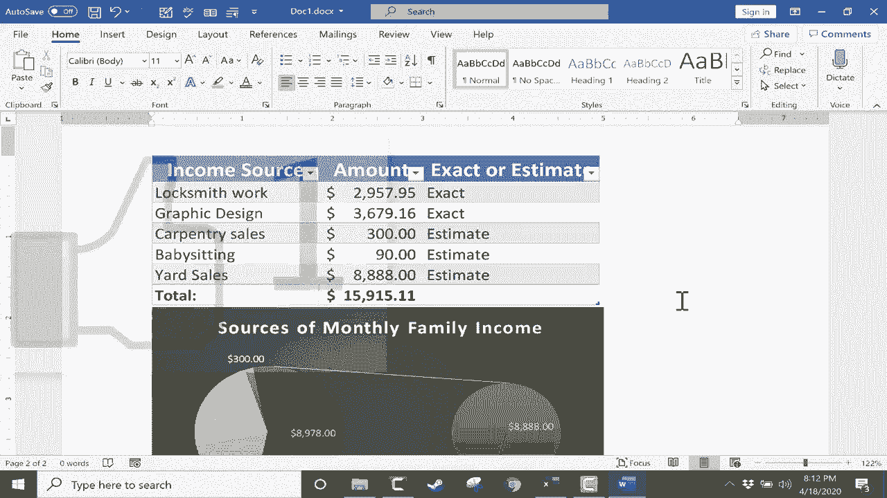

# Excel中级教程 - P49：将数据插入Microsoft Word 📊➡️📄


在本节课中，我们将学习如何将Excel中的数据或图表插入到Microsoft Word文档中。我们将探讨几种不同的方法，包括简单的复制粘贴、作为可编辑的Excel对象插入，以及作为静态图片插入，并分析每种方法的适用场景。

---

## 概述：为何需要将Excel数据插入Word？

将Excel数据插入Word文档是常见的办公需求，例如在撰写包含数据表格或图表的报告时。然而，简单的复制粘贴可能无法保留数据的动态计算功能或格式。本节将介绍几种更有效的方法。

---

## 方法一：直接复制粘贴文本

首先，我们尝试最直接的方法：复制Excel单元格区域，然后粘贴到Word中。

1.  在Excel中，用鼠标点击并拖动，选择你想要复制的数据区域。
2.  使用快捷键 `Ctrl + C` 复制该区域。
3.  切换到Microsoft Word文档。
4.  使用快捷键 `Ctrl + V` 将数据粘贴到Word中。

**结果分析**：数据被成功粘贴，外观尚可。但粘贴的内容被视为普通文本。如果你修改其中的数字，**总计**等公式计算结果不会自动更新。

---

## 方法二：将数据作为表格粘贴

上一节我们介绍了直接粘贴文本的局限性。本节中，我们来看看能否通过先将Excel数据转为表格格式来改善。

在Word中，你可以将粘贴的数据直接转换为表格：
1.  在Word中，点击“插入”选项卡。
2.  点击“表格”，然后选择“插入表格”。
3.  这将把粘贴的文本区域转换为一个Word表格。

**结果分析**：格式有所改善，但本质仍是静态内容。修改表格中的数字，**总计**单元格依然不会自动重新计算。

---

## 方法三：作为可编辑的Excel对象嵌入（推荐）

一定有更好的方法。在我看来，最佳方式是使用“选择性粘贴”功能，将数据作为**Microsoft Excel工作表对象**嵌入。

以下是操作步骤：
1.  在Excel中，复制目标数据区域（`Ctrl + C`）。
2.  切换到Word文档，将光标置于要插入的位置。
3.  在“开始”选项卡的“剪贴板”组中，点击“粘贴”按钮的下半部分（小箭头）。
4.  在弹出的菜单中，选择“选择性粘贴”。
5.  在对话框的列表中，选择“Microsoft Excel 工作表 对象”。
6.  点击“确定”。

**核心优势**：
*   双击嵌入的对象，你会在Word界面中激活Excel的编辑功能（可以看到Excel的菜单和绿色主题）。
*   此时，你可以像在Excel中一样编辑数据，使用公式和筛选器。例如，修改一个数字后按 `Enter` 键，**总计**会自动更新。
*   编辑完成后，在对象外部点击一下，即可返回正常的Word编辑模式。

**代码/操作描述**：
```plaintext
1. Excel中: 选择区域 -> Ctrl+C
2. Word中: 光标定位 -> [开始] -> [粘贴] -> [选择性粘贴] -> 选择“Microsoft Excel 工作表 对象”
```

---

## 方法四：插入Excel图表对象

不仅数据，图表也可以作为可编辑对象插入Word。

操作步骤如下：
1.  在Excel中，选中制作好的图表，按 `Ctrl + C` 复制。
2.  在Word中，定位光标。
3.  同样使用“选择性粘贴”（“粘贴”->“选择性粘贴”）。
4.  选择“Microsoft Excel 图表 对象”并确定。

**结果**：图表被插入。你可以调整其大小。双击图表，即可在Word中激活Excel的图表编辑环境，可以修改数据源、图表样式、甚至“炸开”饼图的一部分，所有操作与在Excel中无异。

---

## 方法五：作为不可编辑的图片插入

有些情况下，你可能不希望接收者修改Excel数据或图表。这时，可以将内容作为图片插入。

以下是具体步骤：
1.  在Excel中，选中数据区域或图表。
2.  在“开始”选项卡的“剪贴板”组中，点击“复制”按钮旁边的小箭头。
3.  在下拉菜单中选择“复制为图片”。
4.  在弹出的对话框中，选择“如屏幕所示”和“图片”格式，点击“确定”。
5.  切换到Word文档，直接使用 `Ctrl + V` 或点击“粘贴”按钮进行粘贴。

**结果分析**：内容以静态图片形式插入Word。双击它只会选中图片，而无法编辑底层数据，适合用于定稿分发。

**公式/操作描述**：
```plaintext
Excel中: 选择对象 -> [开始] -> [复制] -> [复制为图片] -> 设置选项 -> 确定
Word中: Ctrl+V 粘贴
```

---

## 总结

本节课中我们一起学习了将Excel内容插入Word的多种方法：
1.  **直接粘贴文本**：简单快速，但失去计算功能。
2.  **粘贴为Word表格**：改善格式，仍是静态数据。
3.  **作为Excel对象嵌入（推荐）**：保持数据的完全可编辑性和动态计算能力，实现Word与Excel的无缝协作。
4.  **作为图片插入**：生成不可修改的静态图像，适用于保护数据或固定展示。



掌握这些方法，你可以根据文档的实际需求（是否需要后续编辑、是否允许他人修改），灵活选择最合适的方式，高效地完成跨软件的数据整合工作。