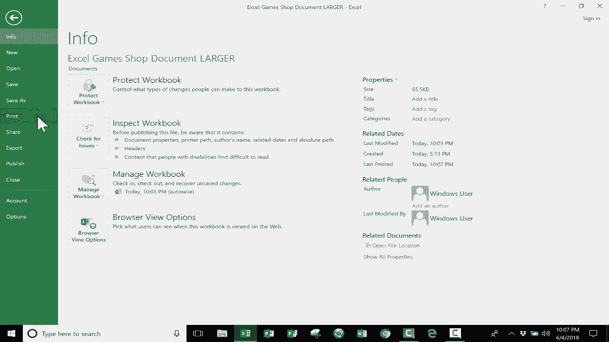

# Excel中级教程 - P5：打印选项巧教程 📄

在本节课中，我们将学习Excel中的关键打印选项。虽然数字共享文件更为常见，但掌握打印技巧对于需要纸质文档的情况至关重要。打印是一个需要多步骤调整的过程，而非单一操作。我们将通过一系列调整，将一个原本需要30页的文档优化到更合理的页数。

## 查找打印选项

上一节我们介绍了打印是一个过程，本节中我们来看看在哪里可以找到调整打印效果的选项。

Excel的打印工具分布在几个位置。

一个主要位置是点击“文件”选项卡后进入的“后台视图”。在此点击“打印”，即可进入打印预览界面并看到各种打印选项。

打印预览可以让你感受文档打印后的实际效果。这里提供的许多选项也出现在Excel的其他位置。此外，“页面设置”链接非常重要。

在退出打印预览前，请注意文档的总页数。当前示例显示需要打印30页。你可以通过箭头或右侧滑块翻看各页。初步浏览时，部分列的数据打印方式异常，未能整齐排列，且总页数过多。这表明需要进行调整。

按键盘上的 `Esc` 键或点击箭头可以退出打印预览。

另一个查找打印选项的地方是“页面布局”选项卡。此外，右下角的视图按钮（包括“普通”、“页面布局”和“分页预览”）在设置打印时也很有帮助。

## 优化打印布局

上一节我们找到了打印选项，本节中我们来看看如何通过调整布局来减少打印页数。

我们的目标是将30页的文档缩减到更易管理的数量。首先，记住可以随时使用快捷键 `Ctrl + F2` 快速进入打印预览。

以下是优化打印布局的几种方法：

**1. 调整页面方向**
如果你的数据宽度较大，将页面从“纵向”改为“横向”可能更合适。你可以在“页面布局”选项卡的“页面设置”组中点击“方向”进行更改。在某些情况下，这能解决问题，但也可能因高度增加而增加页数，需要根据实际情况判断。

**2. 调整列宽**
过宽的列会浪费空间。快速调整所有列宽的方法是：点击并拖动选择所有列，然后在任意两列标题之间的分隔线上双击。Excel会自动将列宽调整为刚好容纳内容。
*代码示例：* 选中所有列后，在列分隔线上双击。

**3. 设置打印区域**
如果只需要打印部分数据，可以先选中目标区域，然后转到“页面布局”选项卡，点击“打印区域”，选择“设置打印区域”。这告诉Excel仅打印选定部分。

**4. 调整文本格式**
缩短列标题（如将“十二月”缩写为“12月”）或改变文本方向（如倾斜或垂直排列），可以使列变窄。
*操作路径：* 选中单元格 -> “开始”选项卡 -> “对齐方式”组 -> “方向”按钮。

**5. 隐藏非必要列**
对于不需要打印的列（如历史数据），可以将其隐藏。选中要隐藏的列，右键点击列标，选择“隐藏”。打印时，Excel将忽略这些隐藏列。

**6. 使用“页面布局”视图**
点击右下角的“页面布局”视图按钮，可以直观看到内容在页面上的分布情况，包括页边距和分页符。你还可以在此直接编辑页眉和页脚。

**7. 使用“分页预览”视图**
点击右下角的“分页预览”视图按钮，会显示带有蓝色虚线和实线的页面。你可以直接拖动这些分页符线条来强制调整内容，使其容纳到更少的页面中。这是控制分页最直接的方法之一。

**8. 调整页边距**
在“页面布局”选项卡或打印预览中，将页边距从“常规”改为“窄”，可以为内容腾出更多空间。

**9. 打印标题行**
为了在每一页顶部都重复显示列标题，需要设置打印标题。转到“页面布局”选项卡 -> “页面设置”组 -> “打印标题”。在“工作表”选项卡中，设置“顶端标题行”为包含标题的行（例如 `$2:$2`）。
*公式示例：* 在“顶端标题行”中输入 `$2:$2` 表示固定重复第2行。

**10. 打印网格线**
默认情况下，Excel不打印网格线。如果需要在打印稿上显示，需在“页面布局”选项卡的“工作表选项”组中，勾选“网格线”下的“打印”复选框。

## 综合应用与流程

上一节我们介绍了多种优化技巧，本节中我们来看看如何将它们组合应用，并理解打印的标准流程。

打印是一个迭代过程。通常需要结合使用多种技巧，并反复在打印预览和电子表格之间切换，直到获得满意的效果。

一个典型流程可能是：
1.  进入打印预览 (`Ctrl + F2`)，评估初始页数和布局问题。
2.  返回工作表，调整列宽、隐藏不必要数据。
3.  切换到“页面布局”或“分页预览”视图，调整页面方向、页边距，并拖动分页符。
4.  设置打印标题行，确保每页都有表头。
5.  添加页眉/页脚（如标题、页码、日期）。
6.  再次进入打印预览，检查最终效果。
7.  确认无误后，执行打印。

## 总结

本节课中我们一起学习了Excel中高效打印的核心技巧。我们了解到打印是一个需要多步骤调整的“过程”，而非一键操作。关键点包括：利用 `Ctrl + F2` 快速预览；通过调整列宽、页面方向、页边距和分页符来优化布局；设置打印区域和打印标题以提升可读性；以及使用“页面布局”和“分页预览”视图进行直观调整。掌握这些技巧，你将能够将任何复杂的电子表格清晰、专业地打印出来。