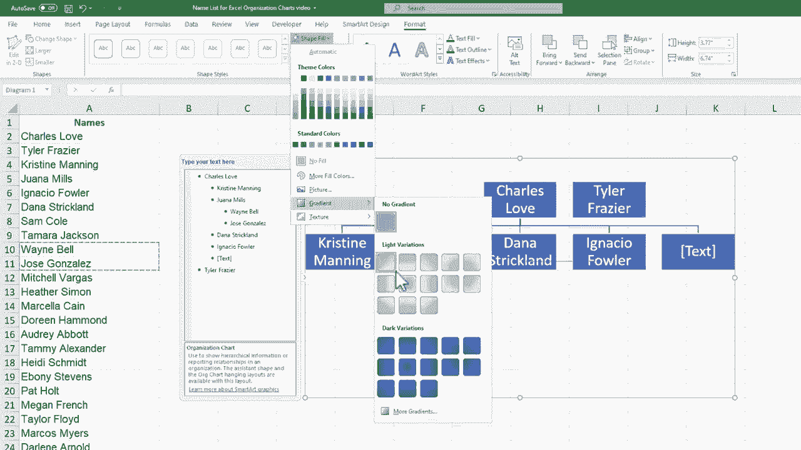

# Excel中级教程 - P50：创建组织结构图 📊


在本节课中，我们将学习如何在Microsoft Excel中轻松创建组织结构图。我们将从一份人员名单开始，逐步将其构建成一个清晰的层级图表。

## 概述

组织结构图是展示组织内部层级关系的有效工具。在Excel中，我们可以利用“智能艺术”功能，快速、直观地创建和自定义这类图表。本节教程将引导你完成从插入图表到最终美化的全过程。

## 创建组织结构图

上一节我们介绍了课程目标，本节中我们来看看具体的创建步骤。

首先，打开你的Excel工作簿。假设我们在`Sheet1`中有一份人员名单，而目标是在`Sheet2`上生成组织结构图。

1.  **插入智能艺术图形**
    在Excel功能区，点击 **“插入”** 选项卡，然后找到并点击 **“智能艺术”** 按钮。

2.  **选择层级图表类型**
    在弹出的“选择智能艺术图形”对话框中，左侧列表选择 **“层级”** 类别。右侧会显示多种预设的层级结构样式。浏览并选择一个最符合你需求的样式（例如，标准的“组织结构图”），然后点击“确定”。

    ```excel
    [操作路径]：插入 -> 智能艺术 -> 层级 -> 选择样式 -> 确定
    ```

    此时，一个默认的组织结构图将插入到当前工作表，并浮动在单元格上方。你可以通过拖拽图表边框来移动位置，或拖拽角落的控制点来调整大小。

## 编辑与填充内容

图表框架搭建好后，接下来需要填充具体的人员信息。

以下是向图表中添加内容的两种主要方法：

*   **直接点击文本框输入**：单击图表中的任意文本框，直接输入姓名或职位。文本会自动调整大小以适应框体。
*   **使用文本窗格输入**：单击图表左侧边缘弹出的箭头，或选中图表后通过“智能艺术设计”选项卡中的“文本窗格”按钮，打开文本窗格。在此窗格中输入或粘贴内容，可以更清晰地看到层级关系。

**提示**：你可以从其他单元格复制姓名，然后粘贴到文本框或文本窗格中，以提高效率。

## 调整组织结构

初始的图表结构可能不符合你的实际需求，我们需要调整层级关系。

在图表中选中某个形状（文本框）后，右键点击，可以看到“添加形状”的选项。这是调整结构的关键：

*   **“在后面添加形状”**：为当前选中的形状添加一个**同级**框体。
*   **“在前面添加形状”**：在当前选中的形状**之前**添加一个同级框体。
*   **“在上方添加形状”**：为当前选中的形状添加一个**上级**框体。
*   **“在下方添加形状”**：为当前选中的形状添加一个**下级**框体（即子成员）。
*   **“添加助理”**：为当前选中的形状添加一个**助理**框体，其位置通常侧向显示。

**操作技巧**：添加一个形状后，再次选中原形状并按键盘上的 **`F4`** 键，可以快速重复上一次的“添加形状”操作。

若要删除某个形状，只需选中它并按 `Delete` 键。

## 设计与美化

一个清晰美观的图表能更好地传达信息。Excel为智能艺术图形提供了丰富的设计工具。

选中组织结构图后，功能区会出现 **“智能艺术设计”** 和 **“格式”** 两个专属选项卡。

1.  **更改整体样式与颜色**（“智能艺术设计”选项卡）
    *   **“更改颜色”**：提供多种配色方案，一键更改图表所有形状的颜色。
    *   **“智能艺术样式”**：提供包括阴影、棱台、三维旋转在内的多种视觉效果，可以让图表看起来更立体或更具现代感。
    *   **“重置图形”**：如果你对修改不满意，可以点击此按钮将图表恢复至初始状态。

2.  **自定义单个元素**（“格式”选项卡）
    *   你可以选中某个具体的形状，单独修改其**形状填充**、**形状轮廓**、**形状效果**（如发光、阴影）。
    *   也可以选中文本，修改**艺术字样式**、字体、字号等。

**建议**：美化应服务于内容的清晰呈现，避免使用过于花哨的效果影响阅读。



## 总结

本节课中我们一起学习了在Excel中创建组织结构图的完整流程。关键步骤包括：通过 **“插入”->“智能艺术”** 选择层级图表；使用**文本窗格**或直接点击来填充内容；通过右键菜单的 **“添加形状”** 选项调整层级关系；最后利用 **“智能艺术设计”** 和 **“格式”** 选项卡对图表进行美化和个性化设置。掌握这些方法，你就能高效地制作出专业、清晰的组织结构图。