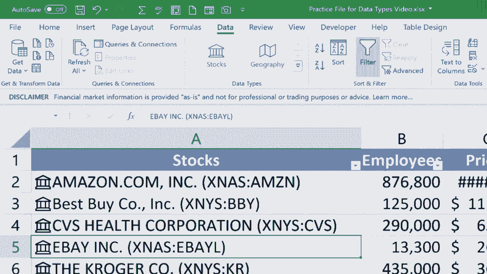

# Excel中级教程 - P51：使用数据类型工具 📊

在本节课中，我们将学习如何使用Excel的数据类型工具。这个功能可以让你轻松地从互联网获取关于股票和地理位置的实时数据，并快速填充到你的工作表中。

## 准备工作与界面介绍

上一节我们介绍了数据工具的基本概念，本节中我们来看看如何启用和使用数据类型功能。

首先，你需要确保使用的是Microsoft 365版本的Excel，并且已登录到OneDrive账户。如果你在“数据”选项卡中看不到“数据类型”组，请按以下步骤操作：

1.  点击“文件”。
2.  向下滚动到“账户”。
3.  确保你已在左侧登录到OneDrive。

仅仅激活Microsoft 365是不够的，必须登录在线OneDrive才能使用此功能。完成后，你应该能在“数据”选项卡的“数据类型”组中看到“股票”和“地理”按钮。

## 使用“地理”数据类型

现在，让我们看看这个功能如何运作。我们将从一个美国州的列表开始。

1.  点击A列，选择所有州名。
2.  在“数据”选项卡的“数据类型”组中，点击“地理”。

此时，每个州名称的左侧会出现一个卡片图标。点击带有卡片的单元格，会弹出一个按钮，允许你插入关于该州的数据。例如，你可以选择插入“中位家庭收入”数据。

然而，通常你需要获取列表中所有项目的信息，而不仅仅是一两个。为此，更好的方法是将数据转换为表格。

1.  选择A列数据。
2.  点击“插入”选项卡，然后点击“表格”，或使用快捷键 `Ctrl + T`。
3.  确认表格范围，点击“确定”。
4.  再次选中表格中的数据列，点击“地理”按钮。

现在，卡片按钮将适用于表格中的所有项目。点击任意单元格旁的弹出按钮，选择你想要显示的信息列（如“中位家庭收入”）。Excel会从互联网获取最新数据并填充到新列中。你可以继续添加其他信息列，例如“最大城市”或“每个家庭的人数”。

你还可以点击左侧的卡片符号，查看该地理位置的概况信息，如国旗、首府和人口统计数据。

## 处理国家与股票数据

“地理”数据类型同样适用于国家列表。操作步骤与美国州列表类似：将列表转换为表格，然后应用“地理”数据类型。Excel会自动识别国家并添加卡片。对于无法识别的条目，旁边会显示问号，你可以手动从建议中选择正确的项。

对于公司股票数据，我们使用“股票”数据类型。

1.  将公司名称列表转换为表格。
2.  选中表格中的数据列。
3.  在“数据”选项卡中，点击“股票”按钮。

Excel会搜索并尝试识别列表中的公司。如果遇到无法自动识别的公司（如eBay），数据选择面板会提供建议结果供你选择。确认后，你可以通过弹出按钮添加关于公司的各种信息列，例如“员工人数”或“当前股价”。

**提示**：在处理股票数据时，建议只选中包含数据的单元格区域，而不是整列，以避免Excel处理过多空白单元格导致性能下降。

## 总结与潜力

本节课中我们一起学习了Excel中强大的“股票”和“地理”数据类型工具的使用方法。

以下是核心操作步骤的总结：
*   **启用条件**：使用Microsoft 365版Excel并登录OneDrive。
*   **基本流程**：将数据列表转换为表格 -> 应用“地理”或“股票”数据类型 -> 通过弹出按钮选择要插入的信息列。
*   **数据源**：信息来自互联网（如维基百科、人口普查数据、财经信息），保证实时性。
*   **应用场景**：快速构建包含地理位置信息（城市、州、国家）或公司金融数据的电子表格。

这个功能极大地提升了数据收集和表格构建的效率。未来，随着Excel添加更多的数据类型，其应用潜力将会进一步扩大。

