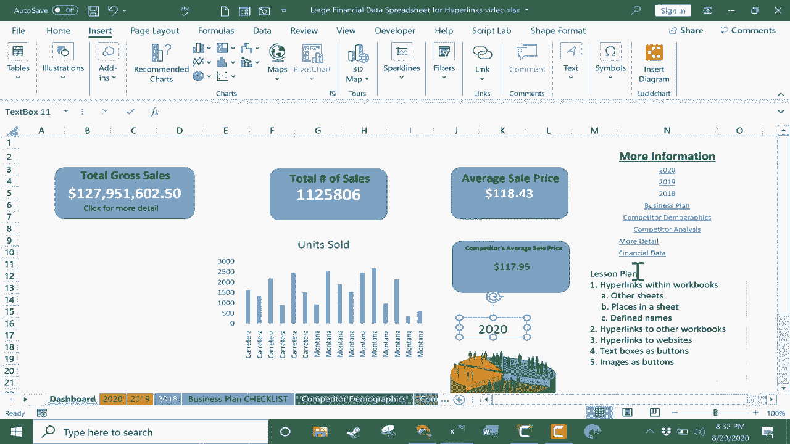

# Excel中级教程 - P53：54）使用超链接 🔗

在本节课中，我们将学习如何在 Microsoft Excel 中创建和使用超链接。超链接可以将单元格、文本、图像等元素链接到工作簿内的其他位置、外部文件、网页甚至电子邮件地址，从而增强电子表格的交互性和导航便利性。

---

## 在工作簿内创建超链接

上一节我们介绍了超链接的基本概念，本节中我们来看看如何在工作簿内部创建超链接。

假设你有一个包含“仪表板”工作表的工作簿，该仪表板汇总了关键信息。为了让查看者能快速跳转到包含详细数据的其他工作表，你可以使用超链接。

以下是创建链接到其他工作表的超链接的步骤：

1.  选择要转换为超链接的单元格或文本。
2.  转到 **“插入”** 选项卡。
3.  在 **“链接”** 功能区组中，点击 **“链接”** 按钮（或使用快捷键 `Ctrl + K`）。
4.  在弹出的对话框中，选择左侧的 **“本文档中的位置”**。
5.  在右侧的列表中选择目标工作表。
6.  如果需要链接到工作表中的特定单元格，可以在 **“请键入单元格引用”** 框中输入单元格地址（例如 `H25`）。
7.  点击 **“确定”**。

完成上述步骤后，点击该单元格即可跳转到指定的工作表或单元格。

**示例代码**：操作路径可简述为：`插入` -> `链接` -> `本文档中的位置` -> `选择工作表` -> `输入单元格引用（可选）` -> `确定`。

---

## 链接到定义名称

除了链接到具体的单元格地址，你还可以链接到已定义的名称区域，这使导航更加精确和灵活。

首先，你需要创建一个定义名称：

1.  在工作表中选择一个单元格区域。
2.  在左上角的名称框中，输入一个名称（例如 `good`）并按回车键。

然后，创建指向该名称的超链接：

1.  选择要添加超链接的单元格。
2.  打开“插入超链接”对话框，选择 **“本文档中的位置”**。
3.  在 **“定义的名称”** 列表下，选择你刚才创建的名称（如 `good`）。
4.  点击 **“确定”**。

现在，点击该超链接将直接跳转到被命名为 `good` 的特定区域。

---

## 链接到外部文件或网页

超链接的功能不仅限于工作簿内部。你可以轻松地链接到其他文件或网站。

### 链接到其他文件

以下是链接到另一个 Excel 工作簿（或其他类型文件）的步骤：

1.  选择目标单元格，打开“插入超链接”对话框。
2.  选择左侧的 **“现有文件或网页”**。
3.  浏览并选择你电脑上的目标文件。
4.  点击 **“确定”**。

**重要提示**：如果目标文件被移动或重命名，链接将会失效。因此，确保链接文件与当前工作簿保持相对固定的位置关系。

### 链接到网页

创建指向网页的超链接同样简单：

1.  选择目标单元格，打开“插入超链接”对话框。
2.  选择 **“现有文件或网页”**。
3.  在地址栏中，粘贴或输入完整的网址（URL），例如 `https://www.example.com`。
4.  点击 **“确定”**。

点击此链接时，系统通常会询问使用哪个浏览器打开，并直接导航到指定网页。

---

## 使用文本框和图像作为超链接按钮

为了让界面更美观，你可以使用文本框或图片作为超链接的载体，而不仅仅是普通的单元格文本。

### 将文本框设置为超链接按钮

1.  在 **“插入”** 选项卡的 **“文本”** 组中，点击 **“文本框”**，并在工作表中绘制一个文本框。
2.  在文本框内输入文字（如“2020”）。
3.  格式化文本框和文字，使其看起来像一个按钮。
4.  选中整个文本框，然后插入超链接，将其指向目标位置（如“2020”工作表）。

### 将图像设置为超链接按钮

1.  在 **“插入”** 选项卡的 **“插图”** 组中，点击 **“图片”** 插入一张图像。
2.  调整图像大小和位置。
3.  选中该图像，然后插入超链接，将其指向目标位置。

这种方法可以极大地提升电子表格的视觉吸引力和用户体验。

---

## 其他超链接选项

Excel 还提供了另外两种实用的超链接类型。

### 创建新文档

在“插入超链接”对话框中，选择 **“新建文档”**。你可以指定新文档的名称和保存路径。点击确定后，Excel 会创建该文档并生成一个指向它的链接。

### 链接到电子邮件地址

选择 **“电子邮件地址”** 选项。在对话框中输入收件人地址和邮件主题。当用户点击此链接时，如果他们电脑上安装了邮件客户端（如 Outlook），将会自动启动并创建一封已填好地址和主题的新邮件。

---

## 总结

本节课中我们一起学习了 Excel 中超链接的多种应用方法。我们掌握了如何在工作簿内部创建链接，包括链接到其他工作表、特定单元格以及定义名称。我们也探讨了如何链接到外部文件、网页，甚至电子邮件地址。最后，我们还学习了如何使用文本框和图像来创建更具视觉效果的交互式按钮。灵活运用超链接，能够使你的 Excel 工作簿变得更加动态、专业且用户友好。