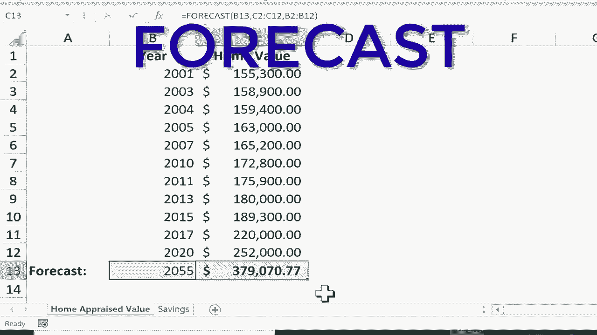

# Excel中级教程 - P54：预测函数 📈

在本教程中，我们将学习如何使用Excel的预测函数。预测函数可以根据已有的历史数据，对未来某个时间点的数值进行估算。虽然这种预测基于简单的数学模型，无法考虑现实世界中的所有复杂变量，但它能为我们提供一个快速、有数据依据的参考值。

我们将通过两个具体的例子来掌握这个功能：预测房屋的未来评估价值，以及预测储蓄账户的未来余额。

---

## 理解预测函数的基本原理

上一节我们介绍了预测函数的用途。本节中，我们来看看它的工作原理。Excel的预测函数本质上是通过分析已知的X值（如年份）和对应的Y值（如房屋价值或储蓄金额）之间的关系，来预测一个新的X值所对应的Y值。

其核心逻辑是寻找数据之间的趋势。Excel提供了多个预测函数，例如：
*   **FORECAST.LINEAR**: 适用于数据呈线性趋势的情况。
*   **FORECAST.ETS**: 适用于数据呈指数或季节性趋势的情况。
*   **FORECAST**: 基础的预测函数，如果你不确定数据模型，可以使用它。

在本教程中，我们将使用基础的 **`FORECAST`** 函数。它的基本语法是：
`=FORECAST(x, known_y‘s, known_x‘s)`
*   **`x`**: 需要预测的未来数据点（例如，未来的年份）。
*   **`known_y‘s`**: 已知的、与`known_x‘s`对应的历史结果数据范围。
*   **`known_x‘s`**: 已知的历史数据点范围（例如，过去的年份）。

---

## 示例一：预测房屋未来价值 🏠

假设你自2001年购买房屋后，定期获得了房屋的评估价值记录。现在，你想估算房屋在2035年的可能价值。

以下是使用FORECAST函数进行预测的步骤：

1.  **定位预测目标单元格**：首先，点击你希望显示2035年预测价值的空白单元格（例如B13）。
2.  **输入公式**：在单元格中输入等号（`=`），然后开始键入`FORECAST(`。
3.  **指定预测点（x）**：输入左括号后，点击包含目标年份“2035”的单元格（即B13），然后输入一个逗号（`,`）。这告诉Excel我们要基于这个年份进行预测。
4.  **选择已知的历史结果（known_y‘s）**：接下来，用鼠标点击并拖动，选择所有已知的历史房屋评估金额（Y值范围）。
5.  **选择已知的历史数据点（known_x‘s）**：再次输入逗号（`,`），然后用鼠标点击并拖动，选择所有对应的已知年份（X值范围）。
6.  **完成公式**：输入右括号（`)`），然后按下键盘上的`Enter`键。

完整的公式看起来类似这样：
`=FORECAST(B13, C2:C11, B2:B11)`
按下回车后，Excel会根据过去年份与价值的线性关系，计算出2035年的预测价值并显示在该单元格中。

---

## 示例二：预测未来储蓄金额 💰

现在，让我们在另一个场景中应用预测函数。假设你有一份从1995年到2005年的储蓄账户余额记录，你想知道到2030年账户里可能有多少钱。

操作步骤与房屋预测类似：

1.  点击目标单元格（例如，显示2030年预测结果的单元格）。
2.  输入公式起始部分：`=FORECAST(`。
3.  点击包含“2030”的单元格作为预测点（x），输入逗号。
4.  选择所有已知的历史储蓄金额作为`known_y‘s`，输入逗号。
5.  选择所有对应的已知年份作为`known_x‘s`。
6.  输入右括号并按下`Enter`键。

公式执行后，Excel会基于1995年至2005年的储蓄增长趋势，给出2030年余额的预测值。

---

## 动态更新预测结果

预测函数的一个优点是它是动态的。你可以轻松地更改预测的年份，结果会自动更新。

*   在房屋评估的例子中，如果你将目标单元格的年份从“2035”改为“2055”，预测的房屋价值会立即重新计算并显示新的结果。
*   同样，在储蓄预测的例子中，更改目标年份也会立刻更新预测的储蓄金额。

这让你可以快速进行不同时间点的情景分析，尽管需要记住这些预测是基于简单数学模型的估算。

---

## 总结

本节课中我们一起学习了Excel预测函数（`FORECAST`）的基本用法。我们了解到，这个函数可以通过分析已知的X和Y数据序列（如年份和对应的价值），来预测新X值所对应的Y值。

我们通过预测房屋未来价值和储蓄账户余额两个具体案例，逐步演练了公式的输入方法：**`=FORECAST(预测点x, 已知历史结果Y, 已知历史数据点X)`**。同时，我们也认识到预测函数的局限性——它无法考虑市场波动、个人习惯等复杂外部变量，其结果应视为一个基于历史趋势的数学估算，而非精确预言。

掌握这个工具，可以帮助你在数据分析中快速对未来的发展趋势做出初步的、量化的判断。