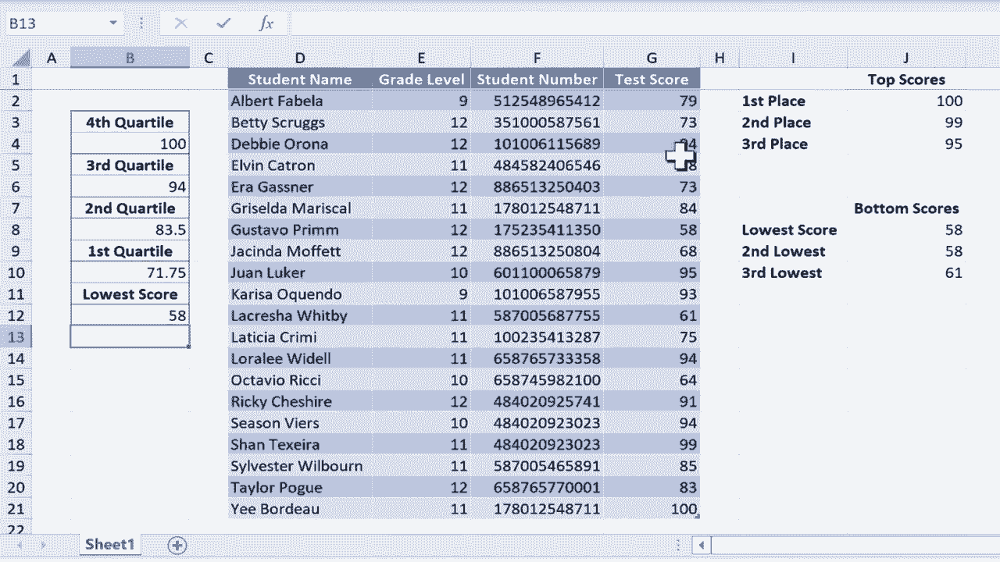

# Excel中级教程 - P55：四分位数函数 📊


在本节课中，我们将学习如何在Excel中使用四分位数函数来分析数据分布。四分位数是统计学中用于描述数据集中趋势和离散程度的重要指标，它能将一组数据分为四个等份。通过本教程，你将掌握使用`QUARTILE`函数快速计算数据的第一、第二、第三和第四四分位数的方法。

## 概述与数据准备

假设我们有一个班级的测试分数列表，我们已经计算出了前三个分数、后三个分数、最高分和最低分。如果你不清楚如何计算这些值，可以回顾关于Excel中`LARGE`和`SMALL`函数的教程。本节课，我们将专注于从测试分数中提取更多信息，即计算各个四分位数，以了解学生成绩的分布情况。

## 四分位数函数详解

`QUARTILE`函数是Excel中用于计算四分位数的核心工具。它的基本语法是：
```
=QUARTILE(array, quart)
```
其中：
*   **`array`**： 代表需要计算四分位数的数据范围。
*   **`quart`**： 指定要返回哪个四分位数，取值范围为0到4。

### 计算第一四分位数 (Q1)

第一四分位数（Q1）表示数据集中有25%的数据小于或等于该值。以下是计算步骤：

1.  选择目标单元格（例如B10）。
2.  输入公式：`=QUARTILE(G2:G21, 1)`。这里`G2:G21`是测试分数的数据范围，`1`表示计算第一四分位数。
3.  按下回车键，得到结果71.75。

结合已知的最低分58，我们可以得出结论：有25%的学生成绩落在58分和71.75分之间。

### 计算第二四分位数 (Q2，即中位数)

第二四分位数（Q2）就是中位数，表示数据集中有50%的数据小于或等于该值。我们可以复制第一四分位数的公式并进行修改。

1.  将公式复制到目标单元格（例如B8）。
2.  在公式栏中将参数`quart`的值从`1`改为`2`。
3.  按下回车键，得到结果83.5。

### 计算第三四分位数 (Q3)

第三四分位数（Q3）表示数据集中有75%的数据小于或等于该值。操作步骤与计算Q2类似。

1.  将公式复制到目标单元格（例如B6）。
2.  在公式栏中将参数`quart`的值改为`3`。
3.  按下回车键，得到结果94。

### 关于第四四分位数 (Q4)

第四四分位数（Q4）就是数据集中的最大值。虽然我们已经用`MAX`函数计算出了最高分100，但用`QUARTILE`函数同样可以得出。

1.  将公式复制到目标单元格。
2.  在公式栏中将参数`quart`的值改为`4`。
3.  按下回车键，得到结果100，与最大值相同。

## 结果解读与应用

现在，我们已经得到了所有四分位数。这些数据的含义是：
*   25%的学生成绩在 **58分** 到 **71.75分** 之间（第一四分位区间）。
*   25%的学生成绩在 **71.75分** 到 **83.5分** 之间（第二四分位区间）。
*   25%的学生成绩在 **83.5分** 到 **94分** 之间（第三四分位区间）。
*   25%的学生成绩在 **94分** 到 **100分** 之间（第四四分位区间）。

因此，任何得分在94到100之间的学生都进入了班级成绩排名的前25%（即第四四分位数）。

## 扩展知识：计算最小值

`QUARTILE`函数还有一个特殊用途：当`quart`参数设置为`0`时，它可以返回数据集中的最小值。

例如，输入公式`=QUARTILE(G2:G21, 0)`，将返回该分数列表中的最低分58。这与使用`MIN`函数的效果完全相同。

## 总结

本节课我们一起学习了Excel中`QUARTILE`函数的使用方法。我们了解到：
1.  `QUARTILE`函数可以快速计算数据的四个四分位数，帮助我们理解数据的分布情况。
2.  函数的两个关键参数是数据范围（`array`）和四分位类型（`quart`，取值为0、1、2、3、4）。
3.  通过分析四分位数，我们可以将数据分为四个等份，从而进行更细致的比较和评估，例如确定学生成绩所处的排名区间。



掌握这个函数，能让你在数据分析时更加得心应手。