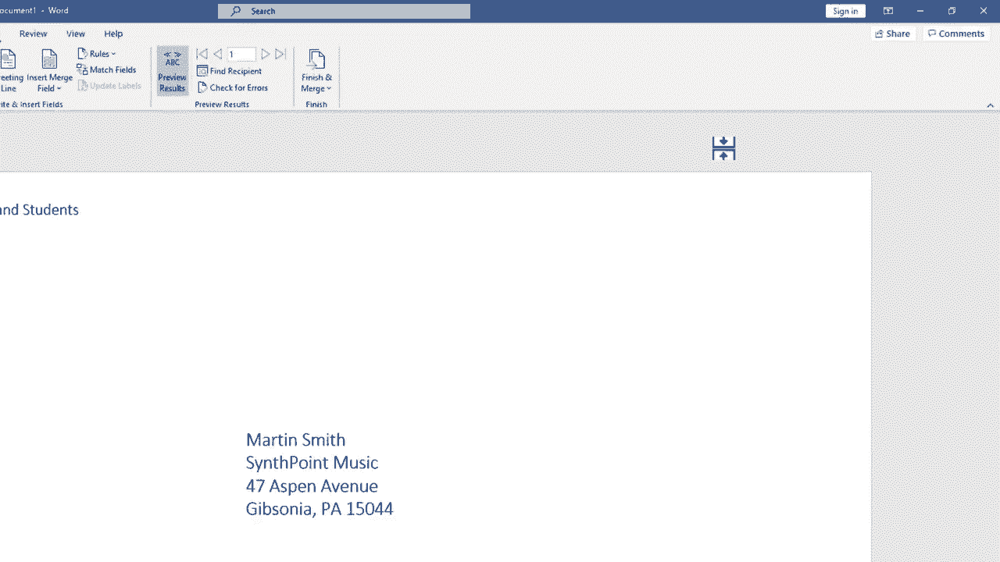

# Excel中级教程 - P56：Microsoft Word 中的邮件合并信封 📮

在本节课中，我们将学习如何使用 Microsoft Word 的“邮件合并”功能，为 Excel 联系人列表中的每一位收件人批量生成带有独立地址的信封。此方法可以高效处理成百上千个信封的打印需求。

---

## 准备工作与初始设置

上一节我们介绍了邮件合并的基本概念，本节中我们来看看如何将其应用于信封制作。

首先，确保你拥有一个包含收件人信息（如姓名、地址）的 Microsoft Excel 文件。接着，在 Microsoft Word 中新建一个空白文档。

1.  在 Word 中，切换到 **“邮件”** 选项卡。
2.  在 **“开始邮件合并”** 组中，点击 **“开始邮件合并”** 按钮。
3.  从下拉菜单中选择 **“信封...”**。

此时会弹出“信封选项”对话框。

---

## 配置信封选项

以下是配置信封格式和打印选项的步骤：

*   **信封尺寸**：在“信封选项”选项卡下，你可以选择标准信封尺寸（例如，美国常用的 **10号** 信封）。如需自定义，可点击“自定义尺寸”。
*   **字体与格式**：点击“送达地址”或“寄件人地址”旁的 **“字体...”** 按钮，可以修改地址的字体、大小、颜色等样式。
*   **地址位置**：在“信封选项”中，可以调整送达地址和寄件人地址距离信封左边和顶边的距离。通常保持 **“自动”** 设置即可。
*   **打印选项**：切换到“打印选项”选项卡，可根据你的打印机设置送纸方式和进纸器来源。

完成设置后，点击 **“确定”**。文档页面将变为信封的版式布局。

---

## 连接数据源（Excel列表）

现在，我们需要将 Word 文档与存储收件人信息的 Excel 文件连接起来。

1.  在 **“邮件”** 选项卡的 **“开始邮件合并”** 组中，点击 **“选择收件人”**。
2.  选择 **“使用现有列表...”**。
3.  在弹出的文件浏览器中，找到并双击你的 Excel 文件。
4.  在“选择表格”对话框中，确保勾选了 **“数据首行包含列标题”**，并选择正确的工作表，然后点击 **“确定”**。

至此，数据连接已完成。

---

## 插入合并字段

连接数据后，需要在信封上指定信息的位置。

**插入寄件人地址（可选）**：
在信封版式的左上角区域，直接输入你的寄件人地址（如公司名称、街道、城市等）。

**插入收件人地址**：
收件人地址区域通常已有一个隐藏的文本框。点击该区域激活它，然后有两种方法插入地址：

*   **方法一：使用地址块**
    1.  点击 **“地址块”** 按钮。
    2.  在弹出的对话框中预览格式。如果信息不匹配（例如，街道地址显示为“未匹配”），点击 **“匹配字段...”**。
    3.  将 Word 的字段（如“地址1”）与 Excel 表中的对应列标题（如“公司地址”）进行匹配，然后点击 **“确定”**。

*   **方法二：手动插入合并字段**
    如果你想完全自定义地址格式，可以手动拼接：
    1.  点击 **“插入合并字段”** 按钮。
    2.  依次选择并插入 **《名字》**、**《姓氏》**、**《公司地址》**、**《城市》**、**《州》**、**《邮政编码》** 等字段，并在中间添加所需的空格、逗号或换行。

---

## 预览与完成合并

在正式打印前，务必预览结果以确保无误。

1.  在 **“邮件”** 选项卡的 **“预览结果”** 组中，点击 **“预览结果”** 按钮。
2.  使用 **“下一记录”** 或 **“上一记录”** 按钮浏览不同收件人的信封效果。
3.  确认无误后，点击 **“完成并合并”** 按钮。
4.  选择 **“打印文档...”**。
5.  在弹出的打印对话框中，建议先选择 **“当前记录”** 打印一份样本进行测试。
6.  测试成功后，再次操作并选择 **“全部”** 以打印所有信封。

---

## 使用邮件合并向导（备选方案）

如果你对上述步骤感到陌生，可以使用更直观的向导模式：

1.  点击 **“开始邮件合并”** -> **“邮件合并分步向导...”**。
2.  右侧将打开向导窗格，跟随 **“选择文档类型”** -> **“选择开始文档”** -> **“选择收件人”** -> **“撰写信函”** -> **“预览信函”** -> **“完成合并”** 的步骤提示进行操作即可。

---

本节课中我们一起学习了如何利用 Word 的邮件合并功能，结合 Excel 数据源，批量生成带有个性化地址的信封。核心步骤包括：**设置信封格式**、**连接 Excel 数据**、**插入合并字段**以及最终的**预览与打印**。掌握此技能将极大提升处理大批量信函工作的效率。