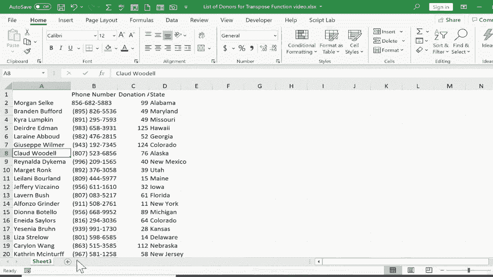

# Excel中级教程 - P57：TRANSPOSE 函数 🔄

在本节课中，我们将要学习如何使用Excel中的TRANSPOSE函数。这个函数能够将数据区域的行列布局进行互换，即将垂直排列的数据转换为水平排列，反之亦然。这对于调整数据视图或创建数据备份非常有用。

## 函数介绍与场景

上一节我们介绍了数据布局的重要性，本节中我们来看看如何调整一个既定的布局。有时，在输入数据后，我们可能会发现将行标题和列标题互换会是更好的呈现方式。例如，你可能将人名输入在第一行作为列标题，但后来觉得将其放在A列作为行标题会更合适。TRANSPOSE函数可以帮助我们快速实现这种转换，而无需手动重新输入数据。

## 使用TRANSPOSE函数

以下是使用TRANSPOSE函数的基本步骤：

1.  **定位目标区域**：在新的工作表或区域中，点击你希望转置后数据出现的左上角单元格。
2.  **输入函数**：输入等号（`=`）并开始键入`TRANSPOSE`。Excel会自动识别该函数。
3.  **选择源数据**：输入左括号后，用鼠标切换到源数据所在的工作表，点击并拖动以选择需要转置的整个数据区域。
4.  **完成公式**：返回公式栏，输入右括号。公式的基本结构如下：
    `=TRANSPOSE(源数据区域)`
5.  **确认输入**：按下键盘上的回车键。Excel会提示“公式溢出”，并将结果填充到相邻的空白单元格中。

完成上述步骤后，数据就会被成功转置。原先在顶部的行标题会移动到左侧的列，而原先在左侧的列标题则会移动到顶部。

## 调整与验证

转置完成后，为了获得更好的视觉效果，可以调整列宽。在列标题字母（如A和B）之间的分隔线上双击，即可自动调整该列宽度以适应内容。

验证数据准确性也很重要。你可以对比源数据和转置后的数据，确保所有信息，如姓名、数字等，都已被正确转换。例如，检查特定人员的电话号码和金额是否匹配。

## 理解动态链接与静态值

使用TRANSPOSE函数创建的数据与源数据是动态链接的。这意味着如果你在源数据表中修改了某个值（例如更新捐赠金额），转置后的表格中的对应值也会自动更新。

如果你希望转置后的数据独立于源数据，不再随源数据变化，则需要将其转换为静态值。以下是操作方法：

1.  选中转置函数生成的所有数据区域。
2.  按下 `Ctrl+C` 进行复制。
3.  在新的目标位置（如另一个工作表）点击左上角单元格。
4.  在“开始”选项卡的“剪贴板”组中，点击“粘贴”按钮的下半部分。
5.  在弹出的菜单中选择“粘贴值”。

完成此操作后，新区域的数据就不再是公式，而是固定的数值。此时，你可以安全地删除包含原始公式的单元格或源数据，而不会影响这份独立的静态数据副本。

## 总结

本节课中我们一起学习了TRANSPOSE函数。我们了解了其**将垂直范围转为水平范围，反之亦然**的核心功能，掌握了使用该函数转置数据的具体步骤，并学会了如何将动态转置的结果转换为独立的静态值。这个函数是重新组织数据视图、提高工作效率的实用工具。