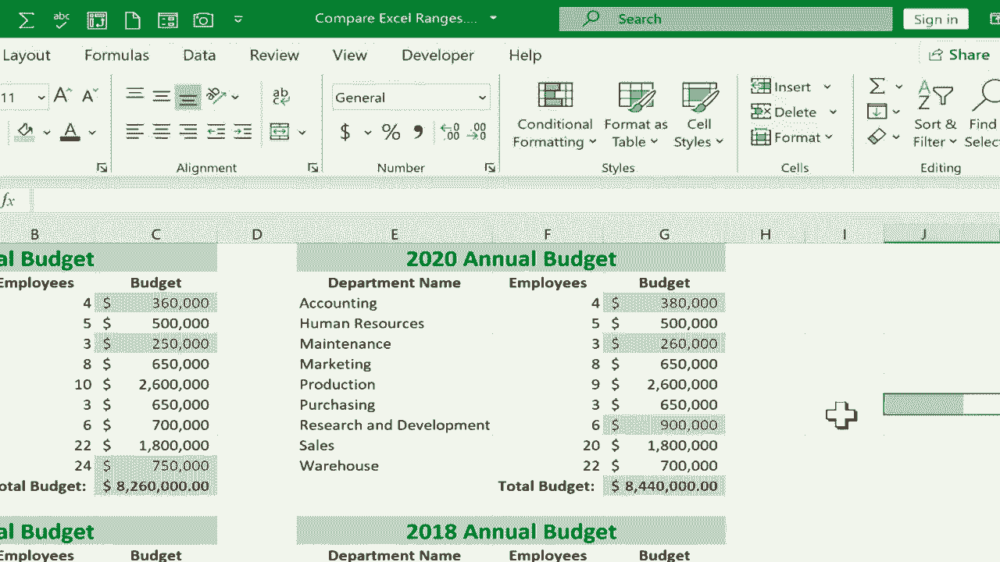

# Excel中级教程 - P58：比较和对比Excel范围 🔍

在本节课中，我们将学习如何快速比较Excel中的两个数据范围，并直观地显示出它们之间的差异。我们将使用“条件格式”功能中的“突出显示单元格规则”来实现这一目标。

## 概述

假设你有一个包含多年预算数据的表格，例如2018年至2021年的年度预算。每个年份的预算数据位于不同的列或区域。我们的目标是快速找出相邻两年（例如2020年与2021年）预算数据的不同之处，而无需手动逐行核对。

## 操作步骤详解

以下是使用条件格式比较两个范围的完整步骤。

### 第一步：选择要比较的第一个范围

首先，用鼠标点击并拖动，选中你想要比较的第一个数据范围。在本例中，我们首先选择2021年的预算数据范围。

### 第二步：选择要比较的第二个范围

接下来，按住键盘上的 `Ctrl` 键，同时用鼠标点击并拖动，选中你想要比较的第二个数据范围。在本例中，我们选择2020年的预算数据范围。此时，两个不连续的区域会被同时选中。

### 第三步：应用条件格式

1.  转到Excel顶部的 **“开始”** 选项卡。
2.  在 **“样式”** 功能组中，找到并点击 **“条件格式”** 按钮。
3.  在弹出的菜单中，将鼠标悬停在 **“突出显示单元格规则”** 选项上。
4.  在次级菜单中，选择 **“重复值”**。

### 第四步：设置规则以显示差异

在弹出的“重复值”对话框中，默认设置是突出显示“重复”值。为了找出差异，我们需要将其改为突出显示“唯一”值。

1.  在左侧的下拉菜单中，将 **“重复”** 改为 **“唯一”**。
2.  在右侧的下拉菜单中，可以选择你喜欢的突出显示样式，例如“浅红填充色深红色文本”或“黄填充色深黄色文本”。
3.  点击 **“确定”**。

完成以上步骤后，Excel会自动在两个选定的范围内，将所有不相同的单元格（即“唯一”值）以你设定的格式高亮显示出来。这样，你就可以一目了然地看到哪些预算项目在两年间发生了变化。

## 应用技巧与注意事项

上一节我们介绍了基础的操作步骤，本节中我们来看看一些实用的技巧和需要注意的细节。

### 精确选择比较范围

为了获得清晰、准确的比较结果，精确选择数据范围至关重要。以下是一些建议：

*   **仅比较数据部分**：如果只想比较预算金额，而不关心年份标题或员工人数，就只选中包含数字的单元格区域。
*   **确保范围结构一致**：两个被比较的范围应具有相同的行数和列数，以确保Excel能正确地进行一一对应的比较。

### 自定义高亮样式

“重复值”规则提供了多种预置的高亮样式。你可以根据个人喜好或报表要求进行选择，例如使用醒目的填充色或更改文字颜色，以使差异更加突出。

### 进行多组比较

此方法不仅限于比较相邻两年。你可以通过重复上述步骤，轻松比较任意两个年份的数据，例如将2021年与2018年进行对比。

### 清除条件格式

如果你想重新进行比较或清除现有的高亮显示，可以按 `Ctrl + Z` 撤销操作。或者，通过 **“开始” -> “条件格式” -> “清除规则”** 来移除指定范围或整个工作表的规则。

## 总结

本节课中，我们一起学习了如何使用Excel的“条件格式”功能来快速比较两个数据范围的差异。核心操作是：**按住 `Ctrl` 键选择两个范围，然后应用“条件格式 -> 突出显示单元格规则 -> 重复值”规则，并将设置改为突出显示“唯一”值**。这个方法能极大地提升数据核对效率，尤其适用于分析财务报表、库存清单或任何需要版本对比的场景。建议你下载练习文件亲自尝试，熟练掌握这一实用技巧。