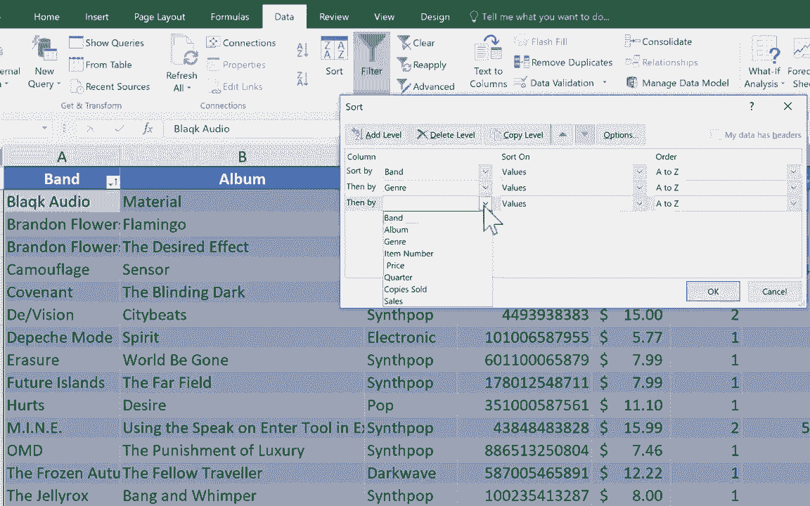

# Excel中级教程 - P6：排序功能详解 🗂️

在本节课中，我们将深入学习Excel中排序功能的工作原理。排序是整理和分析数据的基础操作，能帮助您快速将数据按照特定顺序排列，无论是字母顺序、数值大小还是自定义规则。

## 概述

排序功能允许您根据一列或多列的值重新排列数据行。正确使用排序可以保持数据的关联性，避免信息错位。本节将介绍单列排序、多列排序以及通过“排序”对话框进行复杂排序设置的方法。

---

## 数据准备与表格

您可以看到用于演示的电子表格。这是一个假设的合成流行音乐商店的库存列表，包含乐队、专辑、流派和销量等数据。数据以表格形式呈现。

将数据放入表格中在进行排序时是有帮助的。这不是强制要求，但能简化操作。您可以通过“插入”选项卡创建表格。

*Excel中的表格*

无论是否使用表格，排序的基本逻辑是相同的。接下来，我们看看具体的排序方法。

---

## 单列排序的正确方法

许多人试图通过点击列标题字母（如B）并选择“排序和筛选”来排序。但请注意，如果数据在表格中，此选项可能不可用。更重要的是，这种方法可能导致错误，因为它可能只对单列排序，破坏数据行的整体性。

**我们不希望专辑标题移动时，左侧的乐队名称和右侧的其他信息保持不动。**

因此，建议不要通过点击列标题进行排序。正确的方法是：

1.  在您想作为排序依据的那一列中，**单击任意一个数据单元格**（不要单击列标题）。
2.  然后，转到“开始”选项卡的“编辑”组，点击“排序和筛选”。
3.  选择“从A到Z排序”或“从Z到A排序”。

**示例操作：**
-   若要按专辑标题排序，在B列（专辑）的任意数据单元格（如“Blinding Dark”）上单击。
-   点击“排序和筛选” -> “从A到Z排序”。
-   所有数据行将根据专辑标题的字母顺序重新排列，且数据保持完整。

同理，按乐队排序时，在A列的数据单元格上单击，然后执行排序。

---

## 多列排序与排序优先级

上一节我们介绍了单列排序，本节中我们来看看当数据有重复值时，如何进行多级排序。

假设我们新增了一行数据：乐队“Brandon Flowers”的另一张专辑《Flamingo》。现在，列表中有两条同一乐队的记录。

如果我先按“专辑”从A到Z排序，再按“乐队”从A到Z排序，观察结果：数据首先按乐队字母顺序排列，但对于“Brandon Flowers”这个乐队，其下的两张专辑《Expectation Effect》和《Flamingo》的顺序被颠倒了，《Flamingo》排在了上面。

**这是因为Excel会记住最近的排序操作，并将其作为主要排序依据。** 后续的排序则成为次要的、用于处理“平局”情况的依据。在上例中，主要排序是“乐队”，次要排序是之前操作留下的“专辑”顺序。

您可以继续增加排序层级，例如再按“流派”排序。这样，数据会先按流派排列，在同一流派内再按之前的规则（乐队、专辑）排序。

---

## 使用“排序”对话框进行复杂排序

通过功能区按钮进行的连续排序虽然快捷，但对于复杂的多条件排序，使用“排序”对话框更为清晰和强大。

以下是使用“排序”对话框的步骤：

1.  **选择数据范围**：首先，选中您要排序的所有数据。可以按 `Ctrl + A` 快捷键。为确认选中了整个区域，可以按 `Ctrl + .`（句号）在选区四个角之间跳转查看。
2.  **打开对话框**：转到“数据”选项卡，在“排序和筛选”组中，点击最大的“排序”按钮。
3.  **添加排序条件**：
    -   点击“添加条件”。
    -   在“主要关键字”下拉列表中，选择第一排序列（如“乐队”）。
    -   设置“排序依据”为“数值”，次序为“A到Z”。
4.  **添加次要条件**：
    -   再次点击“添加条件”。
    -   设置“次要关键字”为第二排序列（如“流派”），次序为“A到Z”。
5.  **添加更多条件**（可选）：
    -   您可以继续添加条件，例如第三关键字设为“销量”，排序依据为“数值”，次序为“降序”。

*“排序”对话框设置示例*

**应用场景**：当主要关键字（如乐队）的值相同时，Excel会使用次要关键字（如流派）来决出顺序；如果仍然相同，则使用第三关键字（如销量）。这使您能实现非常精细的数据排列。

---

## 总结

本节课中我们一起学习了Excel排序功能的核心技巧：
1.  进行单列排序时，应单击该列的数据单元格而非列标题，以保持数据行的完整性。
2.  连续执行排序操作时，**最后一次排序是主要依据**，之前的排序会作为次要依据影响结果。
3.  对于需要明确多个优先级的复杂排序，应使用“数据”选项卡中的“排序”对话框，它可以清晰定义**主要、次要乃至第三排序关键字**。

掌握这些方法，您就能高效、准确地对各类数据进行整理，为后续的数据分析打下坚实基础。