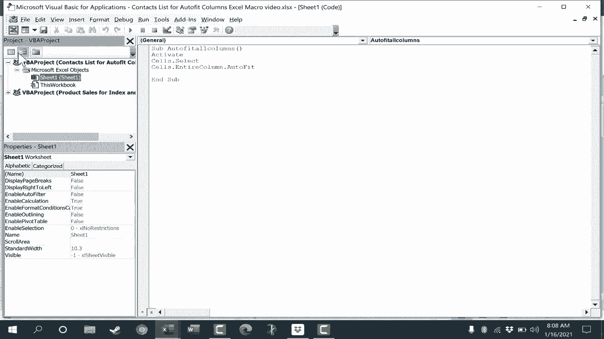

# Excel中级教程 - P60：61）从头开始创建 Excel 宏 - 自动调整列 ⚙️


在本节课中，我们将学习如何从头开始创建一个Excel宏。具体来说，我们将创建一个可以自动调整所有列宽的宏，并将其分配给一个按钮，实现一键操作。

## 概述

手动调整Excel列宽以适应内容可能很繁琐。虽然可以通过双击列标题之间的分隔线来快速调整，但创建一个宏可以让这个过程更快、更自动化。本节课将引导你完成启用开发者工具、编写VBA代码、创建按钮并分配宏的完整流程。

## 准备工作：启用“开发者”选项卡

在开始创建宏之前，需要确保Excel的“开发者”选项卡已显示在功能区中。

以下是启用“开发者”选项卡的步骤：

1.  在Excel功能区任意选项卡上右键单击。
2.  在弹出的菜单中选择“自定义功能区”。
3.  在弹出的对话框右侧“主选项卡”列表中，找到并勾选“开发者”复选框。
4.  点击“确定”按钮。

完成上述步骤后，“开发者”选项卡就会出现在功能区中。

## 打开 Visual Basic 编辑器

“开发者”选项卡是访问VBA（Visual Basic for Applications）编程环境的入口。VBA是微软为Office应用程序内置的一种编程语言。

接下来，我们打开代码编辑器：

1.  点击“开发者”选项卡。
2.  在“代码”组中，点击“Visual Basic”按钮。你也可以使用键盘快捷键 `Alt + F11` 来快速打开编辑器。

## 编写自动调整列宽的宏代码

Visual Basic编辑器打开后，我们将为当前工作表编写一小段简单的代码。

以下是具体的代码编写步骤：

1.  在左侧“工程资源管理器”窗口中，双击你正在操作的工作表（例如“Sheet1”）。
2.  右侧会弹出一个代码窗口。
3.  在代码窗口中输入以下代码：
    ```vba
    Sub AutoFitAllColumns()
        Cells.Select
        Selection.EntireColumn.AutoFit
    End Sub
    ```
    *   `Sub AutoFitAllColumns()` 声明了一个名为“AutoFitAllColumns”的新宏（子程序）。
    *   `Cells.Select` 选中当前工作表中的所有单元格。
    *   `Selection.EntireColumn.AutoFit` 将选中区域的所有列调整为最适合其内容的宽度。
    *   `End Sub` 表示宏结束。

输入完成后，关闭Visual Basic编辑器窗口即可。

## 运行与测试宏

代码编写完成后，我们可以立即测试它是否工作。

返回Excel界面，在“开发者”选项卡的“代码”组中，点击“宏”按钮。在弹出的对话框中，选择我们刚创建的“AutoFitAllColumns”宏，然后点击“执行”。此时，工作表中所有列的宽度都会自动调整，以完美匹配其内容。

## 创建按钮并分配宏

虽然可以通过宏对话框运行宏，但创建一个按钮会更加方便。上一节我们编写并测试了宏代码，本节中我们来看看如何为其创建一个快捷按钮。

以下是创建按钮的步骤：

1.  在“开发者”选项卡的“控件”组中，点击“插入”。
2.  在“表单控件”区域选择“按钮”图标。
3.  在工作表的空白区域点击并拖动鼠标，绘制一个按钮。
4.  松开鼠标后，会弹出“指定宏”对话框。
5.  在列表中选择我们创建的“AutoFitAllColumns”宏，点击“确定”。
6.  此时按钮上的默认文本（如“按钮1”）处于可编辑状态，将其修改为更易懂的名称，例如“自动调整列”。
7.  要移动按钮位置，需要**右键单击**按钮并拖动，将其放置到合适的位置（如数据区域旁边）。

现在，点击这个“自动调整列”按钮，即可一键执行自动调整列宽的操作。

## 保存启用宏的工作簿

由于工作簿中包含了VBA宏代码，必须以特殊格式保存，否则代码会丢失。

当你尝试保存时，Excel可能会弹出警告。请按照以下步骤操作：

1.  点击“否”，不按常规方式保存。
2.  在“另存为”对话框中，将“保存类型”更改为 **“Excel 启用宏的工作簿 (*.xlsm)”**。
3.  为文件命名，然后点击“保存”。

注意，启用宏的工作簿文件扩展名为 `.xlsm`，与普通 `.xlsx` 文件不同。

## 后续使用与安全提示

当你再次打开这个 `.xlsm` 文件时，Excel出于安全考虑可能会禁用宏。你需要点击“启用内容”按钮，才能使宏和按钮恢复正常功能。

关于使用VBA代码，有两点需要注意：

*   **探索学习**：你可以在互联网上搜索更多VBA代码片段，将其粘贴到代码窗口中，探索Excel自动化的各种可能性。
*   **注意安全**：务必从可信来源获取代码，并尽量理解代码的作用。运行来源不明的代码可能会对数据造成意外修改或损坏。

## 总结

本节课中我们一起学习了在Excel中从零开始创建宏的完整过程。我们首先启用了“开发者”选项卡，然后使用VBA编写了自动调整列宽的简单代码，接着创建了一个表单按钮并将宏分配给它，最后学会了如何正确保存启用宏的工作簿。掌握这些步骤，你就为学习更复杂的Excel自动化任务打下了基础。



