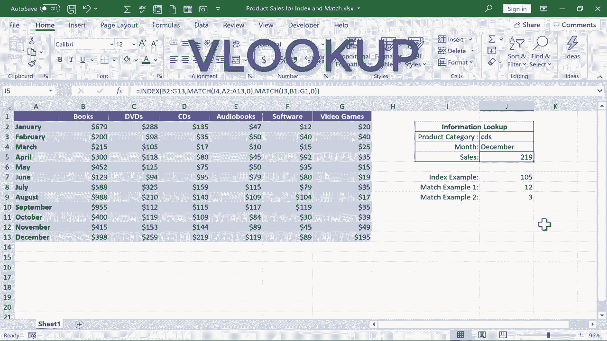

# Excel中级教程 - P61：索引和匹配 🔍


在本节课中，我们将学习如何结合使用 **INDEX** 和 **MATCH** 这两个函数，在Excel中执行强大且灵活的查找操作。我们将通过一个示例，逐步理解每个函数的工作原理，并最终将它们组合成一个动态公式。

## 概述 📋

我们将使用一个假设的媒体企业销售记录表。该表按月跟踪不同产品类别（如DVD、书籍、软件等）的销售额。我们的目标是：在表格右侧指定一个产品类别和一个月份，公式就能自动返回对应的总销售额。

为了实现这个目标，我们将分步学习 **INDEX** 函数和 **MATCH** 函数，然后将它们组合起来。

## 理解 INDEX 函数

上一节我们介绍了本节课的目标。本节中，我们来看看实现目标所需的第一个核心函数：**INDEX**。

**INDEX** 函数的主要作用是从一个指定的单元格区域（数组）中，根据给定的行号和列号提取对应的值。

其基本语法如下：
```
=INDEX(array, row_num, [column_num])
```
*   `array`：要查找的单元格区域。
*   `row_num`：在区域中要返回值的行号。
*   `[column_num]`：可选参数，在区域中要返回值的列号。如果区域只有一列，则可以省略。

让我们通过一个例子来理解它。

假设我们有一个数字区域 `B2:C12`。我们想获取这个区域内第3行、第2列的值（即数字105）。

操作步骤如下：
1.  在目标单元格（例如J7）输入公式：`=INDEX(B2:C12, 3, 2)`
2.  按下回车键，公式将返回结果 `105`。

这个公式的含义是：在区域 `B2:C12` 中，找到第3行和第2列交叉点的单元格，并返回其中的值。

单独使用 **INDEX** 函数时，我们必须手动输入行号和列号，这限制了它的灵活性。接下来，我们将学习如何使其动态化。

## 理解 MATCH 函数

上一节我们学会了如何使用 **INDEX** 根据固定位置提取数据。本节中我们来看看 **MATCH** 函数，它可以帮助我们动态地确定行号或列号。

**MATCH** 函数的作用是在一个单元格区域中搜索指定的项，并返回该项在该区域中的相对位置（序号）。

其基本语法如下：
```
=MATCH(lookup_value, lookup_array, [match_type])
```
*   `lookup_value`：需要查找的值。
*   `lookup_array`：要搜索的单元格区域。
*   `[match_type]`：匹配类型。`0` 表示精确匹配。

以下是两个使用 **MATCH** 函数的例子。

**示例一：查找月份位置**
假设我们想在月份列表 `A2:A12` 中查找 “July” 的位置。
1.  在单元格中输入公式：`=MATCH("July", A2:A12, 0)`
2.  按下回车键，公式将返回数字 `7`。这表示 “July” 在区域 `A2:A12` 中是第7个条目。

**示例二：查找产品类别位置**
假设我们想在产品类别标题行 `B1:H1` 中查找 “Software” 的位置。
1.  在单元格中输入公式：`=MATCH("Software", B1:H1, 0)`
2.  按下回车键，公式将返回数字 `5`。这表示 “Software” 在区域 `B1:H1` 中是第5个条目。

单独使用 **MATCH** 看起来作用有限，但它的强大之处在于其查找值可以是变量。例如，我们可以将公式中的 `"July"` 替换为一个单元格引用（如 `J4`），这样当 `J4` 单元格的内容改变时，**MATCH** 函数返回的位置序号也会自动更新。这为动态查找奠定了基础。

## 组合 INDEX 与 MATCH

上一节我们分别学习了 **INDEX** 和 **MATCH**。本节中，我们将把这两个函数组合起来，创建一个能够根据输入内容动态查找数据的强大公式。

我们的目标是：在单元格 `J3` 输入产品类别（如DVD），在单元格 `J4` 输入月份（如January），然后在 `J5` 单元格自动得到对应的销售额。

思路是：
*   用 **MATCH(J4, A2:A12, 0)** 来确定月份在数据区域中的行号。
*   用 **MATCH(J3, B1:H1, 0)** 来确定产品类别在数据区域中的列号。
*   用 **INDEX(B2:H12, 行号, 列号)** 来根据确定的行号和列号提取最终的销售额。

以下是构建这个组合公式的步骤：

1.  在目标单元格 `J5` 中输入：`=INDEX(`
2.  选择数据区域 `B2:H12`，然后输入逗号 `,`。
3.  现在需要输入行号。我们不直接输入数字，而是输入第一个 **MATCH** 函数来动态计算：`MATCH(J4, A2:A12, 0)`。这个函数会查找 `J4` 单元格中的月份在 `A2:A12` 区域中的位置。
4.  输入逗号 `,`，准备输入列号。
5.  同样，我们不直接输入列号数字，而是输入第二个 **MATCH** 函数：`MATCH(J3, B1:H1, 0)`。这个函数会查找 `J3` 单元格中的产品类别在 `B1:H1` 区域中的位置。
6.  输入右括号 `)` 结束 **INDEX** 函数。最终的公式看起来像这样：
    ```
    =INDEX(B2:H12, MATCH(J4, A2:A12, 0), MATCH(J3, B1:H1, 0))
    ```
7.  按下回车键。

现在，当你在 `J3` 单元格输入 “DVD”，在 `J4` 单元格输入 “January” 时，`J5` 单元格就会显示一月份DVD的销售额 `288`。你可以随意更改 `J3` 和 `J4` 的内容，例如输入 “Software” 和 “October”，公式会立即返回十月份软件的销售额。

## 总结 🎯

本节课中我们一起学习了：
1.  **INDEX 函数**：用于根据指定的行号和列号，从一个区域中提取数据。公式为 `=INDEX(array, row_num, [column_num])`。
2.  **MATCH 函数**：用于在某个区域中查找特定值，并返回其相对位置。公式为 `=MATCH(lookup_value, lookup_array, [match_type])`，其中 `match_type` 为 `0` 时表示精确匹配。
3.  **INDEX 与 MATCH 的组合**：这是本节课的核心。通过将 **MATCH** 函数嵌套在 **INDEX** 函数中作为其 `row_num` 和 `column_num` 参数，我们创建了一个动态的查找公式。这个公式能够根据输入单元格的变化，自动定位并返回所需的数据。



这种组合比类似功能的 VLOOKUP 函数更加灵活，特别是在查找列不在数据表最左侧，或者数据表结构可能发生变化时，**INDEX+MATCH** 是更可靠和强大的选择。对于大型数据集，掌握这个技巧将极大地提升你的数据处理效率。