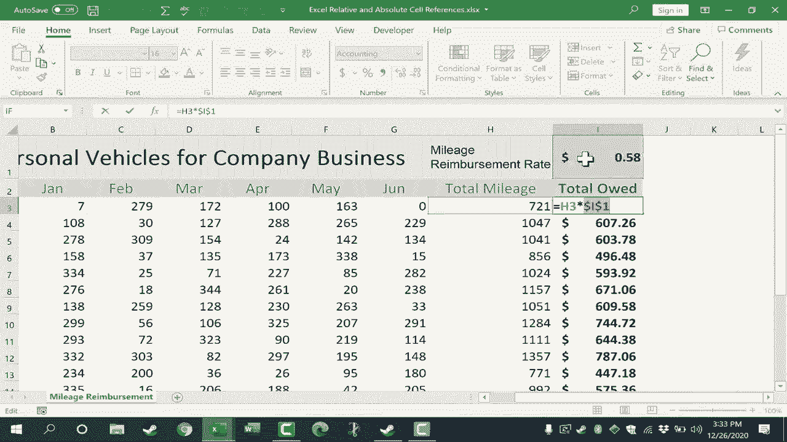

# Excel中级教程 - P62：63）相对与绝对单元格引用 🔢

在本节课中，我们将学习Excel中一个至关重要的概念：**相对单元格引用**与**绝对单元格引用**。理解这两种引用方式的区别，能帮助你更高效、更准确地构建公式，尤其是在复制公式时避免错误。我们将通过一个里程报销的实例来演示它们的应用。

## 概述 📋

单元格引用是Excel公式的基础。默认情况下，Excel使用相对引用，这意味着公式中的单元格地址会随着公式位置的变化而自动调整。但在某些情况下，我们需要公式中的某个部分**固定不变**，这时就需要使用绝对引用。本节课将详细解释这两种引用的工作原理、区别以及如何应用。

## 相对单元格引用

上一节我们概述了引用的基本概念，本节中我们来看看最常见的引用类型——相对单元格引用。

相对单元格引用是Excel的默认行为。当你复制一个包含相对引用的公式时，公式中的单元格地址会相对于新位置发生改变。

以下是使用相对引用的一个典型场景：

假设我们需要计算每位员工上半年的总里程。首先，为第一位员工（Kaina）创建求和公式。

1.  点击目标单元格（例如H3）。
2.  输入公式 `=SUM(B3:G3)`。
3.  按回车键，得到结果。

此时，公式 `=SUM(B3:G3)` 就是一个相对引用。它表示“对当前单元格（H3）左侧连续的六个单元格（B3到G3）求和”。

现在，我们不需要为其他员工重新输入公式，只需使用“自动填充”功能即可。

1.  选中包含公式的单元格H3。
2.  将鼠标移至单元格右下角的**填充柄**（小方块）。
3.  点击并按住鼠标左键，向下拖动以覆盖其他员工所在行。
4.  松开鼠标。

你会发现，Excel自动为每一行调整了公式。例如，H4中的公式变成了 `=SUM(B4:G4)`，H5中的公式变成了 `=SUM(B5:G5)`。这是因为相对引用会根据公式移动的方向和距离进行相应偏移，始终保持着“对当前单元格左侧六个单元格求和”的逻辑关系。

## 绝对单元格引用

理解了相对引用如何自动调整后，本节中我们来看看当需要固定某个特定值时，应该如何使用绝对单元格引用。

在某些计算中，公式的某一部分必须指向一个固定的单元格，不随复制而改变。例如，在计算报销金额时，**每英里的报销费率**是一个常量，应该被固定引用。

如果我们错误地使用相对引用来计算报销金额，就会出错：

1.  为第一位员工输入公式：`=H3*I1` （假设I1单元格存储着费率0.58）。
2.  使用填充柄向下复制公式。
3.  检查结果，会发现从第二位员工开始，公式变成了 `=H4*I2`、`=H5*I3`……Excel错误地将“总里程”标题等单元格当作了费率来相乘，导致计算结果完全错误。

这是因为 `I1` 被当作相对引用，复制时也跟着向下移动了。要修正这个问题，我们需要将费率的引用改为**绝对引用**。

创建绝对引用的方法是在单元格地址的列标和行号前加上美元符号 `$`。

以下是正确的操作步骤：

1.  在目标单元格中输入公式：`=H3*$I$1`。
    *   `H3` 保持为相对引用，允许在向下复制时变为H4、H5……
    *   `$I$1` 是绝对引用，`$`锁定了列（I）和行（1），确保复制公式时引用始终指向I1单元格。
2.  按回车键得到正确结果。
3.  再次使用填充柄向下复制公式。

现在，检查下方单元格的公式，你会发现 `$I$1` 部分始终保持不变，而 `H3` 部分则相对变化，从而为每位员工正确计算了报销金额。

> **提示**：你可以按 **F4** 键快速切换引用类型。选中公式中的单元格地址（如I1），按F4键，它会在 `I1` -> `$I$1` -> `I$1` -> `$I1` 之间循环。`$I$1`（锁定行和列）是绝对引用；`I$1`（只锁定行）或 `$I1`（只锁定列）称为混合引用。

## 总结 🎯

本节课中我们一起学习了Excel中相对与绝对单元格引用的核心知识：

*   **相对引用**（如 `A1`）：公式复制时，引用地址会**自动调整**。这是默认的引用方式，适用于基于相对位置进行计算的情况。
*   **绝对引用**（如 `$A$1`）：公式复制时，引用地址**固定不变**。通过在列标和行号前加 `$` 符号实现，适用于需要指向固定单元格（如常量、系数、税率）的情况。
*   **核心操作**：使用 **填充柄** 复制公式时，相对引用会偏移，绝对引用会锁定。按 **F4键** 可以快速切换引用类型。

掌握这两种引用方式，能够让你在构建复杂表格和批量处理数据时更加得心应手，确保计算结果的准确性。