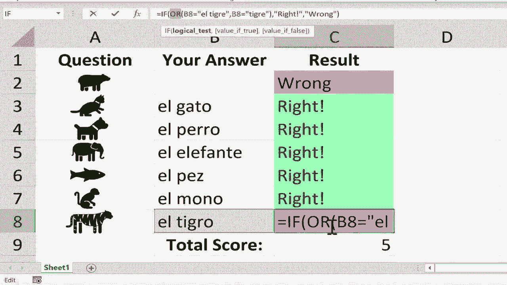

# Excel中级教程 - P63：使用 IF 和 COUNTIF 函数创建交互式工作表 📊

在本节课中，我们将学习如何利用 Excel 的 **IF** 和 **COUNTIF** 函数，创建一个能够自动评分、与学生互动的练习测验工作表。我们将从设置问题与答案开始，逐步实现自动判断对错、视觉化反馈以及最终的成绩汇总。

---

## 概述

我们将创建一个西班牙语动物词汇的练习测验。工作表左侧是动物图标，学生需要在旁边输入对应的西班牙语单词。Excel 将使用 **IF** 函数自动判断答案对错，并使用 **COUNTIF** 函数统计正确数量，最终给出总分。整个过程无需手动批改，实现自动化与互动性。

---

## 第一步：准备问题与答案区域

首先，在工作表中准备好问题和答案的输入区域。你可以插入图标作为视觉问题。

以下是插入图标的步骤：
1.  点击【插入】选项卡。
2.  在【插图】组中，点击【图标】。
3.  在搜索框中输入关键词（如“动物”），选择想要的图标。
4.  点击【插入】，然后调整图标大小并放置到合适位置。

假设A列放置动物图标，B列将作为学生输入答案的区域。

---

## 第二步：使用 IF 函数实现自动评分

接下来，我们需要在C列设置公式，用于判断B列输入的答案是否正确。这里将使用 **IF** 函数。

**IF函数的基本语法是：**
`=IF(逻辑测试, 如果为真则返回此值, 如果为假则返回此值)`

现在，让我们为第一个问题（假设是“熊”，西班牙语为“El Oso”）设置公式。

1.  选中单元格 **C2**。
2.  输入公式：`=IF(B2="El Oso", "right!", "wrong")`
3.  按下回车键。

此时，如果在B2中输入“El Oso”，C2会显示“right!”；如果输入其他内容或留空，则显示“wrong”。

---

## 第三步：快速复制公式

我们不需要为每个问题手动重复输入公式。可以使用“填充柄”功能快速复制。

1.  选中已设置好公式的单元格 **C2**。
2.  将鼠标指针移动到单元格右下角的小绿点（填充柄）上，直到指针变成黑色加号。
3.  按住鼠标左键并向下拖动，覆盖C3到C8单元格。

拖动后，Excel会自动将公式复制到下方单元格，并智能地调整行号引用。例如，C3中的公式会自动变为 `=IF(B3="El Oso", "right!", "wrong")`。

> **注意**：复制后，你需要手动修改每个单元格公式中的正确答案。例如，对于“猫”（El Gato），需要将C3单元格的公式改为 `=IF(B3="El Gato", "right!", "wrong")`。修改时，建议点击单元格后在编辑栏中操作，更为清晰。

---

## 第四步：添加条件格式进行视觉反馈

为了让对错结果更直观，我们可以使用“条件格式”功能，为“right!”和“wrong”单元格自动填充不同颜色。

以下是设置步骤：

1.  选中C列的所有反馈单元格（例如C2:C8）。
2.  点击【开始】选项卡，在【样式】组中找到【条件格式】。
3.  选择【突出显示单元格规则】 -> 【文本包含】。
4.  在弹出的对话框中，输入“right!”，并在右侧下拉菜单中选择一个绿色填充的格式（如“绿填充色深绿色文本”），点击确定。
5.  重复步骤2-4，这次输入“wrong”，并选择一个红色填充的格式（如“浅红色填充深红色文本”）。

设置完成后，当学生输入答案，C列单元格不仅会显示文字，还会根据对错呈现不同的背景色，提供更强烈的视觉反馈。

---

## 第五步：使用 COUNTIF 函数统计总分

最后，我们需要在工作表底部统计学生答对的总题数。这里将使用 **COUNTIF** 函数。

**COUNTIF函数的基本语法是：**
`=COUNTIF(要检查的区域, 要计数的条件)`

1.  选择一个单元格来显示总分，例如 **C9**。
2.  输入公式：`=COUNTIF(C2:C8, "right!")`
3.  按下回车键。

这个公式会统计C2到C8这个范围内，内容为“right!”的单元格数量，从而得出正确答题数。

---

## （进阶）第六步：允许多个正确答案变体

有时，一个答案可能有多种正确的表达方式。例如，“老虎”的西班牙语可以是“El Tigre”，也可能被简写为“Tigre”。我们可以通过修改 **IF** 函数来接受多个正确答案。

修改C列对应单元格的公式，使用 **OR** 函数组合多个条件。

例如，将老虎问题的公式（假设在C8）从：
`=IF(B8="El Tigre", "right!", "wrong")`

修改为：
`=IF(OR(B8="El Tigre", B8="Tigre"), "right!", "wrong")`

**公式解释：**
`OR(条件1, 条件2, ...)` 函数表示只要括号内的任意一个条件成立，整个结果就为“真”。这样，无论学生输入“El Tigre”还是“Tigre”，都会被判定为正确。

你可以根据需要对其他问题应用类似的逻辑。

---

## 总结

本节课中，我们一起学习了如何创建一个交互式、自评分的工作表：
1.  我们使用 **IF** 函数为核心，构建了答案自动判断的逻辑：`=IF(答案单元格=“正确答案”, “right!”, “wrong”)`。
2.  利用填充柄快速复制公式，提高了工作效率。
3.  通过**条件格式**为结果添加颜色，增强了视觉反馈。
4.  使用 **COUNTIF** 函数进行成绩汇总：`=COUNTIF(反馈区域, “right!”)`。
5.  最后，还探讨了使用 **OR** 函数来接受多个正确答案变体的进阶技巧。

通过组合这些功能，你可以轻松地将此模板改造成任何学科的自测练习，实现教学或培训的自动化辅助。