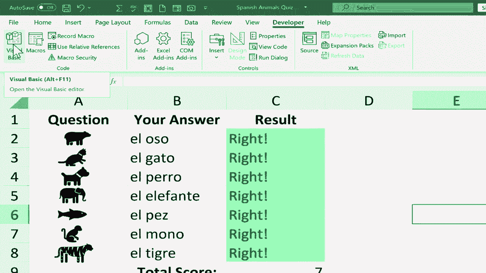
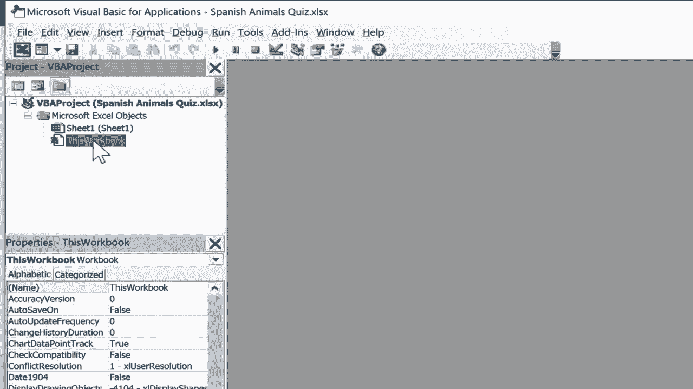
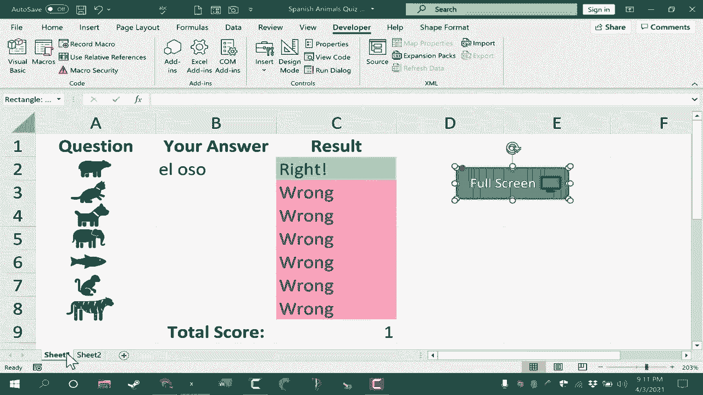

# Excel中级教程 - P64：创建全屏宏与自定义按钮 🖥️🔘


在本节课中，我们将学习如何从零开始创建一个Excel宏。这个宏的功能是切换Excel的全屏模式。我们还将学习如何创建一个美观的自定义按钮来触发这个宏，从而提升工作表的交互性和专业性。

---

## 第一步：启用“开发者”选项卡

要创建和运行宏，首先需要确保Excel的“开发者”选项卡可见。

1.  点击Excel左上角的“文件”菜单。
2.  选择“选项”。
3.  在弹出的“Excel选项”对话框中，点击“自定义功能区”。
4.  在右侧的“主选项卡”列表中，找到并勾选“**开发者**”。
5.  点击“确定”。

现在，你的Excel功能区将显示“开发者”选项卡。

---

## 第二步：编写VBA宏代码

上一节我们启用了宏开发环境，本节中我们来看看如何编写具体的宏代码。我们将使用Visual Basic for Applications (VBA) 来编写一个简单的程序。

1.  点击“开发者”选项卡。
2.  在“代码”组中，点击“**Visual Basic**”按钮，打开VBA编辑器。
3.  在VBA编辑器左侧的“项目”窗口中，找到并双击“**ThisWorkbook**”。这表示宏将作用于整个工作簿，而不仅仅是当前工作表。
4.  在右侧的代码窗口中，输入以下代码：

```vb
Sub GoFullScreen()
    Application.DisplayFullScreen = Not Application.DisplayFullScreen
End Sub
```



**代码解释**：
*   `Sub GoFullScreen()` 定义了宏的开始和名称。
*   `Application.DisplayFullScreen` 是控制全屏显示的属性。
*   `Not` 运算符用于切换该属性的状态（True 或 False），从而实现点击一次全屏，再点击一次退出全屏的功能。
*   `End Sub` 标志着宏的结束。

5.  输入完毕后，关闭VBA编辑器窗口，返回Excel界面。

---

## 第三步：测试宏

在创建按钮之前，我们先测试一下宏是否能正常运行。

1.  点击“开发者”选项卡。
2.  在“代码”组中，点击“**宏**”按钮。
3.  在弹出的对话框中，选择名为“**GoFullScreen**”的宏。
4.  点击“**运行**”。

此时，Excel应切换至全屏模式。按下键盘上的 `Esc` 键可以退出全屏。你也可以再次运行该宏来退出全屏。

---



## 第四步：创建自定义按钮

虽然可以通过“宏”对话框运行代码，但创建一个自定义按钮会更加方便和直观。以下是创建美观按钮的步骤。

首先，我们来插入并设计按钮的形状和外观。

1.  点击“插入”选项卡。
2.  在“插图”组中，点击“**形状**”。
3.  选择一个你喜欢的形状，例如“圆角矩形”。
4.  在工作表中点击并拖动鼠标，绘制出按钮形状。
5.  选中该形状，在顶部出现的“形状格式”选项卡中，可以更改其填充颜色、轮廓等样式。
6.  双击形状，输入按钮文字，例如“**全屏**”，并调整字体大小。

接下来，我们可以为按钮添加一个图标，使其更生动。

1.  点击“插入”选项卡。
2.  在“插图”组中，点击“**图标**”。
3.  在搜索框中输入关键词（如“屏幕”），选择一个合适的图标并点击“插入”。
4.  将图标调整到合适大小，并放置在按钮上。

为了使图标和按钮形状作为一个整体移动和操作，我们需要将它们组合。

1.  按住 `Ctrl` 键，同时单击选中按钮形状和图标。
2.  右键点击选中的对象，在弹出的菜单中选择“**组合**” -> “**组合**”。

---

## 第五步：为按钮分配宏

现在，我们需要将这个图形按钮与我们之前编写的宏关联起来。

1.  右键点击已组合好的按钮。
2.  在弹出的菜单中，选择“**分配宏...**”。
3.  在“分配宏”对话框中，选择我们之前创建的“**GoFullScreen**”宏。
4.  点击“确定”。

现在，点击这个自定义按钮，即可执行切换全屏的宏。再次点击则会退出全屏。

---

## 第六步：跨工作表使用按钮

由于我们的宏是保存在“ThisWorkbook”中的，因此它可以在本工作簿的所有工作表中使用。以下是跨表复制按钮的方法。

1.  在 `Sheet1` 中，右键点击创建好的按钮，选择“**复制**”。
2.  切换到 `Sheet2` 或其他任何工作表。
3.  在空白处右键点击，选择“**粘贴**”。
4.  粘贴过来的按钮已经关联了宏，可以直接点击使用。

---

## 总结



本节课中我们一起学习了如何创建一个实用的Excel全屏切换宏。我们首先启用了“开发者”选项卡，然后编写了简单的VBA切换代码 `Application.DisplayFullScreen = Not Application.DisplayFullScreen`。接着，我们通过插入形状和图标设计了一个美观的自定义按钮，并为其分配了宏功能。最后，我们还掌握了如何将按钮复制到其他工作表以实现功能的复用。这个技巧可以极大地增强你制作的Excel表格或测验的交互体验。