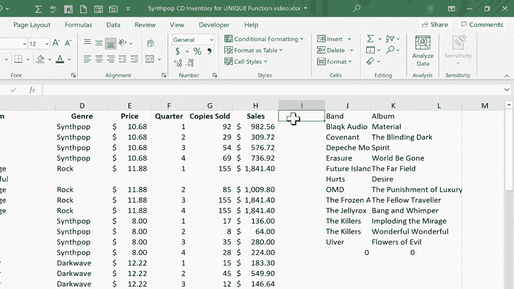

# Excel中级教程 - P65：66）两个动态数组函数：UNIQUE 和 SORT 🎯


在本节课中，我们将学习Excel的两个新动态数组函数：`UNIQUE`函数和`SORT`函数。我们将了解如何将这两个函数结合起来，实现一些非常实用的数据处理功能。

## 概述

本节教程将引导你掌握`UNIQUE`和`SORT`函数的基本用法。我们将从一个包含重复数据的示例表格开始，逐步演示如何使用这两个函数提取唯一值并对结果进行排序。通过本课的学习，你将能够利用动态数组功能高效地清理和组织数据。

## 认识UNIQUE函数

首先，我们来看`UNIQUE`函数。它的作用是提取指定范围中的唯一值，并自动排除重复项。

假设我们有一个记录乐队和专辑销售数据的表格。由于数据按季度记录，乐队和专辑名称存在大量重复。如果我们想生成一个不包含重复项的乐队列表，`UNIQUE`函数就派上用场了。

以下是使用`UNIQUE`函数的基本步骤：

1.  确保你使用的是Microsoft 365版本的Excel，该版本支持动态数组函数。
2.  在目标单元格（例如J2）输入公式：`=UNIQUE(`。
3.  选择包含数据的数组范围，例如整列B。
4.  输入右括号或直接按回车。

完整的公式如下所示：
```excel
=UNIQUE(B:B)
```
按下回车后，Excel会提取B列中的所有唯一值，并将结果从公式单元格开始“溢出”显示。这是一个动态数组，当源数据发生变化时，结果会自动更新。

## 结合多列提取唯一组合

`UNIQUE`函数不仅可以处理单列，还可以处理多列数据，提取唯一的行组合。

例如，如果我们想同时获取唯一的“乐队”和“专辑”组合，可以这样做：

1.  在目标单元格输入公式：`=UNIQUE(`。
2.  选择B列和C列作为数组范围。
3.  完成公式。

公式如下：
```excel
=UNIQUE(B:C)
```
这个公式会考虑B列和C列数据的组合。只有当两列的值完全相同时，才会被视为重复项。因此，即使乐队名称相同，只要专辑不同，就会被保留在结果中。

## 认识SORT函数

接下来，我们介绍`SORT`函数。它的作用是对一个数组或范围进行排序。

单独使用`SORT`函数非常简单。例如，要对A列的数据进行排序，可以使用公式：
```excel
=SORT(A:A)
```
该函数会按升序对指定范围进行排序，并将排序后的结果溢出显示。

## 组合使用UNIQUE和SORT函数

`UNIQUE`和`SORT`函数的强大之处在于可以嵌套使用，一步实现“提取唯一值并排序”的操作。

上一节我们介绍了如何提取唯一值，本节中我们来看看如何让这些唯一值变得井然有序。

假设我们想获得按乐队名称字母顺序排列的唯一乐队和专辑列表，可以按照以下步骤操作：

1.  在目标单元格输入公式：`=SORT(`。
2.  将`UNIQUE(B:C)`作为`SORT`函数的数组参数。
3.  完成公式。

完整的嵌套公式如下：
```excel
=SORT(UNIQUE(B:C))
```
这个公式的执行顺序是：首先，`UNIQUE(B:C)`提取B列和C列的唯一组合；然后，`SORT`函数对这个唯一组合的结果进行排序（默认按第一列升序排序）。最终，我们得到了一个既无重复又排列整齐的数据列表。

## 动态数组的优势

使用这些动态数组函数时，结果会以“溢出”形式呈现。这意味着你只需要在一个单元格中输入公式，结果会自动填充到相邻的单元格区域。

更重要的是，这些结果是动态链接的。如果你修改了源数据，例如添加或删除记录，溢出区域的结果会立即自动更新，无需手动刷新或重新应用公式。

## 总结

本节课中我们一起学习了Excel中两个强大的动态数组函数：`UNIQUE`和`SORT`。

*   `UNIQUE`函数用于从范围中提取唯一值，去除重复项。
*   `SORT`函数用于对数组进行排序。
*   通过嵌套使用这两个函数，例如`=SORT(UNIQUE(范围))`，可以高效地实现数据清洗和整理，一步得到排序后的唯一值列表。

掌握这两个函数能极大地提升你处理重复数据和整理列表的效率，是Excel数据分析中非常实用的工具。



