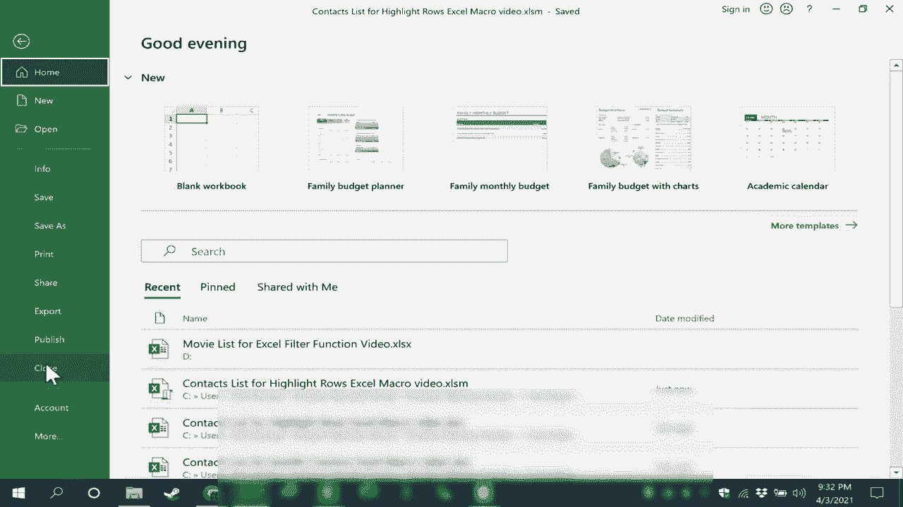

# Excel中级教程 - P67：68）创建突出显示行的 Excel 宏 🎨


在本节课中，我们将学习如何创建一个Excel宏，用于高亮显示选定范围内的每隔一行。这个宏可以让你快速、直观地识别数据行，是数据整理和美化表格的实用技巧。

---

## 概述

我们将分步讲解如何启用开发者工具、编写并运行宏、创建触发按钮，以及如何保存包含宏的工作簿。即使你没有任何编程经验，也能轻松跟上。

---

## 第一步：启用开发者选项卡

在开始创建宏之前，需要确保Excel的功能区上显示了“开发者”选项卡。这是访问宏和Visual Basic编辑器的入口。

以下是启用步骤：

1.  点击Excel左上角的“文件”菜单。
2.  选择“选项”。
3.  在弹出的“Excel选项”对话框中，点击“自定义功能区”。
4.  在右侧的“主选项卡”列表中，勾选“开发者”复选框。
5.  点击“确定”保存设置。

现在，你应该能在功能区看到“开发者”选项卡了。

---

## 第二步：打开 Visual Basic 编辑器

上一节我们介绍了如何启用开发者工具，本节中我们来看看如何进入编写宏的编程环境。

1.  切换到“开发者”选项卡。
2.  在“代码”组中，点击“Visual Basic”按钮。
3.  这将打开“Microsoft Visual Basic for Applications”（VBA）编辑器窗口。

在VBA编辑器中，左侧的“项目资源管理器”窗口列出了当前打开的工作簿及其工作表。为了让我们编写的宏在整个工作簿中可用，我们双击“ThisWorkbook”对象，右侧会打开一个白色的代码编辑窗口。

---

## 第三步：编写宏代码

现在，我们将在代码编辑窗口中输入宏的指令。宏的代码就像一份食谱，告诉Excel需要执行哪些步骤。

将以下代码复制并粘贴到代码编辑窗口中：

```vba
Sub HighlightAlternateRows()
    Dim rng As Range
    Dim i As Long
    Dim myColor As Long

    ' 设置你想要的高亮颜色（这里使用黄色）
    myColor = RGB(255, 255, 0)

    ' 检查用户是否选择了单元格区域
    If TypeName(Selection) <> "Range" Then
        MsgBox "请先选择一个单元格区域。"
        Exit Sub
    End If

    ' 将选定的区域赋值给变量 rng
    Set rng = Selection

    ' 循环遍历选定区域的每一行
    For i = 1 To rng.Rows.Count
        ' 如果行号是奇数，则填充颜色
        If i Mod 2 = 1 Then
            rng.Rows(i).Interior.Color = myColor
        End If
    Next i
End Sub
```

**核心概念解释**：
*   `Sub HighlightAlternateRows()` 和 `End Sub` 定义了宏的开始和结束。
*   `Dim` 语句用于声明变量，例如 `rng` 代表选定的区域。
*   `For i = 1 To rng.Rows.Count ... Next i` 是一个循环结构，用于遍历选定区域的每一行。
*   `If i Mod 2 = 1 Then` 是一个条件判断，`Mod` 是取余运算符，用于判断行号 `i` 是否为奇数（`i` 除以 2 的余数等于 1）。

代码输入完毕后，直接关闭VBA编辑器窗口即可，代码会自动保存。

---

## 第四步：运行与测试宏

代码已经就位，接下来我们测试一下它是否正常工作。

1.  回到Excel工作表界面。
2.  用鼠标拖动选择一个数据区域（例如A1到D10）。
3.  切换到“开发者”选项卡。
4.  点击“代码”组中的“宏”按钮。
5.  在弹出的“宏”对话框中，你会看到名为“HighlightAlternateRows”的宏，选中它并点击“执行”。

此时，你选定的区域中，奇数行（第1、3、5...行）应该被高亮显示了。

---

## 第五步：创建宏按钮

虽然可以通过“宏”对话框运行，但创建一个按钮会更加方便。本节中我们来看看如何添加一个形状按钮来触发宏。

以下是创建按钮的步骤：

1.  点击“插入”选项卡，在“插图”组中选择“形状”，然后选择一个矩形。
2.  在工作表的空白处点击并拖动，绘制一个按钮形状。
3.  右键单击这个形状，选择“编辑文字”，输入按钮名称，例如“高亮行”。
4.  你可以继续右键单击形状，选择“设置形状格式”来调整颜色、字体等，美化按钮。
5.  按钮设计好后，再次右键单击它，这次选择“分配宏”。
6.  在弹出的“分配宏”对话框中，选择我们刚才创建的“HighlightAlternateRows”宏，点击“确定”。

现在，这个形状按钮就与我们的宏关联起来了。点击工作表其他区域取消按钮的选中状态，然后选定一个数据区域，再点击“高亮行”按钮，即可看到效果。

---

## 第六步：修改宏与保存工作簿

如果你对高亮的颜色不满意，可以随时修改宏代码。

1.  再次进入“开发者”选项卡 -> “Visual Basic”。
2.  在代码窗口中，找到 `myColor = RGB(255, 255, 0)` 这一行。RGB函数中的三个数字分别代表红、绿、蓝的分量（范围0-255）。`(255,255,0)`是黄色。
3.  你可以将其改为其他颜色，例如浅蓝色 `RGB(173, 216, 230)`，然后关闭VBA编辑器。

**重要提示**：由于工作簿现在包含了宏（VBA代码），在保存时需要选择特殊的文件格式。

1.  点击“文件” -> “另存为”。
2.  在“保存类型”下拉菜单中，选择“Excel 启用宏的工作簿 (*.xlsm)”。
3.  为文件命名并保存。

请注意，文件的扩展名从普通的 `.xlsx` 变成了 `.xlsm`。下次打开此文件时，Excel可能会在顶部显示一个安全警告，提示“宏已被禁用”。你需要点击“启用内容”按钮，才能正常使用我们创建的宏按钮。

---



## 总结

本节课中我们一起学习了如何创建一个实用的Excel宏。我们从启用开发者工具开始，逐步完成了打开VBA编辑器、编写用于高亮交替行的代码、运行测试、创建便捷的触发按钮，最后学习了如何正确保存包含宏的工作簿。掌握这些步骤后，你就可以尝试创建更多自动化小工具来提升你的Excel工作效率了。