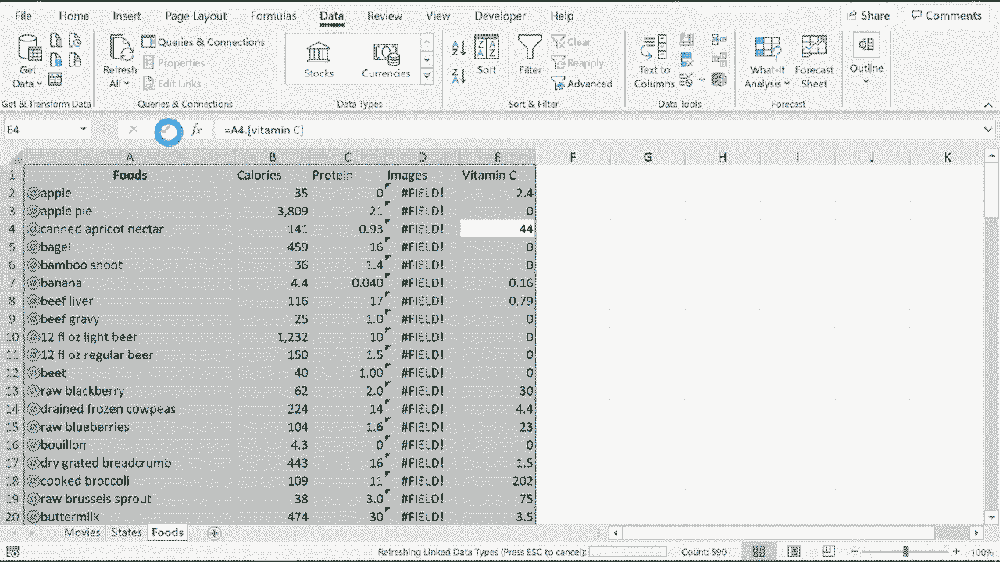

# Excel中级教程 - P68：使用链接数据类型 🎬


在本节课中，我们将学习Excel中一项强大的新功能——**链接数据类型**。它允许Excel自动识别单元格中的特定文本（如电影、城市、食物），并从互联网获取并链接相关的结构化数据，从而快速丰富你的电子表格信息。

---

## 概述

链接数据类型是Microsoft 365及Excel网页版中的一项功能。它能够识别单元格内容所属的类别（例如电影、地理、食物），并自动从在线数据源（如Wolfram）获取详细信息。这意味着你可以为列表中的项目快速添加如上映年份、导演、人口、营养成分等数据，而无需手动搜索和复制粘贴。

上一节我们介绍了数据整理的基本概念，本节中我们来看看如何利用智能化的链接数据来提升效率。

---

## 启用与识别链接数据

首先，你需要确保使用支持此功能的Excel版本，并登录你的Microsoft账户。

1.  **准备数据**：在一个工作表内列出你的项目，例如一列电影名称。
2.  **选择数据范围**：用鼠标点击并拖动，选中包含文本的单元格区域。
3.  **应用链接数据类型**：
    *   转到 **“数据”** 选项卡。
    *   在 **“数据类型”** 功能组中，你会看到如“股票”、“货币”等按钮。点击下拉箭头，会显示完整的可用数据类型列表（如电影、城市、食物等）。
    *   根据你的数据内容，选择相应的类型（例如，为电影列表选择“电影”）。

**代码示例：选择数据范围**
```excel
// 假设电影名称在A2:A10单元格
// 手动选择该区域，或使用名称框输入“A2:A10”后按回车。
```

应用类型后，Excel会开始处理。屏幕底部会显示“正在将数据转换为链接数据…”的提示。处理完成后，被成功识别的单元格旁会出现一个特定的图标（如电影图标🎬、地图图标🗺️）。

> **注意**：处理时间取决于数据量。如果某些项目未被识别（旁边没有图标），可能是因为名称不明确（如存在多部同名电影）或该数据尚未被收录。你可以点击该单元格，从弹出的选项中选择正确的项目。

---

## 插入链接数据字段

成功识别数据后，你就可以轻松添加各种相关信息。

以下是向已识别的链接数据添加详细信息的步骤：

1.  **选中范围**：再次选中已应用了链接数据类型的单元格区域。
2.  **插入数据字段**：在选中区域右侧，会出现一个小的“插入数据”图标（或回到“数据”选项卡的“数据类型”组中点击该图标）。点击后会弹出一个字段列表，列出了所有可获取的信息。
3.  **选择所需字段**：从列表中选择你想要的字段（例如“导演”、“上映年份”、“人口”、“卡路里”）。Excel会自动在右侧相邻的列中填充这些数据。

**核心操作流程公式**：
```
选择数据范围 → 应用链接数据类型 → 选择字段 → 自动填充
```

例如，为电影列表添加“导演”和“上映年份”后，你的表格将立即得到扩展。

---

## 实际应用案例

让我们通过几个例子来巩固理解。

### 案例一：完善电影信息表
假设你有一个电影名称列表。应用“电影”数据类型后，你可以快速添加类型、导演、票房等信息，无需手动查阅。

### 案例二：获取美国各州信息
如果你有一个州名列表，应用“地理”数据类型后，可以添加如州首府、人口、州长等数据。这些信息会定期在线更新。

### 案例三：分析食物营养成分
对于一个食物清单，应用“食物”数据类型可以迅速获取每项食物的卡路里、蛋白质、维生素含量等营养数据，极大方便了饮食分析。

> **提示**：对于大量数据（如上百行），可以使用名称框（左上角）快速输入范围（如 `A2:A118`）来精确选择，避免拖动。

---

## 更新与维护链接数据

由于链接数据来源于网络，信息可能发生变化。为了确保你的电子表格拥有最新信息，你需要手动刷新。

1.  选中包含链接数据的单元格。
2.  转到 **“数据”** 选项卡。
3.  在 **“查询和连接”** 组中，点击 **“全部刷新”** 按钮。
4.  你也可以点击该按钮的下拉箭头，选择 **“刷新所选内容”** 或 **“全部刷新”**。

刷新过程需要一些时间，完成后，单元格中的数据将更新为在线可用的最新版本。

---

## 总结

本节课中我们一起学习了Excel的**链接数据类型**功能。我们掌握了如何将单元格文本转换为智能数据链接、如何插入丰富的在线信息字段，以及如何刷新这些数据以保持其时效性。



这项功能能显著提升数据收集和表格构建的效率，特别适用于需要频繁获取标准信息的场景。记住，它的核心价值在于**将手动查找替换为自动关联**，让你能更专注于数据分析本身。