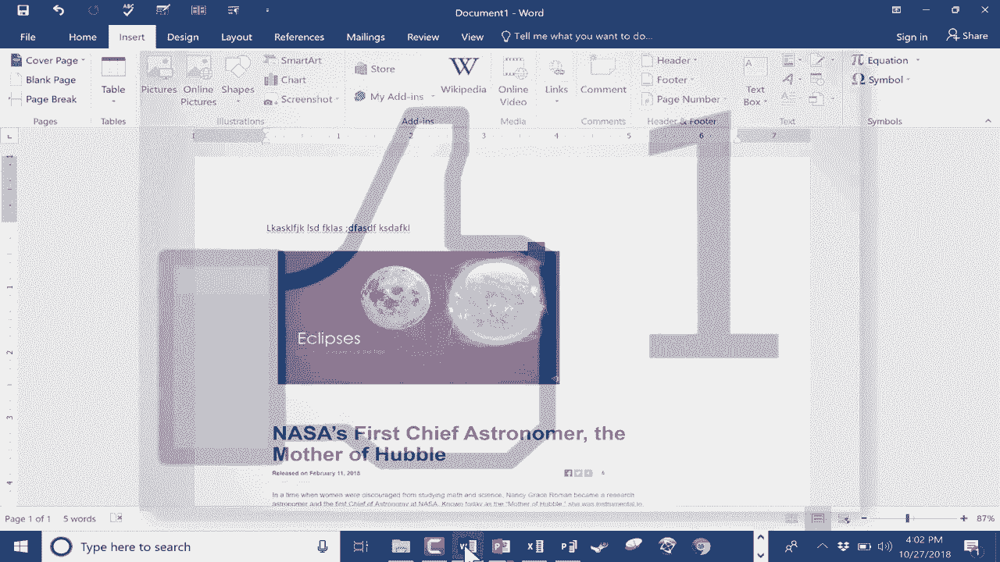

# Excel中级教程 (P8) 📸：Word、PPT和Excel的屏幕截图工具

在本节课中，我们将学习一个内置于常见Microsoft Office工具（如Word、PowerPoint和Excel）中的实用功能——屏幕截图工具。这个工具操作简便，能帮助您快速将其他程序窗口或屏幕的特定部分插入到您的Office文档中。

许多用户知道Windows系统自带的“截图工具”（Snipping Tool），但Office内置的截图功能在某些场景下更为便捷。接下来，我们将详细介绍其使用方法。

## 在Word中使用截图工具

假设您正在Microsoft Word中撰写报告，需要插入来自其他已打开程序（如PowerPoint演示文稿）的内容。

**以下是插入整个窗口截图的方法：**

1.  在Word中，点击顶部菜单栏的 **“插入”** 选项卡。
2.  在功能区找到并点击 **“截图”** 按钮。
3.  系统会显示所有当前已打开窗口的缩略图。
4.  直接点击您想要截取的窗口（例如PowerPoint），该窗口的完整截图便会插入到Word文档的光标位置。

此方法优点是快捷，但缺点是会截取整个窗口。

**如果您只想截取窗口的某一部分，可以使用“屏幕剪辑”功能：**

1.  确保您想截取的程序窗口是最近活动过的窗口。
2.  在Word中，点击 **“插入” > “截图”**。
3.  在下拉菜单中，选择 **“屏幕剪辑”**。
4.  屏幕会立刻切换到最近活动的窗口，鼠标指针变为十字形。
5.  按住鼠标左键并拖动，框选出您想要截取的区域。
6.  松开鼠标，所选区域的截图便会插入到Word文档中。

## 编辑已插入的截图

插入截图后，您可以像处理普通图片一样对其进行编辑。

**以下是基本的图片编辑操作：**

*   **调整大小与旋转**：点击选中图片，拖动四周的控制点可调整大小，拖动上方的旋转手柄可旋转图片。
*   **裁剪图片**：若想去除截图的多余部分，可以右键点击图片，选择 **“裁剪”** 选项。此时图片边缘会出现黑色裁剪控点，拖动这些控点即可调整裁剪范围，完成后在空白处点击即可应用裁剪。

上一节我们介绍了在Word中的操作，本节中我们来看看在PowerPoint和Excel中是否同样适用。

## 在PowerPoint和Excel中使用截图工具

**在PowerPoint中，操作与Word完全一致：**

1.  点击 **“插入” > “截图”**。
2.  您可以选择插入可用窗口的完整截图，或使用“屏幕剪辑”功能截取特定区域。

**在Excel中，截图功能可能被折叠在菜单中：**

1.  点击 **“插入”** 选项卡。
2.  在“插图”功能组中，找到并点击 **“截图”** 按钮。
3.  其后的操作与Word和PowerPoint完全相同。

需要注意的是，此功能并非在所有Office组件中都可用。例如，在Microsoft Publisher中，“插入”选项卡下可能没有“截图”按钮。

## 总结

本节课中，我们一起学习了Microsoft Office内置截图工具的使用方法。

*   我们掌握了在**Word、PowerPoint和Excel**中，通过 **“插入” > “截图”** 路径来插入整个窗口截图或进行局部屏幕剪辑。
*   我们学习了如何对插入的截图进行**调整大小、旋转和裁剪**等基本编辑。
*   我们了解到，该功能在**Microsoft Publisher**等部分Office组件中可能不可用。

这个内置工具能极大提升您在整合多源内容到Office文档时的工作效率。

