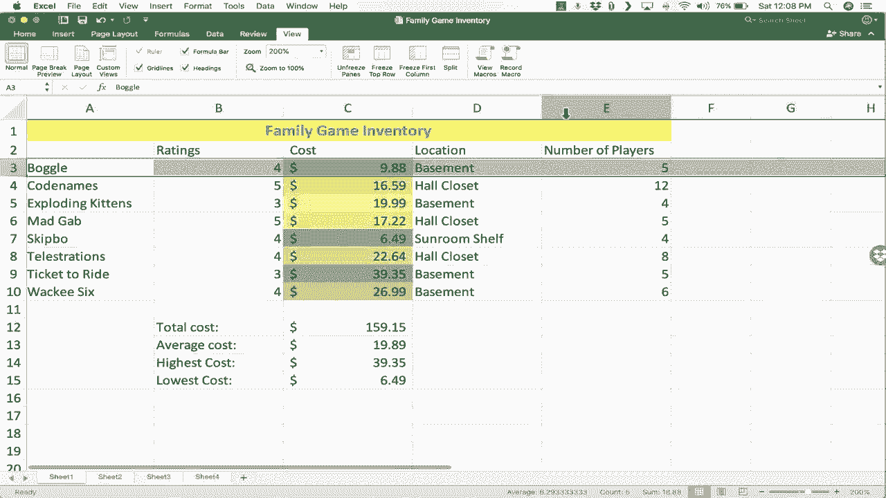

# Excel中级教程 (P9) - 9）Excel for Mac 中级技能 💻

在本节课中，我们将学习一系列Excel for Mac的中级技能、技巧和窍门。这些内容建立在《Excel for Mac 初学者指南》的基础之上。我们将重点关注格式设置、自动填充、公式与函数，以及一些高级数据处理工具，帮助你更高效地管理和分析数据。


---

## 1. 更多格式选项 🎨

上一节我们介绍了合并居中和单元格颜色等基础格式。本节中，我们来看看两个更强大的格式工具：**格式刷**和**条件格式**。

### 1.1 格式刷

格式刷工具位于左上角，图标是一把刷子。它的作用是复制特定单元格或区域的格式（如背景色、字体、合并居中），并将其应用到其他单元格，而不会复制单元格的内容。

**操作步骤如下：**
1.  选中一个具有你所需格式的单元格。
2.  点击“格式刷”图标。
3.  点击或拖动选择你想要应用此格式的单元格或区域。

例如，如果你喜欢A列中某个单元格的格式（如斜体、特定字体和颜色），你可以使用格式刷快速将相同格式应用到电子表格的其他部分。

### 1.2 条件格式

条件格式能根据你设定的规则自动改变单元格的样式。例如，可以根据数值高低显示不同的颜色。

**应用颜色刻度示例：**
1.  选中包含数字的列（例如C列）。
2.  在“开始”选项卡中，点击“条件格式”。
3.  将鼠标悬停在“色阶”上，选择一个颜色方案（如“绿-黄-红”色阶）。
4.  点击后，数值高的单元格会显示为绿色，数值低的显示为红色，中间值呈现过渡色。

这让你能直观地快速识别数据的高低分布。

---

## 2. 数字格式：货币 💰

为了让数据含义更清晰，我们可以将数字设置为特定的格式。例如，将表示金额的列格式化为货币。

**操作步骤如下：**
1.  选中包含金额的列（例如C列）。
2.  在“开始”选项卡的数字格式区域，点击下拉菜单（默认显示“常规”）。
3.  选择“货币”或“会计数字格式”。
    *   **货币格式**：在数字前添加美元符号 `$`。
    *   **会计格式**：将美元符号左对齐，使数字列更整齐。

这个简单的步骤能让你的数据表更专业、更易读。

---

## 3. 自动填充手柄 ✨

自动填充手柄是单元格右下角的一个小方块。将鼠标悬停其上时，指针会变成黑色加号。它主要有两个功能：**复制内容**和**扩展序列**。

以下是自动填充手柄的几种用法：

**复制内容：**
*   选中一个单元格，拖动其填充手柄，可以将该单元格的内容复制到拖过的区域。

**扩展数字序列：**
*   如果选中两个有规律的单元格（如1和2），拖动填充手柄，Excel会识别规律并自动填充后续序列（3, 4, 5...）。
*   公式示例：`1, 2` → 拖动 → `3, 4, 5...`

**扩展时间或日期序列：**
*   输入一个时间（如“6:00 AM”），拖动填充手柄，会自动按小时递增填充。
*   要创建更复杂的模式（如每半小时），需要先输入前两个值（`6:00 AM`, `6:30 AM`）来定义模式，然后拖动填充手柄。

善用自动填充手柄可以极大地提升数据录入效率。

---

## 4. 公式与函数：Excel的核心 ⚙️

Excel最强大的功能之一是执行计算。所有公式都必须以等号 `=` 开头。

### 4.1 基础求和

假设要计算所有游戏的总成本。

**方法一：手动相加（不推荐用于大量数据）**
在目标单元格中输入：
```excel
=26.99+39.35+22.64+...
```
然后按回车。

**方法二：使用SUM函数**
在目标单元格中输入：
```excel
=SUM(C3:C10)
```
`C3:C10` 表示从C3单元格到C10单元格的区域。你也可以用鼠标直接选中这个区域来代替手动输入引用。

**方法三：使用自动求和（最快）**
1.  选中紧挨着数据下方的单元格（如C11）。
2.  点击“开始”选项卡中的“自动求和”按钮（Σ）。
3.  Excel会自动识别上方数据并生成SUM公式，按回车确认即可。

### 4.2 使用其他函数

除了求和，你还可以使用其他函数，如 `AVERAGE`（平均值）、`MAX`（最大值）、`MIN`（最小值）。

**计算平均值示例：**
```excel
=AVERAGE(C3:C10)
```

**查找最高价和最低价示例：**
```excel
=MAX(C3:C10)  // 最高价
=MIN(C3:C10)  // 最低价
```

### 4.3 公式辅助工具

*   **公式栏**：位于工作表上方，你可以在这里查看和编辑单元格中的公式。
*   **插入函数 (Fx)**：点击公式栏左侧的“Fx”按钮，可以打开函数列表，搜索你需要的函数并获得使用帮助。

---

## 5. 高级数据处理技巧 🔍

最后，我们快速了解三个处理数据的高级技巧。

### 5.1 排序

你可以按某一列的内容对整张表格进行排序。
1.  选中要排序的列中的任意单元格。
2.  点击“开始”选项卡中的“排序和筛选”。
3.  选择“升序”（A到Z，或小到大）或“降序”（Z到A，或大到小）。
Excel会自动调整所有相关行的顺序，保持数据的完整性。

### 5.2 筛选

筛选功能可以让你只查看符合特定条件的行。
1.  选中标题行。
2.  点击“开始”选项卡中的“排序和筛选” > “筛选”。
3.  标题单元格会出现下拉箭头。点击箭头，勾选你想显示的项目（例如，只显示“评级”为5星的游戏）。
4.  要取消筛选，再次点击“排序和筛选” > “筛选”。

**注意**：使用筛选后，记得取消筛选以查看全部数据，避免误以为数据丢失。

### 5.3 冻结窗格

当表格很长时，向下滚动会看不到标题行。冻结窗格可以锁定特定的行或列，使其始终可见。
1.  选中你希望冻结区域下方的那一行（例如，想冻结第1-2行，就选中第3行）。
2.  点击“视图”选项卡中的“冻结窗格”。
3.  选择“冻结窗格”。现在，无论你如何滚动，被冻结的行都会保持在屏幕上方。

---

## 总结 📝

本节课中我们一起学习了多项Excel for Mac的中级技能：
1.  使用**格式刷**快速复制格式，利用**条件格式**让数据可视化。
2.  设置**货币格式**，使数据表更规范。
3.  掌握**自动填充手柄**，高效复制数据或生成序列。
4.  学习创建**公式与函数**，特别是`SUM`、`AVERAGE`、`MAX`、`MIN`的使用，这是Excel数据分析的核心。
5.  了解了**排序**、**筛选**和**冻结窗格**这三个高级技巧，以更好地管理和查看大型数据集。



熟练掌握这些技能，将能显著提升你使用Excel处理数据的效率和能力。