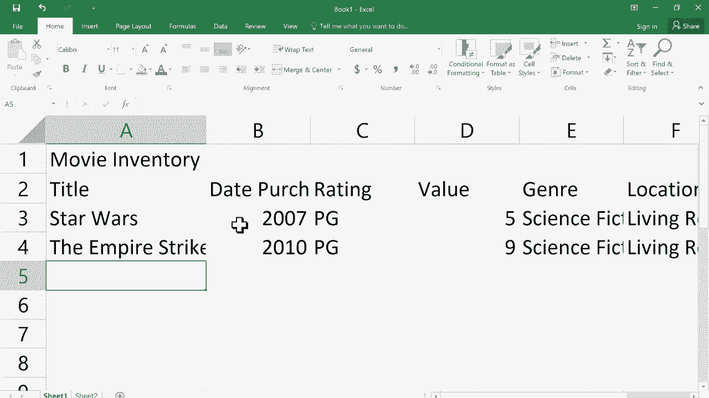
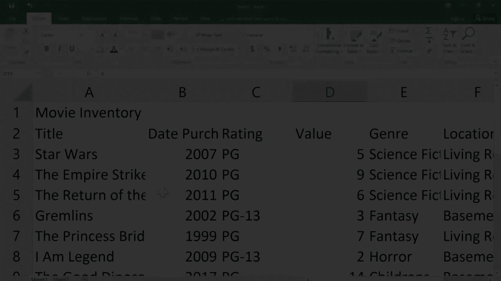
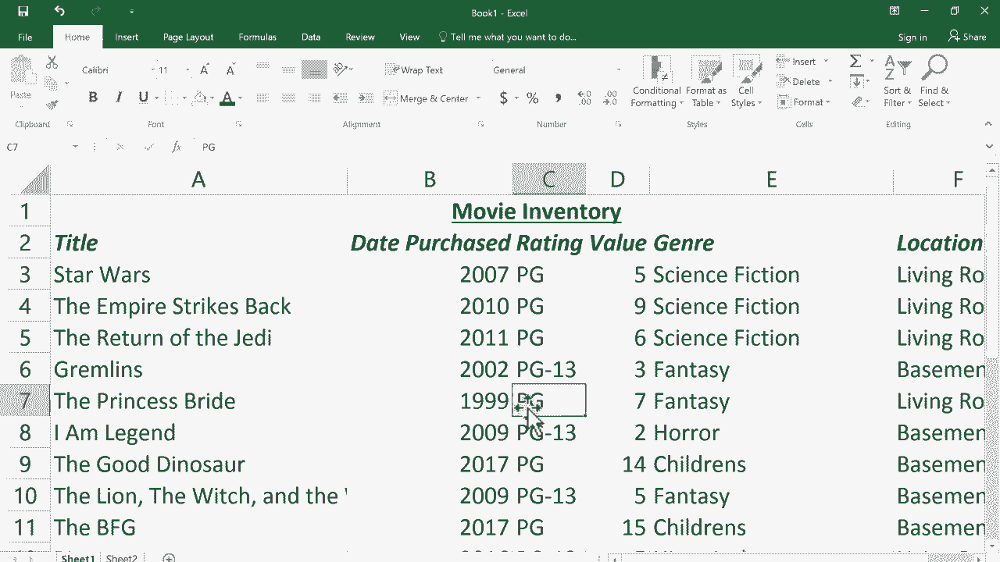

# Excel基础教程 P1：正确打开方式与提效技巧 🚀

在本节课中，我们将学习Microsoft Excel的基础知识，包括界面布局、核心概念以及数据输入与格式化的基本操作。无论你使用的是哪个版本的Excel，本教程的大部分内容都适用。

## 界面布局与核心术语 📐

上一节我们介绍了课程概述，本节中我们来看看Excel的界面布局和一些必须了解的核心术语。

在Excel 2016的顶部，有一系列**选项卡**，如“开始”、“插入”、“页面布局”等。点击某个选项卡会打开对应的**功能区**。每个功能区又被划分为多个**组**。例如，“页面布局”功能区包含“主题”、“页面设置”和“缩放比例”等组。

在某些组的右下角，有一个小图标，称为**启动器按钮**。点击它可以打开包含更多选项的对话框。

电子表格本身由**列**（垂直，以字母A、B、C…标记）和**行**（水平，以数字1、2、3…标记）组成。列与行的交叉点形成一个**单元格**。每个单元格都有一个唯一的名称，由列字母和行号组成，例如 `C2`。

一组相邻的单元格构成一个**范围**。范围的命名规则是：左上角单元格名称 + 冒号 + 右下角单元格名称，例如 `L7:N12`。

所有这些内容都位于一个**工作表**上。多个工作表组合在一起，构成一个**工作簿**。

## 开始使用：创建与输入数据 ✍️

了解了基本布局后，本节我们将动手创建一个简单的电子表格。

首先，启动Excel并选择“空白工作簿”。我们将创建一个电影收藏清单作为示例。

点击 `A1` 单元格，输入标题“电影清单”，然后按 `Enter` 键确认。你会发现文本超出了单元格的宽度，但这并不影响数据存储。

以下是基本的键盘导航技巧：
*   `Enter` 或 `Return`：向下移动。
*   `Shift` + `Enter`：向上移动。
*   `Tab`：向右移动。
*   `Shift` + `Tab`：向左移动。
*   方向键：向任意方向移动。

接下来，在 `A2` 到 `F2` 单元格中，依次输入列标题：**标题**、**购买日期**、**评级**、**价值**、**类别**、**位置**。然后从 `A3` 开始，逐行输入电影信息。

**重要提示**：修改单元格内容时，**单击**单元格会选中它，此时输入会替换原有内容。若要编辑内容，需要**双击**单元格进入编辑模式，此时会出现闪烁的光标。

## 美化与格式化表格 🎨

数据输入完成后，我们可以通过一些简单的格式化操作让表格更清晰易读。

首先，让标题更醒目。选中 `A1` 单元格，在“开始”功能区中，可以将其设置为**粗体**。为了让标题居中于表格上方，我们可以使用“合并后居中”功能。

操作步骤如下：
1.  选中 `A1` 到 `F1` 单元格。
2.  点击“开始”功能区“对齐方式”组中的 **“合并后居中”** 按钮。

现在，标题将在一个合并的大单元格中居中显示。

接下来，调整列宽以适应内容。将鼠标指针移动到两列列标（如A和B）之间的分隔线上，当指针变为双向箭头时**双击**，Excel会自动将左侧列的宽度调整为刚好容纳该列中最长的内容。

更高效的方法是：选中所有需要调整的列（点击并拖动列标），然后在任意两列之间的分隔线上双击，即可一次性调整所有选中列的宽度。

**核心原则**：在Excel中，要产生任何效果（如格式化、调整大小），必须先**选中**目标单元格、行、列或范围。

最后，我们可以格式化列标题行以作区分。选中第2行（点击行号“2”），然后在“开始”功能区中，将其设置为**粗体**和*斜体*。

同样的调整技巧也适用于行高。

## 总结与展望 📝

本节课中我们一起学习了Excel的基础知识。

我们认识了Excel的界面元素，如选项卡、功能区和组。理解了工作簿、工作表、单元格和范围等核心概念。我们练习了如何输入和编辑数据，并掌握了使用键盘高效导航的技巧。最后，我们学习了如何通过合并单元格、调整列宽和设置字体格式来美化表格，并牢记了“先选择，后操作”的核心原则。

这些是使用Excel的基石。在未来的课程中，我们将深入探讨更高效的技巧、强大的公式与函数，以及一些高级功能，帮助你真正发挥Excel的潜力。