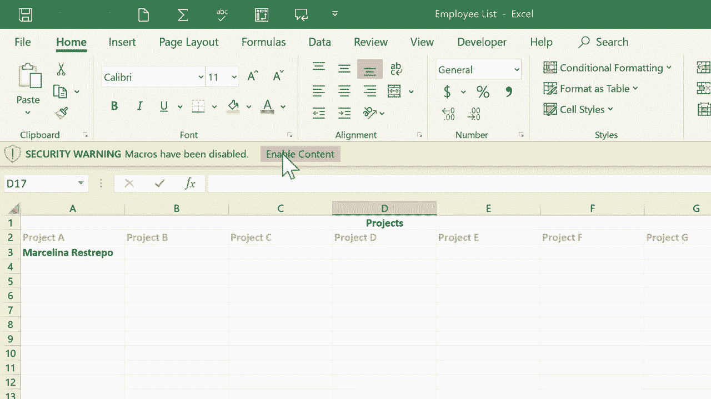

# Excel 高效技巧合集 - P11：创建 Excel 宏快捷方式 🚀

在本节课中，我们将学习如何为 Excel 中的重复性任务创建快捷方式，即“宏”。宏可以自动执行一系列操作，从而显著提升工作效率。我们将通过一个员工管理表格的示例，学习如何录制宏、创建按钮，并安全地保存包含宏的工作簿。

---

## 1. 宏的基本概念与准备工作

上一节我们介绍了宏能带来的效率提升，本节中我们来看看如何开始使用宏。首先，你需要确保 Excel 的“开发工具”选项卡可见。

以下是启用“开发工具”选项卡的步骤：

1.  在 Excel 功能区任意位置右键单击。
2.  选择“自定义功能区”。
3.  在主选项卡列表中，勾选“开发工具”选项。
4.  点击“确定”。

完成此设置后，你将在功能区看到“开发工具”选项卡，这是我们创建和管理宏的主要入口。

---

## 2. 录制第一个宏：切换工作表

假设我们有一个包含“员工”和“项目”两个工作表的工作簿。我们将创建一个宏，用于快速从“员工”表跳转到“项目”表。

操作步骤如下：

1.  点击“开发工具”选项卡。
2.  点击“录制宏”按钮。
3.  在弹出的对话框中，为宏命名，例如 `项目标签`。
4.  为宏指定一个键盘快捷键（例如 `Ctrl+Shift+A`）。**注意**：避免使用 `Ctrl+C`、`Ctrl+V` 等系统已占用的快捷键。
5.  将宏的保存位置设置为“当前工作簿”。
6.  （可选）填写宏的描述。
7.  点击“确定”开始录制。此时，Excel 开始记录你的操作，但**不记录鼠标移动和时间间隔**。
8.  点击“项目”工作表标签。
9.  返回“开发工具”选项卡，点击“停止录制”。

至此，一个用于切换工作表的宏就录制完成了。你可以通过快捷键 `Ctrl+Shift+A` 来执行它。

---

## 3. 为宏创建按钮控件

虽然可以使用快捷键，但为宏创建一个按钮会更直观。下面我们为刚才录制的宏添加一个按钮。

以下是创建按钮的步骤：

1.  在“开发工具”选项卡中，点击“插入”，然后选择“按钮（表单控件）”。
2.  鼠标指针会变成十字形，在表格的合适位置点击并拖动，绘制一个按钮。
3.  松开鼠标后，会弹出“指定宏”窗口。
4.  从列表中选择我们刚才录制的宏（`项目标签`），点击“确定”。
5.  双击按钮上的文字，将其修改为更具描述性的名称，例如“项目”。

现在，点击这个按钮，就会立即执行宏，跳转到“项目”工作表。为了方便返回，建议在“项目”工作表上也创建一个“返回员工表”的按钮，方法同上。

---

## 4. 录制更复杂的宏：标记单元格

宏不仅可以切换视图，还能执行格式设置等操作。例如，我们可以创建一个宏，将选中的单元格标记为特定颜色（如已审核）。

操作步骤如下：

1.  **关键步骤**：在开始录制前，先选中一个**空白单元格**，而不是目标单元格。
2.  点击“开发工具” -> “录制宏”，命名为 `标记为已审阅`，并设置快捷键（如 `Ctrl+Shift+C`）。
3.  点击“开始”选项卡，选择一种填充颜色（例如蓝色）。
4.  点击“停止录制”。

这样录制的宏，其逻辑是“为**当前选中的任何单元格或区域**填充蓝色”，而不是固定为某个特定单元格。使用时，只需选中任意目标（一个单元格、一行或一列），然后点击对应的按钮或使用快捷键，即可快速应用格式。

---

## 5. 保存包含宏的工作簿

创建宏后，保存文件时需要特别注意。默认的 `.xlsx` 格式无法保存宏代码。

保存启用宏的工作簿，请遵循以下步骤：

1.  点击“文件” -> “另存为”。
2.  在“保存类型”下拉框中，选择 **“Excel 启用宏的工作簿 (*.xlsm)”**。
3.  为文件命名并保存。

此后打开该 `.xlsm` 文件时，Excel 可能会显示安全警告，提示“宏已被禁用”。你需要点击“启用内容”，才能使宏正常运行。

---

## 总结

本节课中我们一起学习了 Excel 宏的基础应用。我们掌握了如何录制宏来自动化简单任务（如切换工作表、设置格式），如何通过插入表单控件按钮来方便地触发宏，以及如何正确保存启用宏的工作簿（`.xlsm` 格式）。宏是 Excel 强大的自动化工具，从这些简单的快捷方式开始，你可以逐步探索更复杂的自动化流程，从而极大地提升数据处理效率。

感谢观看。希望本教程对你有帮助。

