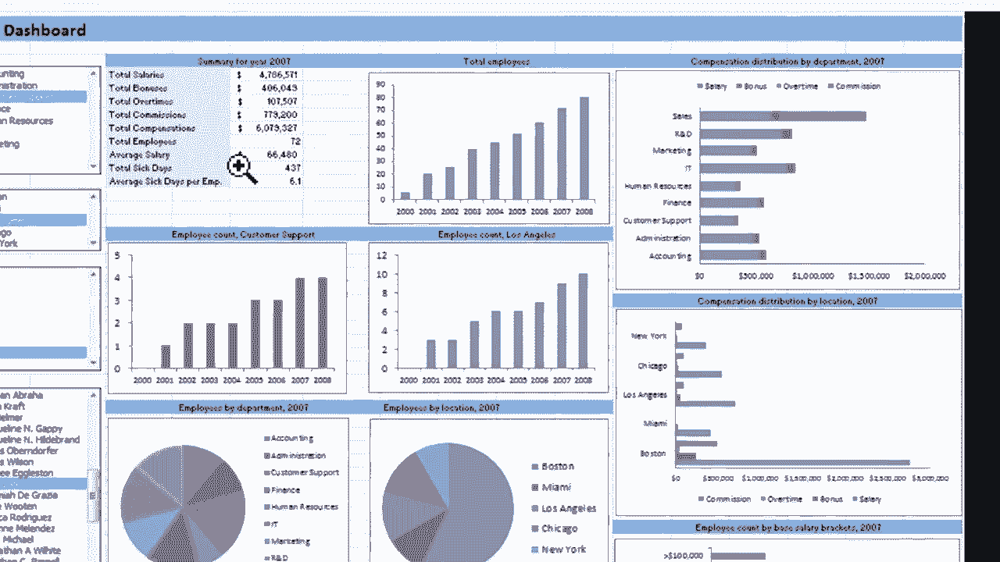
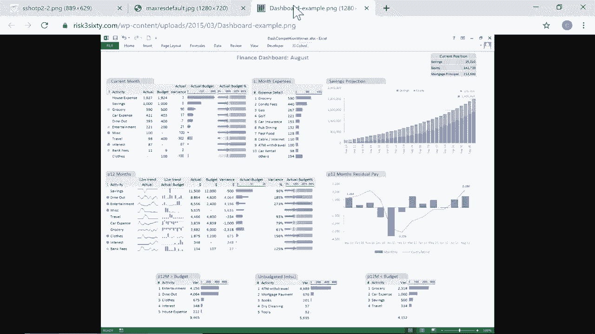
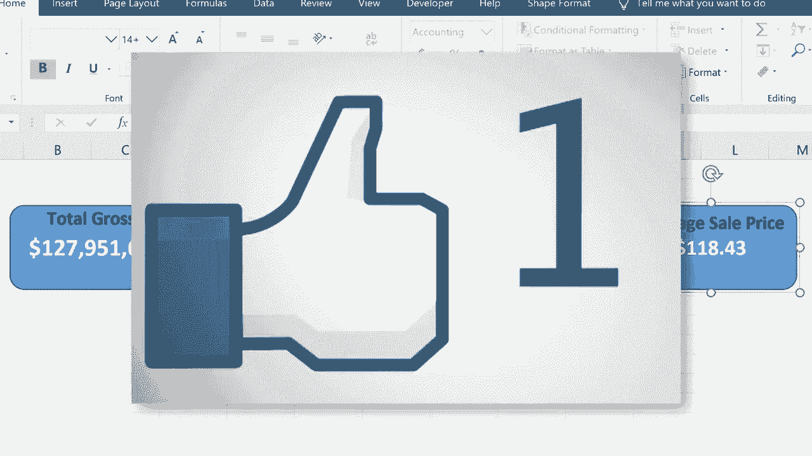

# Excel 正确打开方式！提效技巧大合集！(持续更新中) - P12：12）仪表板初学者指南 📊

在本节课中，我们将学习如何为你的 Excel 工作簿创建一个基础的仪表板。仪表板是一种将复杂数据以清晰、美观的方式集中展示的工具，它能帮助你专注于关键指标。我们将从最基础的步骤开始，学习如何规划、创建并美化一个简单的仪表板。

## 什么是仪表板？🤔

仪表板是一个单独的电子表格或界面，用于汇总和可视化来自其他工作表或工作簿的关键数据和指标。它通常包含图表、图形和重要的数字摘要，目的是让复杂的数据变得易于理解和访问。

例如，一个仪表板可以展示年度销售总额、各州销售趋势或平均价格等关键信息。虽然原始数据表格可能非常庞大和杂乱，但仪表板能提取并突出显示最重要的部分。

## 开始创建你的第一个仪表板 🚀

上一节我们介绍了仪表板的概念，本节中我们来看看如何从零开始搭建一个。

首先，你需要一个包含数据的工作表。在本例中，我们有一个包含多年财务数据的复杂工作表。为了创建仪表板，我们需要插入一个新的工作表。

以下是具体步骤：
1.  在工作簿左下角，点击“+”号添加新工作表。
2.  双击新工作表名称（如Sheet4），将其重命名为“Dashboard”。
3.  将“Dashboard”工作表拖到最前面，方便查看。

## 规划与设计仪表板布局 📐

创建仪表板前，最好先规划一下要展示的内容和布局。你可以在纸上画草图，或者直接在Excel中开始设计。例如，你可以在左上角放置年度总销售额，在右侧放置平均价格等。

我们将使用简单的形状来构建仪表板的框架。

以下是插入和设置形状的步骤：
1.  点击顶部菜单栏的“插入”选项卡。
2.  在“插图”组中，找到并点击“形状”。
3.  从下拉菜单中选择一个形状，例如“圆角矩形”。
4.  在仪表板工作表上点击并拖动鼠标，绘制出该形状。

## 将形状与数据动态链接 🔗

仅仅在形状中输入静态数字是不够的。为了让仪表板能随数据源自动更新，我们需要将形状与原始数据单元格动态链接起来。

以下是链接数据的步骤：
1.  点击你绘制的形状。
2.  将光标移至顶部的公式栏，输入等号 `=`。
3.  切换到包含源数据的工作表（例如“2020”工作表）。
4.  点击你想要链接的单元格（例如总销售额所在的单元格）。
5.  按下键盘上的 `Enter` 键。此时，形状中显示的数字就与源数据单元格动态关联了。

## 美化仪表板元素 🎨

仪表板的核心目的之一是让数据展示更美观、易读。因此，我们需要对形状和文本进行格式化。

以下是美化元素的步骤：
1.  **调整字体**：点击形状，在“开始”选项卡中调整字体大小、颜色和对齐方式（如居中）。
2.  **更改形状颜色**：选中形状，在“形状格式”选项卡（或右键菜单）中，更改“形状填充”颜色。
3.  **添加标题**：点击“插入” > “文本框”，在形状旁添加说明性标题（如“总毛销售额”），并调整其格式。
4.  **组合对象**：按住 `Ctrl` 键，同时选中形状和文本框。在“页面布局”或“形状格式”选项卡的“排列”组中，点击“组合”。这样它们就可以作为一个整体被移动和管理。

## 复制并创建更多指标 ➕

当你需要创建多个类似的指标框时，复制现有元素可以节省时间。

以下是快速创建新指标框的步骤：
1.  右键点击已创建并美化好的组合对象，选择“复制”。
2.  在空白处右键点击，选择“粘贴”。
3.  拖动新对象到合适位置。
4.  双击文本框修改标题（如改为“销售总数”）。
5.  点击形状，在公式栏中修改链接的单元格地址，指向新的数据源（如销售总数所在的单元格）。

## 确保数据格式正确 ✅

仪表板上的数字格式（如货币、小数位数）应与数据含义匹配。有时直接在仪表板的形状上修改格式会受限，这时需要去源数据单元格进行调整。

以下是修正数据格式的步骤：
1.  切换到源数据工作表（如“2020”）。
2.  选中需要调整格式的源数据单元格（如总销售额）。
3.  在“开始”选项卡的“数字”组中，选择合适的格式（如“货币”），并调整小数位数。
4.  返回仪表板工作表，形状中显示的数字会自动更新为新的格式。你可能需要稍微调整形状大小以适应新格式。

---

本节课中我们一起学习了创建Excel仪表板的基础知识。我们了解了仪表板的定义，学会了如何新建工作表、规划布局、使用形状作为容器，并将这些形状与后台数据动态链接。同时，我们也掌握了通过调整字体、颜色、组合对象以及修正数据格式来美化仪表板的基本技巧。这只是仪表板制作的起点，掌握这些基础后，你可以继续探索更复杂的图表和交互功能来丰富你的仪表板。

