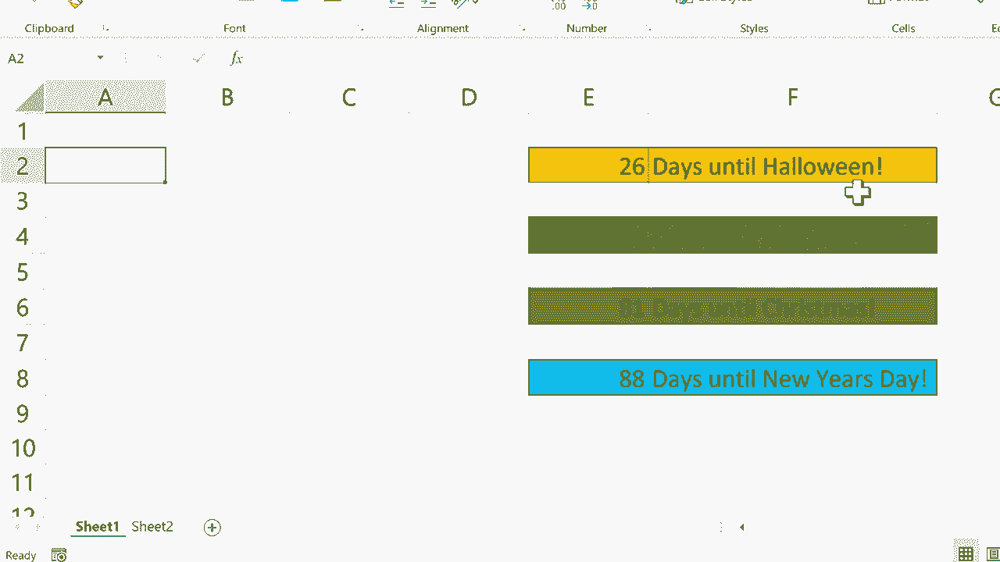

# Excel高效技巧课程 - P13：使用 TODAY 函数设置目标日期 📅


在本节课中，我们将学习如何使用 Excel 的 **TODAY** 函数来动态获取当前日期，并基于此计算距离未来目标日期的天数。这个技巧非常适合用于创建自动更新的日期跟踪器或提醒系统。

---

## 1. TODAY 函数的基本用法

上一节我们介绍了日期函数的重要性，本节中我们来看看 **TODAY** 函数的具体应用。**TODAY** 函数无需任何参数，每次打开工作簿时都会自动更新为当前系统日期。

其基本语法是一个简单的公式：

```
=TODAY()
```

在单元格中输入此公式并按下回车键，该单元格便会显示今天的日期。例如，在单元格 `B3` 中输入 `=TODAY()`，结果将类似 `2023-10-05`。

这个功能非常实用。例如，在需要记录打印日期的报表中，你可以插入这个公式。这样，每次打印时，报表上都会自动显示当天的日期。

---

## 2. 计算距离目标日期的天数

理解了 **TODAY** 函数的基础后，我们可以进一步利用它来计算重要事件还有多少天到来。这适用于追踪项目截止日期、节日或任何目标日期。

以下是实现这一目标的核心步骤：

1.  **建立数据源**：首先，在一个单独的表格（例如 `Sheet2`）中，使用 `=TODAY()` 获取今日日期，并列出所有目标日期。
2.  **执行日期计算**：在主工作表中，用目标日期减去今日日期，即可得到剩余天数。

计算剩余天数的公式为：

```
=目标日期单元格 - TODAY()
```
或
```
=目标日期单元格 - Sheet2!$A$1
```
（假设 `Sheet2!$A$1` 是存放 `=TODAY()` 的单元格）

---

## 3. 实战演练：创建节日倒计时

让我们通过一个具体例子来巩固所学知识。我们将创建一个节日倒计时列表。

首先，在 `Sheet2` 中设置基础数据：
*   在 `A1` 单元格输入 `=TODAY()` 作为动态的“今日”日期。
*   在 `B` 列依次输入万圣节、感恩节等节日的具体日期（例如 `2023-10-31`）。

接下来，在 `Sheet1` 中创建倒计时：

1.  在 `A2` 单元格输入“万圣节”。
2.  在 `B2` 单元格输入公式：`=Sheet2!B2 - Sheet2!$A$1`。
    *   这个公式的意思是：用 `Sheet2` 中万圣节的日期（B2）减去 `Sheet2` 中的今日日期（A1）。
3.  按下回车，单元格将显示距离万圣节的天数（例如 `26`）。

为了快速为其他节日创建倒计时，你可以使用填充柄功能：
*   选中 `B2` 单元格。
*   将鼠标移至单元格右下角，当光标变成黑色十字（填充柄）时，向下拖动至 `B4` 单元格。
*   这样，`B3` 和 `B4` 单元格的公式会自动调整为 `=Sheet2!B3 - Sheet2!$A$1` 和 `=Sheet2!B4 - Sheet2!$A$1`。

通过将基础数据（今日日期与目标日期）放在 `Sheet2`，而将计算和展示放在 `Sheet1`，可以使你的数据管理更加清晰，避免干扰主工作表中的其他内容。

---

## 总结

本节课中我们一起学习了 **TODAY** 函数的强大用途。我们掌握了：
*   使用 **`=TODAY()`** 动态获取当前日期。
*   通过 **日期相减** 公式计算距离未来某一天的天数。
*   利用 **单独工作表存储数据** 和 **填充柄** 来提高工作效率和组织性。



你可以将这个技巧灵活运用于各种场景，如跟踪项目里程碑、监控任务截止日期或制作活动倒计时，让你的 Excel 表格更加智能和自动化。